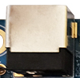
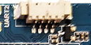
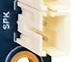
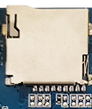
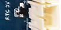

# 接口说明

## 电源开关和插座

X3128BV3 使用 12V 直流电源供电，黑色 DC 插座为 12V 直流电源输入插座。

## 调试串口

X3128 预留 UART2 作为调试串口，同时提供 UART0 和 UART1 两个普通串口。默认调试串口为 UART2，需要配合串口小板转换为 RS232 电平后使用。

## HDMI 接口

X3128BV3 采用 mini HDMI 接口，可通过 mini HDMI 延长线连接电视机或显示器。由于 RK3128 属于低成本方案，HDMI 和液晶屏不能同时显示。

## 以太网接口

主板板载 RTL8211E，支持千兆有线以太网。

## 音频接口

开发板支持外接扬声器输出。

开发板支持录音输入，板载麦克风，无需外接耳麦输入。

## TF 卡槽

X3128BV3 引出一个外置 TF 卡槽，可用于存放数据文件。

## 独立按键

| 开关 | 功能 |
| --- | --- |
| Recovery/K1 | 独立按键/recovery键 |

## USB OTG 接口

该接口用于程序烧写、同步等，也可以通过 OTG 线实现 HOST 功能。

## USB HOST 接口

RK3128 芯片自带 1 路 USB HOST，X3128BV3 通过 HUB 芯片扩展出三路 HOST 接口，其中一路用于连接 USB Wi-Fi / 蓝牙，另外两路通过标准 USB 接口引出。

## 开机、复位和 Recovery 按钮

接入外部电源适配器后，开发板会自动开机。进入 Android 系统后，轻按 POWER 键可休眠，再次按 POWER 键可唤醒，长按 POWER 键可弹出关机界面。

系统运行时，轻按 RESET 键可实现硬复位重启。

烧写固件时可按下 Recovery 键进入刷机模式。

## LCD 接口

X3128BV3 默认预留一个 30PIN LCD 接口，通过软排线连接 LCD 控制板。该接口包含 PWM 背光控制脚，可实现多级背光亮度调节。VGA、LVDS、MIPI 均通过该接口实现。

## 后备电池

后备电池用于保证断电后 RTC 仍可工作，避免系统时间丢失。
