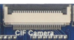
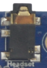
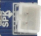
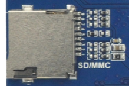
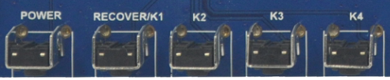
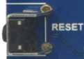
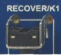
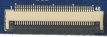
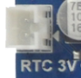
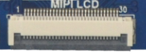

# 接口说明

本页按接口类型说明用途和注意点。硬件接口位置总览见[硬件资源](./x3288-hardware-resources)，核心板引脚编号见[引脚定义](./x3288-pin-definition)。

## 电源开关和插座

x3288bv4采用12V直流电源供电，图中黑色插座为12V直流电源输入插座。

## 调试串口

x3288预留一个串口UART2作为调试，以及三个普通串口分别为UART1，UART3和UART4。注意，默认使用UART2作为调试串口，需要配合串口小板将电平转化为RS232电平后使用。

## HDMI 接口

x3288主板采用miniHDMI接口，配合miniHDMI的延长线，可以将音视频信号完美的呈现在支持HDMI2.0协议的监控终端，如电视机，显示器等。

## Camera 接口

该接口为通用的24PIN摄相头接口，支持OV全系列摄相头，省去camera转接板。针对不同型号的摄相头，只需按照摄相头的规格，调整一下输出电压就行了。

该接口为通用的26PIN MIPI摄相头接口。

## 以太网接口

x3288支持千兆有线以太网接口，板载RTL8211E，用户可以通过有线以太网上网，体验极速网络。

## 耳机接口

将耳机接入该接口，可以实现耳机输出。当然也可以直接通过该接口送到功放输入，如家庭影院的音频输入口，实现将主板的音源信号通过家庭影院展现出来。注意该接口需要接3线的耳机，如果耳机带MIC，输出的音频将会严重失真。

## 喇叭接口

主板直接支持扬声器输出，将喇叭接到上图接口，可实扬声器输出。

## 录音接口

主板支持录音输入。耳麦已经直接载载到主板上，无须通过外置的耳麦输入了。

## TF 卡槽

x3288引出一个外置TF卡，可以通过该通道进行TF卡升级，或是存放一些多媒体文件。

## 独立按键

X3288除了复位和电源开关外，还有四个独立的按键，在原理图中，对应关系如下：

| 开关 | 功能 |
| --- | --- |
| Recovery/K1 | 独立按键/recovery键 |
| K2 | 独立按键 |
| K3 | 独立按键 |
| K4 | 独立按键 |

## USB OTG 接口

该接口用于程序烧写，同步等。它还能通过OTG线实现HOST的功能。

## USB HOST 接口

RK3288自带有两路USB HOST接口，相对Exynos4412，要轻松很多。x3288主板再通过一路HOST接口扩展出了三路USB HOST2.0接口，共4路HOST可用于连接USB WIFI，USB蓝牙，USB鼠标键盘等。

## 开机按钮

接上外部电源适配器后，长按POWER键开机。进入android系统后，轻触POWER键休眠，再次按POWER键实现唤醒。长按POWER键实现出现关机界面，按照屏幕提示关机。

## 复位按钮

在系统运行时，轻按RESET键主板重启，实现硬复位的功能。

## Recovery 按钮

刷机时需要按下该键进入recovery模式。

## LCD 接口

x3288主板默认留有一个40PIN的LCD接口，通过软排线将RGB相关信号连接到LCD控制板上，进而控制LCD。同时，这个40PIN接口的第一个管脚为PWM脚，用于控制LCD的背光，通过PWM实现多级背光亮度调节。VGA接口，LVDS接口都通过该接口实现。

## 后备电池

后备电池用于保证断电后RTC仍然能够工作，确保系统时间不丢失。

## 蜂鸣器

该蜂鸣器为有源蜂鸣器，有直流电时会鸣叫，通过三极管控制电源的导通与截止。硬件电路通过一路PWM控制三极管，即可以用于PWM测试，也可以用于适当场合的声音提示。

## 红外一体化接收头

这里采用HS0038B一体化接收头，它具有灵敏度高，使用方便等优点。利用它我们可以实现无线遥控，将x3288主板作为一个高性能的四核机顶盒。

## MIPI 接口

RK3288芯片板载MIPI控制器，在x3288主板上已经板载有MIPI接口，可直接驱动MIPI接口的显示屏。
