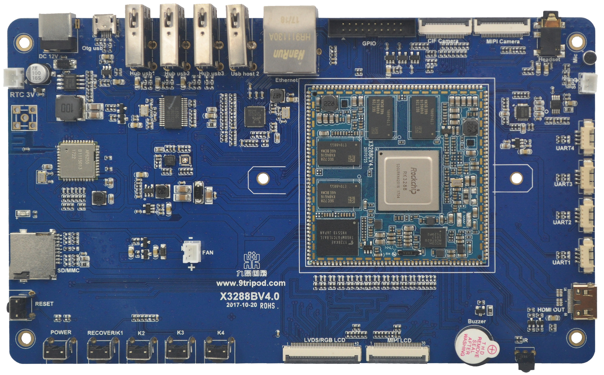
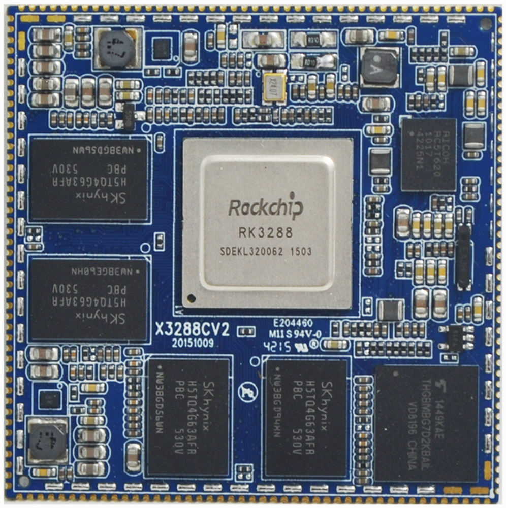
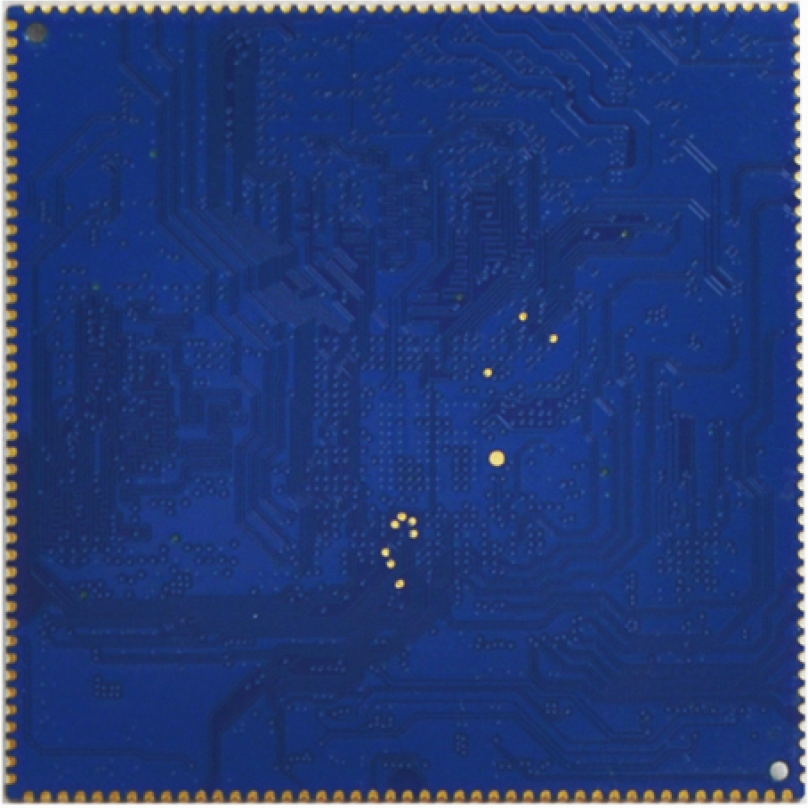
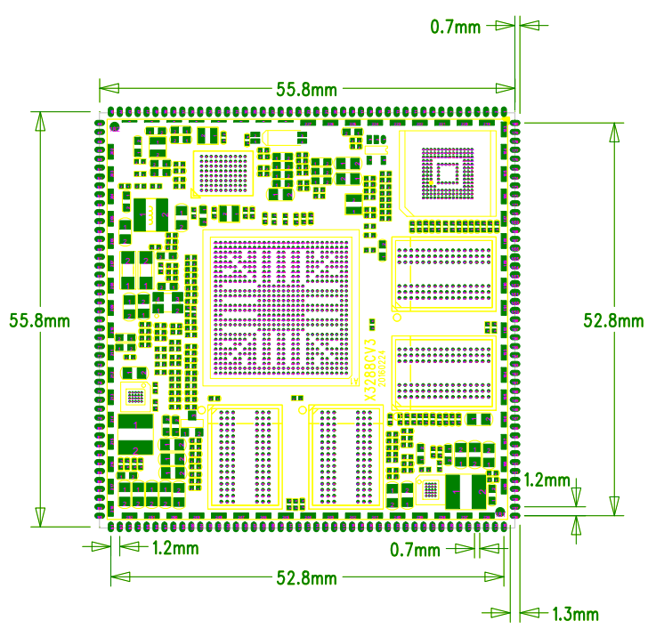

# 产品介绍

X3288BV4 基于瑞芯微 RK3288 平台，核心板为 X3288CV4。RK3288 采用 ARM Cortex-A17 四核架构，主频最高 1.8GHz，面向多媒体终端、工控、车载、金融、显示控制和教学实验等场景。

X3288 主板由邮票孔核心板、底板和液晶板组成。核心板采用 8 层板工艺，底板引出 HDMI、Camera、千兆以太网、USB、LCD、MIPI、音频、按键等常用接口，便于做系统移植、驱动调试和应用验证。

## 核心板特性

- 最佳尺寸，即保证精悍的体积又保证足够的GPIO口，仅55mm*55mm；
- 使用理光的RC5T620的PMU作为电源管理设计，在保证工作稳定可靠的同时，成本足够低廉；
- 支持多种品牌，多种容量的emmc，默认使用东芝8GB emmc；
- 使用双通道DDR3设计，默认支持2GB容量，可定制4GB容量；
- 支持电源休眠唤醒；
- 支持android4.4、android5.1、linux、ubuntu四大操作系统；
- 支持千兆有线以太网；
- 产品稳定可靠，拷机7天7夜不死机；

## 产品外观

## 系统配置

| 项目 | 参数 |
| --- | --- |
| CPU | RK3288 |
| 主频 | A17四核1.8GHz |
| 内存 | 标配2GB，可定制4GB |
| 存储器 | 4GB/8GB/16GB emmc可选，标配16GB |
| 电源IC | 使用RC5T620，支持动态调频，库仑计等 |

## 接口参数

| 项目 | 参数 |
| --- | --- |
| LCD接口 | 同时支持TTL、LVDS、MIPI接口输出 |
| Touch接口 | 电容触摸，可使用USB或串口扩展电阻触摸 |
| 音频接口 | AC97/IIS接口，支持录放音 |
| SD卡接口 | 2路SDIO输出通道 |
| emmc接口 | 板载emmc接口，管脚不另外引出 |
| 以太网接口 | 支持千兆以太网 |
| USB HOST接口 | 2路HOST2.0 |
| USB OTG接口 | 1路OTG2.0 |
| UART接口 | 4路串口，支持带流控串口 |
| PWM接口 | 2路PWM输出 |
| IIC接口 | 4路IIC输出 |
| SPI接口 | 1路SPI输出 |
| ADC接口 | 1路ADC输出 |
| Camera接口 | 1路BT656/BT601，1路MIPI输出 |
| HDMI接口 | 高清音视频输出接口，音视频同步输出 |
| VGA接口 | 使用LCD输出接口扩展 |
| 启动配置接口 | 无需启动配置，核心板自动适配 |

## 电气特性

| 项目 | 参数 |
| --- | --- |
| 输入电压 | 3.7~5.5V(推荐使用5V输入) |
| 输出电压 | 3.3V/4.2V(可用于底板供电及电池充电) |
| 工作温度 | -10~70度 |
| 储存温度 | -10~80度 |

## 结构参数

| 项目 | 参数 |
| --- | --- |
| 外观 | 邮票孔方式 |
| 核心板尺寸 | 55.8mm*55.8mm*3mm |
| 引脚间距 | 1.2mm |
| 引脚焊盘尺寸 | 1.8mm*0.7mm |
| 引脚数量 | 180PIN |
| 板层 | 8层 |

## 核心板外观与结构

### 核心板正面

### 核心板背面

### 核心板结构尺寸

## 文档导航

- [硬件资源](./x3288-hardware-resources)
- [引脚定义](./x3288-pin-definition)
- [接口说明](./x3288-interface-details)
- [硬件设计](./x3288-hardware-design)
- [配置清单](./x3288-configuration-list)
- [Android 编译与烧录](./x3288-android-build-flash)
- [Android 使用指南](./x3288-android-user-guide)
- [Android 测试与驱动](./x3288-android-test-driver)
- [Linux 编译与烧录](./x3288-linux-build-flash)
- [Linux QT 文件系统](./x3288-linux-qt-filesystem)
- [Linux 开发示例](./x3288-linux-examples)
- [裸机开发](./x3288-bare-metal-guide)
