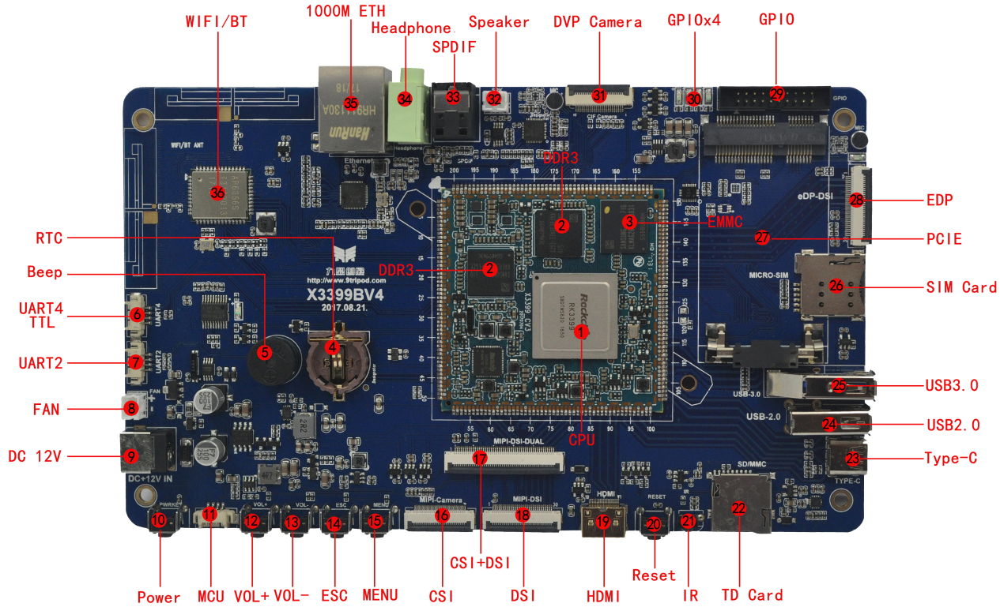

# 硬件资源

X3399V4 底板留有丰富外设，包含千兆以太网、CSI、DSI、HDMI、EDP、Type-C、USB 3.0、USB 2.0、音频光纤、红外接收、双 CSI、PCIe、SIM 卡、扬声器、耳机、TF 卡、RTC、蜂鸣器和 Wi-Fi/BT 等资源。

## 硬件接口介绍

| 标号 | 名称 | 说明 |
| --- | --- | --- |
| 【1】 | CPU | RK3399，A53,4*1.5GHz+A72,2*2GHz |
| 【2】 | DDR | K4E8E304EE-EGCF，LPDDR3，2GBytes或 / TM8G32MD4LSA1，LPDDR4，2GBytes |
| 【3】 | eMMC | KLMAG2GEND,16GB(4G,8G可选) |
| 【4】 | RTC | RTC电池座，CR1202 |
| 【5】 | BEEP | 蜂鸣器 |
| 【6】 | UART4 | UART4，TTL电平接口 |
| 【7】 | UART2 | 串口2，默认调试串口，TTL电平 |
| 【8】 | FAN | 散热风扇电源接口 |
| 【9】 | DC座 | 12V DC电源输入 |
| 【10】 | POWER | 电源按键 |
| 【11】 | BOOT | 单片机程序烧录接口 |
| 【12】 | 独立按键 | 音量加，在升级时用作Recovery键 |
| 【13】 | 独立按键 | 音量减 |
| 【14】 | 独立按键 | 返回键 |
| 【15】 | 独立按键 | 菜单键 |
| 【16】 | MIPI CSI | MIPI摄像头接口 |
| 【17】 | MIPI CSI+DSI | MIPI摄像头接口及DSI接口，可接双MIPI屏 |
| 【18】 | MIPI DSI | 接MIPI接口的屏 |
| 【19】 | HDMI | HDMI输出接口 |
| 【20】 | RESET | 复位按键 |
| 【21】 | 红外接收头 | HS0038红外一体化接收头 |
| 【22】 | TF卡 | TF卡座 |
| 【23】 | Type-C | Type-C接口，兼容OTG功能 |
| 【24】 | USB HOST | HOST 2.0接口 |
| 【25】 | USB HOST | HOST 3.0接口 |
| 【26】 | SIM卡槽 | 3G、4G手机卡槽 |
| 【27】 | PCIE接口 | 接3G、4G模块的PCIE接口 |
| 【28】 | EDP | EDP接口 |
| 【29】 | GPIO接口 | 扩展GPIO口 |
| 【30】 | LED灯 | 四路可编程LED灯 |
| 【31】 | 摄像头接口 | 标准 24PIN 并口摄像头接口 |
| 【32】 | 喇叭接口 | 外置双声道扬声器 |
| 【33】 | SPDIF | 光纤输出接口 |
| 【34】 | 耳机座 | 耳机输出 |
| 【35】 | 千兆网口 | RT8211E 接口 |
| 【36】 | Wi-Fi/BT | AP6356S Wi-Fi/BT二合一模块 |

