# 接口说明

## 电源开关和插座

X3399V4 采用 12V 直流电源供电，图中插座为 12V 直流电源输入插座。

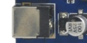

## 调试串口

X3399 预留一个 RS232 串口 UART2 用于调试，还有一个普通 TTL 电平串口 UART4。默认使用 UART2 作为调试串口，用户可以通过修改程序调整调试串口。

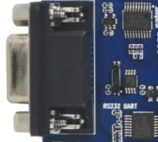

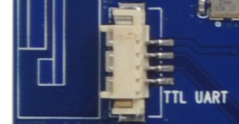

## HDMI 接口

开发板采用 Mini HDMI 接口，配合 Mini HDMI 延长线，可将音视频信号输出到支持 HDMI 2.0 的电视机、显示器等终端。

## Camera 接口

开发板提供 24PIN 并口摄像头接口、30PIN MIPI 摄像头接口和 50PIN CSI + DSI 接口。50PIN CSI + DSI 接口可同时接两路 MIPI 摄像头，并支持同时显示。

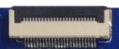

## 以太网接口

X3399 支持千兆有线以太网接口，板载 RTL8211E，用户可通过有线以太网连接网络。

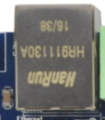

## 音频接口

开发板支持耳机输出、外置 2W 扬声器输出、录音输入和音频光纤输出。耳机接口可直接接耳机，也可送到功放输入；光纤接口可连接带光纤输入的高保真音箱。

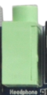

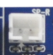

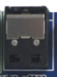

## TF 卡槽

X3399 引出一个外置 TF 卡接口，可用于 TF 卡升级或存放多媒体文件。

## 独立按键

X3399 共有六个按键，包括四个独立按键、一个 Power 键和一个 Reset 键。独立按键通过 ADC 采样获取键值。

| 开关 | 功能 |
| --- | --- |
| VOL+ | 音量加键 |
| VOL- | 音量减键 |
| ESC | 返回键 |
| MENU | 菜单键 |
| POWER | 电源键 |
| RESET | 复位键 |

## Type-C 接口

Type-C 接口兼容 OTG 功能，可用于程序烧写、同步，也支持更高速数据传输和显示相关扩展能力。

## USB HOST 接口

RK3399 自带两路 USB HOST 2.0 和两路 Type-C，其中一路 Type-C 在 X3399 上用作 USB 3.0。上图中上面的接口对应 USB 3.0，下面的接口对应 USB HOST 2.0；另一路 HOST 2.0 已引到 PCIe 卡槽，供 3G / 4G 模块使用。

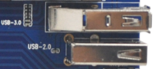

## Power、Reset 和 Recovery

接上外部电源适配器后，长按 Power 键开机；进入 Android 系统后轻触 Power 键休眠，再次按 Power 键唤醒，长按 Power 键出现关机界面。系统运行时轻按 Reset 键可硬复位。音量加按键在烧录时用作 Recovery 键。

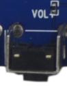

## LCD、双 MIPI 和 EDP

X3399 默认提供 30PIN DSI 接口，通过软排线连接 LCD 控制板。该 30PIN 接口第 12 脚为 PWM，用于背光亮度调节，同时引出电容触摸 I2C、中断和唤醒信号。开发板还预留双 MIPI 接口和 EDP 接口，可驱动更高分辨率屏幕。

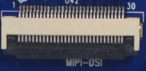

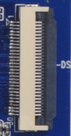

## 后备电池、蜂鸣器和红外

后备电池用于保证断电后 RTC 继续工作，蜂鸣器为有源蜂鸣器，可通过 PWM 控制，红外一体化接收头采用 HS0038B。

## SIM 卡和 Wi-Fi / Bluetooth

PCIe 座用于接 3G / 4G 通讯模块，使用时需在 SIM 卡槽插入对应手机卡。开发板标配 2.4G / 5G 双频 Wi-Fi 的 SDIO 接口 Wi-Fi / BT 模块。

