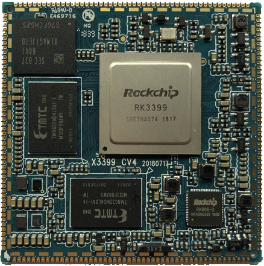
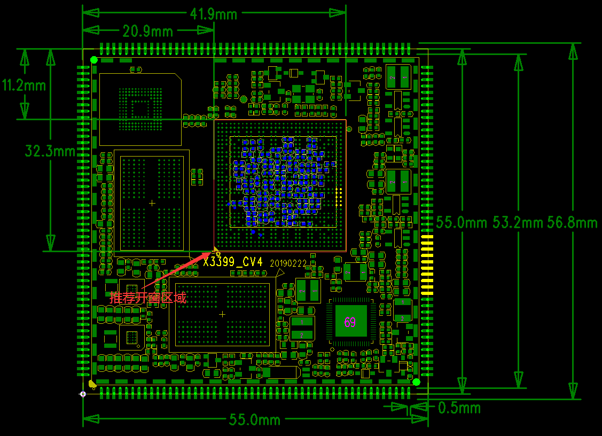

# 产品介绍

X3399V4 开发板基于 Rockchip RK3399 平台设计，由邮票孔核心板、底板和液晶板组成。RK3399 采用双 Cortex-A72 大核 + 四 Cortex-A53 小核架构，GPU 为四核 ARM Mali-T860，支持 Type-C、PCIe、双摄像头、LPDDR4 等特性，适合工业控制、广告机/一体机、金融 POS、车载终端、瘦客户机、视频会议、安防监控和 IoT 等领域。

## 功能特性

- 内核：ARM Cortex-A53 四核 + Cortex-A72 双核。
- 主频：1.4GHz × 4 + 2GHz × 2。
- 内存：2GB / 4GB LPDDR3 / LPDDR4。
- Flash：支持 4GB / 8GB / 16GB / 32GB / 64GB eMMC，标配 16GB eMMC。
- 一路 USB HOST 2.0、一路 USB HOST 3.0、一路 Type-C 接口，Type-C 兼容 OTG 功能。
- 一路 RS232 接口、一路 TTL 串口、一路 TF 卡接口。
- 四路独立按键、Power 键、Reset 键，支持软件开关机和休眠唤醒。
- 双声道外置扬声器、MIC 输入、耳机输出和音频光纤输出。
- 支持 HDMI、MIPI、EDP、双 MIPI 摄像头、并口摄像头、千兆以太网和 PCIe 模块。
- 板载 AP6354 / AP6356S Wi-Fi / BT，支持 G-sensor、陀螺仪、红外一体化接收头和 RTC。

## 规格概览

| 项目 | 参数 |
| --- | --- |
| SoC | Rockchip RK3399 |
| CPU | 四核 Cortex-A53 1.4GHz + 双核 Cortex-A72 2GHz |
| GPU | Mali-T860，支持 2D / 3D 图形加速 |
| 内存 | 2GB / 4GB LPDDR3 / LPDDR4 |
| 存储 | 4GB / 8GB / 16GB / 32GB / 64GB eMMC 可选，标配 16GB |
| 显示 | MIPI、EDP、HDMI，默认 7 寸 MIPI 屏，可选 7.9 寸 2K 屏 |
| 摄像头 | BT656 / BT601 并口摄像头，MIPI CSI 摄像头 |
| 网络 | 千兆以太网 RTL8211E，AP6354 / AP6356S Wi-Fi / BT |
| 电源 | 开发板 12V DC 输入；核心板主 3.3V/4.3A，副 3.3V/300mA，RTC 2.5V 到 3V |
| 核心板尺寸 | 55mm × 55mm × 3mm，200PIN 邮票孔 |

## 核心板特性

X3399CV4 核心板相对 X3399CV3 将 LPDDR3 调整为 LPDDR4，管脚完全兼容。针对 Android 7.0 及以上系统，代码完全兼容。手册中特别提示：Android 6.0 版本不支持 LPDDR4，使用 X3399CV4 核心板时需要注意系统版本。

### 系统配置

| CPU | RK3399 |
| --- | --- |
| 主频 | 四核A53(1.4GHz) + 双核A72(2GHz) |
| 内存 | 标配2GB，可定制4GB |
| 存储器 | 4GB/8GB/16GB eMMC可选，标配16GB |
| 电源IC | 使用RT808，支持动态调频等 |

### 接口参数

| LCD接口 | 同时支持MIPI、EDP、HDMI接口输出 |
| --- | --- |
| Touch接口 | 电容触摸，可使用USB或串口扩展电阻触摸 |
| 音频接口 | AC97/IIS接口，支持录放音 |
| SD卡接口 | 2路SDIO输出通道 |
| eMMC接口 | 板载eMMC接口，管脚不另外引出 |
| 以太网接口 | 支持千兆以太网 |
| USB HOST 2.0接口 | 2路HOST 2.0 |
| USB HOST 3.0接口 | 2路TYPE3.0 |
| UART接口 | 5路串口，支持带流控串口 |
| PWM接口 | 4路PWM输出 |
| IIC接口 | 7路IIC输出 |
| SPI接口 | 1路SPI输出 |
| ADC接口 | 1路ADC输出 |
| Camera接口 | 1路BT656/BT601，1路MIPI输出 |
| HDMI接口 | 高清音视频输出接口，音视频同步输出 |

### 电气特性

| 主3.3V输入电压 | 3.3V/4.3A(推荐使用3.3V/5A输入) |
| --- | --- |
| 副3.3V输入电压 | 3.3V/300mA(不能和主3.3V混用) |
| RTC输入电压 | 2.5到3V/5uA |
| 输出电压 | 1.8V(可用于底板供电，休眠后为0V) |
| 工作温度 | -40~80度 |
| 储存温度 | -10~50度 |

### 结构参数

| 外观 | 邮票孔方式 |
| --- | --- |
| 核心板尺寸 | 55mm*55mm*3mm |
| 引脚间距 | 1.0mm |
| 引脚焊盘尺寸 | 0.5mm*1.8mm，封装以中心对称 |
| 引脚数量 | 200PIN |
| 板层 | X339CV3：10层 X339CV4：8层 |
| 开窗区域 | 上图中红色部分为推荐底板封装开窗区域 |

## 核心板外观

## 软件资源

| system / driver | Linux4.4+ / Android6.0 | Linux4.4.52+Android7.1 | Linux4.4+ / Qt5.6 | Linux4.4.5+debian9 |
| --- | --- | --- | --- | --- |
| 四路可编程LED灯 | ● | ● | ● | ● |
| 7寸MIPI屏(1024*600) | ● | ● | ● | ● |
| MIPI屏(2048*1536) | ● | ● | ● | ● |
| EDP屏(2048*1536) | ● | ● | ● | ● |
| 背光驱动 | ● | ● | ● | ● |
| PMIC驱动(RK808) | ● | ● | ● | ● |
| 电容触摸 | ● | ● | ● | ● |
| eMMC驱动 | ● | ● | ● | ● |
| SD卡驱动 | ● | ● | ● | ● |
| 独立按键 | ● | ● | ● | ● |
| ADC驱动 | ● | ● | ● | ● |
| Gsensor | ● | ● | No need | No need |
| 陀螺仪 | ● | ● | No need | No need |
| 指南针 | ● | ● | No need | No need |
| 亮度传感器 | ● | ● | No need | No need |
| 蜂鸣器驱动 | ● | ● | ● | ● |
| 红外遥控 | ● | ● | ● | ● |
| 开关机 | ● | ● | ● | ● |
| 休眠唤醒 | ● | ● | ● | No need |
| USB HOST 2.0驱动 | ● | ● | ● | ● |
| USB HOST 3.0驱动 | ● | ● | ● | ● |
| Type-C(OTG)驱动 | ● | ● | ● | ● |
| 音频(RTL5651) | ● | ● | ● | ● |
| 录音(RTL5651) | ● | ● | No need | ● |
| 音频光纤输出 | ● | ● | ● | No need |
| 双频Wi-Fi/BT4.0 | ● | ● | ● | ● |
| 并口摄像头驱动 | ● | ● | No need | No need |
| CSI摄像头驱动 | ● | ● | Coming soon | No need |
| USB口摄像头驱动 | ● | ● | ● | ● |
| 串口 | ● | ● | ● | ● |
| HDMI2.0 | ● | ● | Coming soon | ● |
| 3G模块(3G dongle) | ● | ● | No need | No need |
| 4G模块(PCIE接口) | ● | ● | No need | No need |
| GPS模块 | ● | ● | ● | ● |
| 千兆以太网 | ● | ● | ● | ● |
| USB鼠标键盘 | ● | ● | ● | ● |
| U-Boot | ● | ● | ● | ● |
| SD卡脱机更新映像 | ● | ● | ● | ● |

## 版本信息

| 版本号 | 日期 | 作者 | 描述 |
| --- | --- | --- | --- |
| Rev.01 | 2017-1-22 | lqm | 原始版本 |
| Rev.02 | 2017-4-19 | lqm | 合并核心板和硬件手册 |
| Rev.03 | 2017-11-2 | lqm | 更新到v4版本，电源适配器输入由5V调整到12V |
| Rev.04 | 2018-11-9 | lqm | 核心板更新至LPDDR4 |
| Rev.04 | 2022-4-18 | 九鼎创展 | 堪误 |

