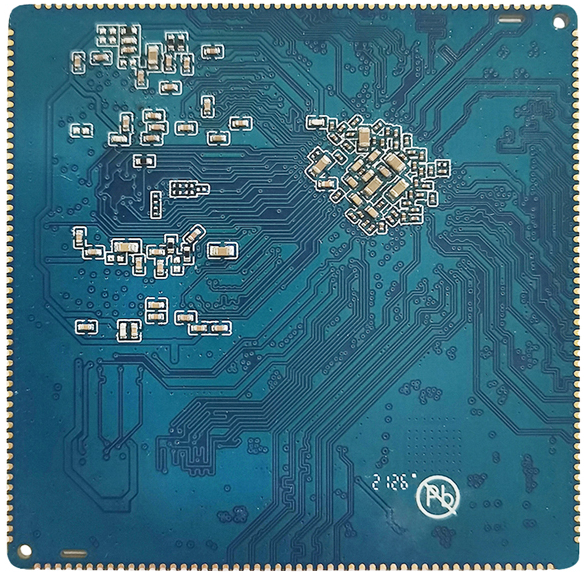

# 尺寸与规格

## 核心板外观

## 核心板结构图

## 结构参数

| 外观 | 邮票孔方式 |
| --- | --- |
| 核心板尺寸 | 55mm*55mm*3mm |
| 引脚间距 | 1.0mm |
| 引脚焊盘尺寸 | 1.3mm*0.5mm |
| 引脚数量 | 200PIN |
| 板层 | 8层 |
| 翘曲度 | 不超过0.5% |

## 关键规格汇总

| CPU | RK3566 |
| --- | --- |
| 主频 | 四核A55(1.8GHz) |
| 内存 | 标配2GB，硬件兼容4GB |
| 存储器 | 4GB/8GB/16GB eMMC可选，标配16GB |
| 电源IC | 使用RK817，支持适配器、电池供电 |

| LCD接口 | 支持DSI/LVDS/EDP/HDMI接口输出 |
| --- | --- |
| Touch接口 | 电容触摸 |
| 音频接口 | 支持耳机喇叭直接输出，支持录放音 |
| SD卡接口 | 2路SDIO输出通道 |
| eMMC接口 | 板载eMMC接口，管脚不另外引出 |
| 以太网接口 | 支持1路千兆以太网 |
| USB HOST2.0接口 | 2路HOST2.0 |
| USB HOST3.0接口 | 1路HOST3.0 |
| OTG接口 | 1路OTG接口 |
| UART接口 | 10路串口，支持带流控串口 |
| PWM接口 | 16路PWM输出 |
| IIC接口 | 6路IIC输出 |
| SPI接口 | 4路SPI输出 |
| ADC接口 | 2路ADC输出（有6路未引出） |
| Camera接口 | CSI/BT601/BT656/BT1120/RAW输入 |

| VBUS输入电压 | 5V/2A |
| --- | --- |
| VBAT输入电压 | 3.5到4.2V，典型值3.7V |
| 输出电压 | VCC5V_MIDU输出5V，可给底板供电 |
| 工作温度 | -10~70度 |
| 储存温度 | -10~40度 |

