# 接口说明

本页只说明主板外部接口的用途和连接注意事项，不重复完整引脚表。

## 电源开关和插座

x3568 采用 12V 直流电源供电。图中插座为 12V 直流电源输入插座，右侧红色 PH 座为备选 12V 电源输入，用户根据产品需求二选一供电即可。

## 调试串口

主板默认使用 UART2 作为调试串口，用户可以通过修改程序调整调试串口。

## HDMI 接口

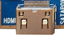

主板采用 miniHDMI 接口，配合 miniHDMI 延长线，可以将音视频信号输出到支持 HDMI2.0 的电视、显示器等终端。

## Camera 接口

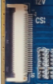

该接口为通用 30PIN 摄像头接口，支持 OV 系列摄像头。不同型号摄像头需要按照规格调整供电和驱动配置。

## 以太网接口

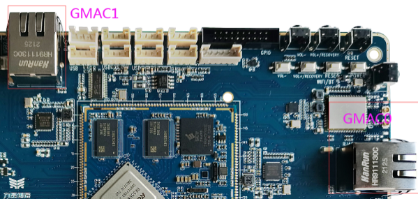

X3568V4 主板支持两路千兆有线以太网接口，以太网芯片由 RTL8211F 更新为 YT8521CA。

## 耳机接口

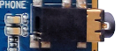

耳机接入该接口可实现耳机输出，也可送到功放输入。

## 喇叭接口

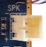

主板支持单路 2W 扬声器输出。

## 录音接口

主板支持录音输入，MIC 电路已在主板上实现。

## TF 卡槽

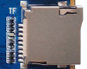

外置 TF 卡可用于固件升级或存放多媒体文件。

## 独立按键

X3568 共有 4 个按键，包括 2 个独立按键、1 个 PWRKEY 和 1 个复位键。独立按键通过 ADC 采样获取键值。

## USB OTG 接口

RK3568 的 OTG 接口和其中一路 USB3.0 接口复用，通过硬件拨码开关切换 Host / Device 功能。Device 模式可用于程序下载。

## HOST2.0 接口

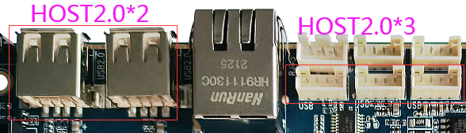

RK3568 自带两路标准 Type-A HOST2.0 接口，同时通过 PH 座引出 3 路 HOST2.0，便于 USB 外设扩展。

## HOST3.0 接口

RK3568 自带两路 HOST3.0 接口。右侧 HOST3.0 的 USB2.0 功能和 OTG 复用，需要根据拨码开关状态使用。

## 开机按钮

接上外部电源适配器后，长按 PWRKEY 开机。进入 Android 后，短按可休眠/唤醒，长按可弹出关机界面。

## 复位按钮

系统运行时轻按 RESET 键，主板会硬复位重启。

## Recovery 按钮

音量加按键在烧录时可作为 Recovery 键，刷机时按下该键进入 recovery / loader 相关模式。

## LCD 接口

RK3568 支持双路 DSI、LVDS、EDP 等显示接口。左侧为 DSI/LVDS 显示接口，通过程序切换；右侧为 DSI/EDP 显示接口，通过核心板 0R 电阻进行硬件分配。

## 后备电池

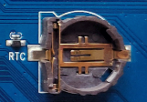

后备电池用于保证断电后 RTC 继续工作，确保系统时间不丢失。X3568 核心板带有外置 RTC 芯片，工作电流低于 0.6uA。

## 红外一体化接收头

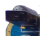

采用 HS0038B 一体化接收头，可用于红外遥控和机顶盒类应用。

## 光纤接口

主板声音可通过喇叭、耳机、HDMI 和光纤输出。光纤接口可连接带光纤输入的音箱或功放。

## WIFI 蓝牙模块

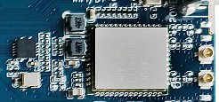

标配 2.4G / 5G 双频 WIFI6 的 SDIO 接口 WIFI/BT 模块，同时兼容 AP6398S、AP6375S 以及欧飞信双频 WIFI 模组。

## 串口

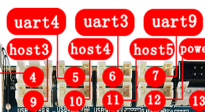

RK3568 自带 10 路串口。主板默认通过 PH 座预留 3 路 TTL 串口，分别对应 UART3、UART4、UART9；同时预留 UART2 调试串口。

## PCIE 接口

RK3568 相比 RK3288 增加 PCIE 总线，主板通过标准 PCIE 接口座预留，可外接标准 PCIE 设备。

## 预留 GPIO 接口

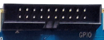

主板预留 GPIO 简牛座，用于 GPIO 扩展和常用控制类外设连接。

## 按键对应关系

| 开关 | 功能 |
| --- | --- |
| VOL+ | 音量加键 |
| VOL- | 音量减键 |
| PWRKEY | 电源键 |
| RESET | 复位键 |
