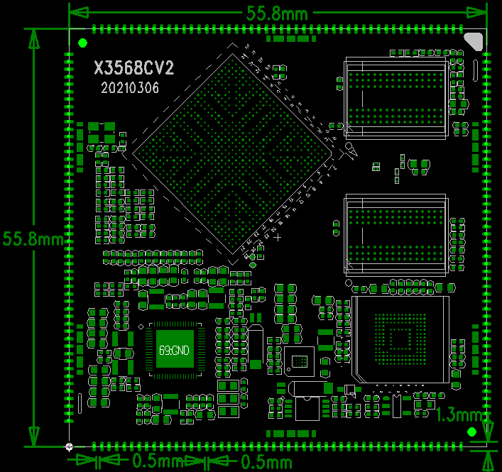

# 产品介绍

X3568V4 主板基于瑞芯微 RK3568 / RK3568B2 平台，核心板对应 X3568CV2 / X3568CV3。RK3568 采用 ARM Cortex-A55 四核架构，主频 2GHz，面向智能终端、工业控制、显示控制、多媒体设备和嵌入式系统开发等场景。

X3568 核心板有两个版本：X3568CV2 对应 DDR4 内存，X3568CV3 对应 LPDDR4 / LPDDR4X 内存。二者管脚、程序兼容。RK3568 芯片封装包含铝壳和塑胶封装两种形式，更新九鼎最新代码后可同时兼容。

## 功能特性

- 内核：ARM Cortex-A55 四核；
- 主频：2GHz × 4；
- 内存：1GB / 2GB / 4GB / 8GB DDR4 或 LPDDR4 / LPDDR4X，标配 2GB；
- Flash：支持 4GB / 8GB / 16GB / 32GB / 64GB / 128GB eMMC 可选，标配 16GB；
- 5 路 USB HOST2.0 接口，其中 2 路通过标准 Type-A USB 座引出，3 路通过 PH 座引出；
- 2 路 USB HOST3.0 接口；
- 1 路 Micro USB OTG 接口，和其中一路 USB3.0 接口复用；
- 4 路 TTL 串口接口，含 1 路调试串口；
- 1 路 TF 卡接口；
- 1 路 HDMI 输出接口；
- 1 路 SPDIF 光纤接口；
- 1 路 20 针 GPIO 扩展接口；
- 1 路 DSI 或 LVDS 显示接口，通过软件配置；
- 1 路 DSI 或 EDP 显示接口，通过核心板电阻配置；
- 1 路 SATA 接口；
- 支持双路千兆有线以太网、MIPI 摄像头、PCIE3.0、USB 鼠标键盘、RTC 和 WIFI/BT 模块。

## 核心板特性

- 最小尺寸 55mm × 55mm；
- 引出 200PIN 管脚；
- 使用 RK809 PMU，保证工作稳定可靠；
- X3568CV2 使用双通道 DDR4 设计，支持 1GB / 2GB / 4GB / 8GB；
- X3568CV3 使用 LPDDR4 / LPDDR4X 设计，支持 1GB / 2GB / 4GB / 8GB；
- DDR4 和 LPDDR4 / LPDDR4X 方案内存均可稳定工作在 1560MHz；
- 支持 Android / Linux / Ubuntu / Debian 操作系统；
- 支持双路千兆有线以太网；
- 经过高低温、反复重启等可靠性实验。

## 产品外观

## 核心板结构图

## 系统配置

| CPU | RK3568/RK3568B2 |
| --- | --- |
| 主频 | 四核A55(2GHz) |
| 内存 | 标配2GB，硬件兼容4GB，8GB |
| 存储器 | 4GB/8GB/16GB emmc可选，标配16GB |
| 电源IC | 使用RK809，支持动态调频等 |

## 接口参数

| LCD接口 | 支持DSI/LVDS/EDP/HDMI接口输出 |
| --- | --- |
| Touch接口 | 电容触摸 |
| 音频接口 | 支持耳机喇叭直接输出，支持录放音 |
| SD卡接口 | 2路SDIO输出通道 |
| emmc接口 | 板载emmc接口，管脚不另外引出 |
| 以太网接口 | 支持2路千兆以太网 |
| USB HOST2.0接口 | 2路HOST2.0 |
| USB HOST3.0接口 | 2路HOST3.0 |
| OTG接口 | 1路OTG接口（和其中一路USB3.0复用） |
| UART接口 | 10路串口，支持带流控串口 |
| PWM接口 | 16路PWM输出 |
| IIC接口 | 6路IIC输出 |
| SPI接口 | 4路SPI输出 |
| ADC接口 | 2路ADC输出（有6路未引出） |
| Camera接口 | CSI/BT601/BT656/BT1120/RAW输入 |

## 电气特性

| 3.3V输入电压 | 3.3V/2A |
| --- | --- |
| RTC输入电压 | 3V/0.6uA |
| 输出电压 | 3.3V/1.5A(可用于底板供电) |
| 工作温度 | -10~70度 |
| 储存温度 | -10~40度 |

## 结构参数

| 外观 | 邮票孔方式 |
| --- | --- |
| 核心板尺寸 | 55mm*55mm*3mm |
| 引脚间距 | 1.0mm |
| 引脚焊盘尺寸 | 1.3mm*0.5mm |
| 引脚数量 | 200PIN |
| 板层 | 8层 |
| 翘曲度 | 不超过0.5% |
