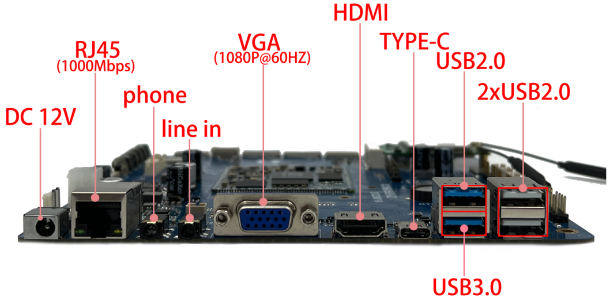

# 接口说明

本页按接口类型整理说明，便于现场接线、驱动调试和文档引用。

## Mini PCIe 接口

用于外扩 4G Wireless 无线通讯模块，配合 SIM 卡座使用。

## TF 卡

板载 TF 卡座，可用于外部存储或升级场景。

## 串口接口

UART6、UART4 为 RS485 电平接口，可配置成 TTL；UART3、UART0 为 RS232 电平接口；UART5、UART7 为 TTL；UART2 默认为调试串口。

## USB 接口

主板包含多路 USB HOST2.0、双层 USB HOST、USB HOST3.0 以及 Type-C 接口。Type-C 可用于程序下载等场景。

## 显示接口

支持 HDMI OUT、VGA、DSI0、DSI1 和 EDP。EDP 与 HDMI OUT 复用。

## 音频接口

包含 LINE IN、耳机座、MIC、外置双声道扬声器接口，并支持 HDMI 音频输出。

## 网络接口

GMAC 为千兆以太网接口，板载高速双频 Wi-Fi/BT 模块，并支持 mini PCIe 无线扩展。

## SATA 接口

提供 SATA 电源接口和 SATA 信号接口，可扩展 SATA SSD/HDD。

## 摄像头接口

MIPI CSI0、CSI1、CSI2 为摄像头接口，主板最大支持四路 CSI 摄像头。

## 按键与扩展信号

包含音量加/减、boot、复位、PWRKEY、开机、复位、程序更新和 GPIO 控制等扩展座。

## 电源接口

包含 DC 插座、12V IN、12V OUT 和风扇电源座。12V OUT 与风扇电源座支持 GPIO 控制。

## RTC

RTC 钮扣电池用于断电后保持系统时间。

