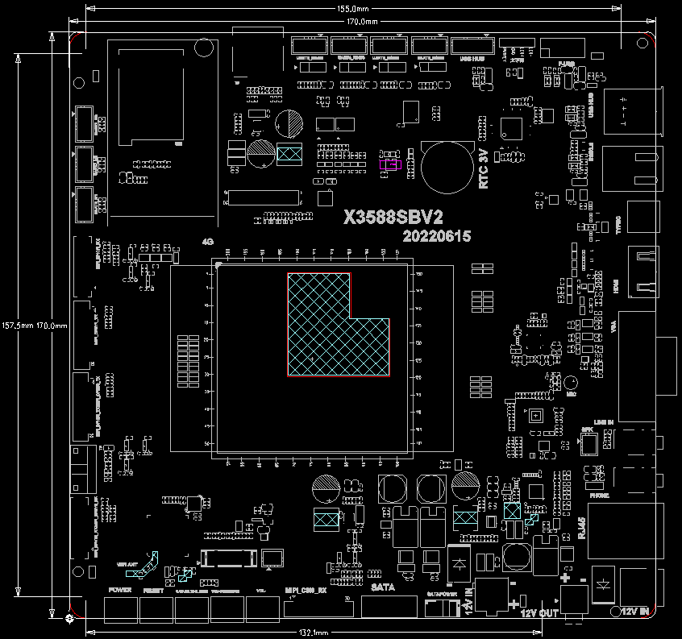

# 尺寸与规格

## 产品尺寸

X3588S mini ITX 主板采用标准 Mini-ITX 尺寸，规格参数表中标注为 17cm × 17cm，适配通用 ITX 电脑机箱。

## 规格参数

| SOC | RockChip RK3588S |
| --- | --- |
| CPU | 八核64位（4×Cortex-A76+4×Cortex-A55）, 8nm先进工艺，主频高达2.4GHz |
| GPU | ARM Mali-G610 MP4四核GPU支持 OpenGL ES3.2 / OpenCL 2.2 / Vulkan1.1, 450 GFLOPS |
| NPU | NPU算力高达6TOPS，支持 INT4/INT8/INT16 混合运算， / 可实现基于TensorFlow/MXNet/PyTorch/ Caffe等系列框架的网络模型转换 |
| ISP | 集成48MP ISP with HDR&3DNR |
| 编解码 | 视频解码： / 8K@60fps H.265/VP9/AVS2 / 8K@30fps H.264 AVC/MVC / 4K@60fps AV1 / 1080P@60fps MPEG-2/-1/VC-1/VP8 / 视频编码： / 8K@30fps编码，支持H.265 / H.264 / *最高可实现32路1080P@30fps解码和16 路1080P@30fps编码 |
| 内存 | 4GB/8GB/16GB 64bit LPDDR4/LPDDR4x/LPDDR5（最高可配 32GB） |
| 存储 | 16GB/32GB/64GB/128GB eMMC |
| 存储扩展 | 1 × 标准SATA3.0接口，可扩展标准SATA3.0 SSD/HDD硬盘 |
| 硬件参数 |  |
| 以太网 | 千兆以太网 |
| 无线网络 | 2.4G/5G双频WIFI，支持扩展4G无线模块 |
| 视频 | 1 × HDMI2.1（8K@60fps 或 4K@120fps） / 2 × MIPI-DSI（4K@60fps） / 1 × VGA 显示输出（1080P@60fps） |
| 音频 | 1 × Speaker 喇叭输出 / 1 × Phone 输出 / 1 × HDMI 音频输出 / 1 × Line-In 输入 / 1 × MIC 输入 |
| SATA | 1 × 标准 SATA3.0 接口 |
| USB | 1 × USB3.0 / 1 × TypeC（和VGA接口复用） / 6 × USB2.0（其中 3 个 USB2.0 由主板插针引出） |
| 电源 | 两种供电方式： / DC12V输入(DC5.5×2.1mm) / 机箱电源12V输入（标准 ATX 电源接口） |
| 其他接口 | 2×RS485 、2×RS232、2×UART、1×Debug、1×Fan |
| 系统软件 |  |
| 系统 | Android：Android 12.0 / Linux：Ubuntu、Debian11、Buildroot |
| 其他参数 |  |
| 尺寸 | 17cm×17cm（标准Mini-ITX），适配通用ITX 电脑机箱 |
| 重量 | 约200克 |
| 散热 | 散热器安装孔距：75mm*47mm |
| 功耗 | 待机功耗：约1.08W (12V/90mA) / 典型功耗：约3.24W (12V/270mA) / 最大功耗：约9.72W (12V/810mA) |
| 环境 | 工作温度：-10℃- 70℃ / 存储温度：-20℃- 70℃ / 存储湿度：10%～80 % |

