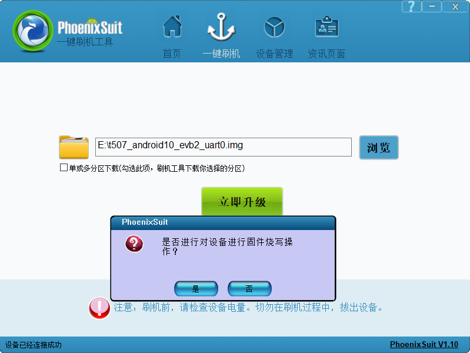
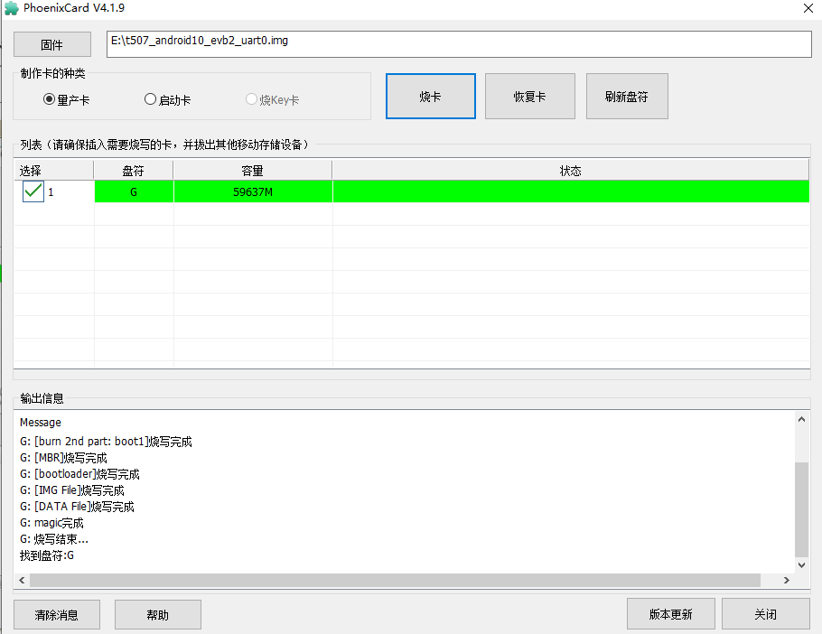

# Android编译与烧录

## 环境说明

原手册使用较老的Ubuntu示例。编译实际交付的Android 10 SDK时，应优先查看SDK中的README、编译脚本和容器/虚拟机要求。完整Android源码编译建议使用原生Linux主机，并预留足够内存和磁盘空间。

## 常用工具

```bash
sudo apt-get install git gnupg flex bison gperf build-essential zip curl   zlib1g-dev gcc-multilib g++-multilib libncurses5-dev libxml2-utils   xsltproc unzip lzop liblz4-tool device-tree-compiler u-boot-tools   libssl-dev adb fastboot
```

串口调试可使用：

```bash
sudo apt-get install picocom
sudo picocom -b 115200 /dev/ttyUSB0
```

## 获取源码

### 从压缩包恢复Git工作区

```bash
tar xjf x507_android10.tar.bz2
cd x507_android10
git checkout .
```

### 配置远程仓库

```bash
git remote add gitlab http://gitlab.com/9tripod/x507_android10.git
git pull gitlab
```

压缩包名和仓库地址可能随交付批次变化，应以当前资料包为准。

## 编译

必须使用普通用户权限编译，不要用root直接编译整个Android源码。

### 编译全部

```bash
./mk.sh -a
```

### 编译内核

```bash
./mk.sh -l
```

### 编译Android文件系统

```bash
./mk.sh -s
```

### 查看帮助

```bash
./mk.sh -h
```

原手册记录：`-a`等价于执行U-Boot、Kernel、System和Update镜像相关步骤。具体选项应以当前`mk.sh -h`输出为准。

## 主要镜像

| 镜像 | 说明 |
|---|---|
| MiniLoaderAll.bin / uboot.img / trust.img | 引导相关镜像 |
| kernel.img | Linux内核镜像 |
| resource.img | 设备树和启动资源 |
| boot.img | Android ramdisk和启动镜像 |
| system.img | Android system分区 |
| vendor.img | Android vendor分区 |
| recovery.img | Recovery模式镜像 |
| misc.img | 启动模式和Recovery参数 |
| oem.img | 厂商只读数据或应用 |
| update-android.img | 完整升级包 |

## PhoenixSuit USB烧录

1. 安装并启动PhoenixSuit。
2. 选择编译生成的完整IMG固件。
3. 关闭开发板电源并等待指示灯熄灭。
4. 按住FEL键，再重新上电；也可按住FEL后按Reset。
5. 工具提示强制格式化时，按项目需求确认。
6. 等待烧录完成，烧录过程中不要断开USB或电源。

### 设备与固件选择




### FEL位置


### 烧录进度



## PhoenixCard TF卡升级

1. 解压SDK工具目录中的PhoenixCard。
2. 插入TF卡并在PhoenixCard中选择完整固件。
3. 制作启动升级卡。
4. 断电后将升级卡插入开发板并重新上电。
5. 等待屏幕进度条和串口日志完成；完成后拔卡再上电。

