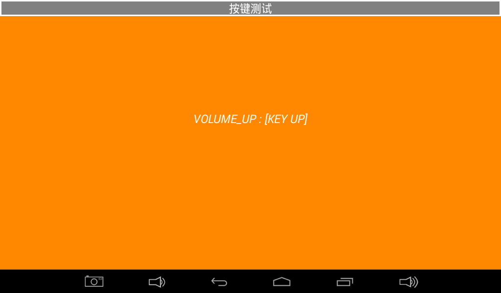
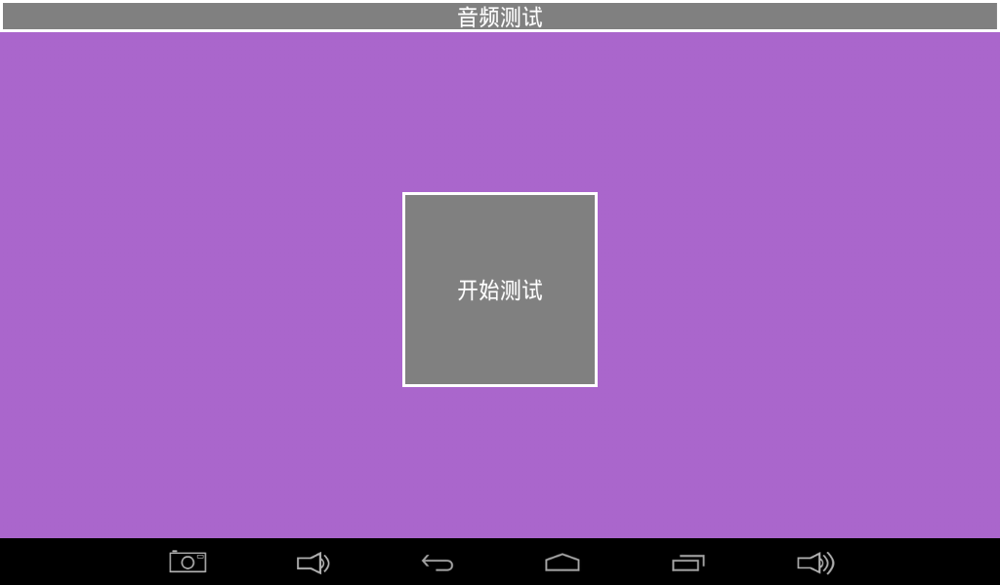
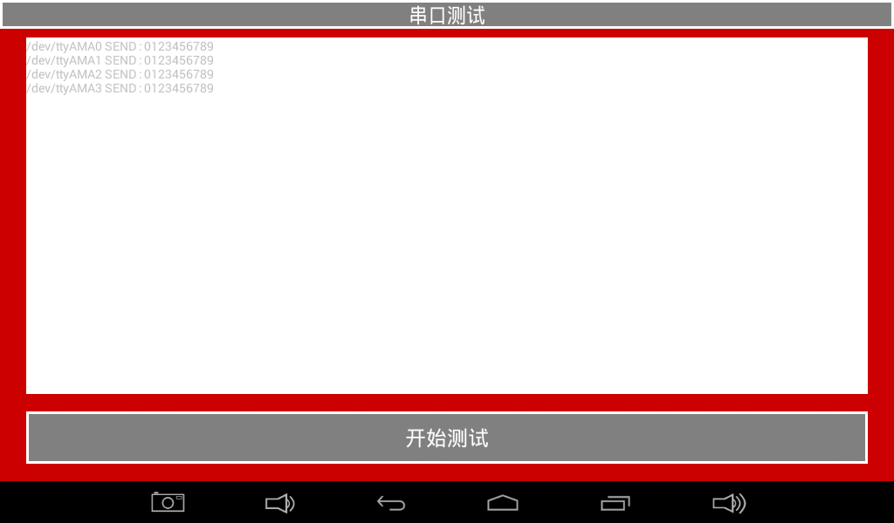
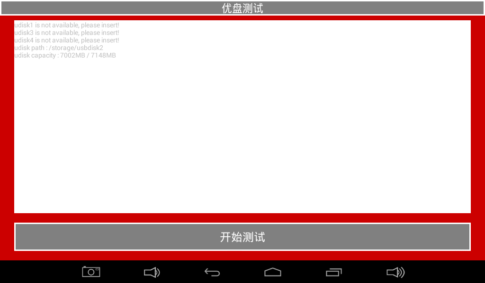

# Android测试与驱动

## 硬件测试程序

原手册提供了一套Android硬件测试应用，用于研发调试和量产检查。界面和具体项目会随固件版本变化。

### 液晶屏测试


点击纯色区域切换颜色，用于检查缺色、坏点和显示异常。

### 触摸屏测试


在屏幕上画线，量产时可通过对角线检查触摸连续性和边缘响应。

### LED测试


切换界面中的LED状态，观察开发板对应指示灯。

### 蜂鸣器测试


按住测试键时蜂鸣器发声，松开后停止。

### 背光测试


拖动滑块检查背光亮度变化是否平滑。

### 按键测试



按下和释放开发板按键，确认事件均被识别。

### 电池测试


显示连接电池时的电量和状态信息。

### ADC测试


观察ADC通道电压随外部输入或电位器变化。

### 重力传感器测试


旋转开发板并观察X、Y、Z轴数据变化。

### 音频测试



播放测试音，检查喇叭或耳机输出。

### 摄像头测试


安装摄像头后打开预览并检查画面。

### 无线网络测试


连接Wi-Fi后扫描附近无线网络。

### 网络连接测试


验证有线或无线网络是否能访问网页。

### 串口测试



短接待测串口TXD/RXD，执行自发自收测试。

### TF卡测试


插入TF卡后检查容量和读写信息。

### U盘测试



插入U盘后检查设备和存储信息。

## 驱动位置

| 功能 | 原手册给出的路径 | 说明 |
|---|---|---|
| G-sensor | `longan/kernel/linux-4.9/drivers/input/sensors/accel/lis3dh.c` | 还应检查设备树和sensor框架配置 |
| 电容触摸 | `longan/kernel/linux-4.9/drivers/input/touchscreen/gslx680new/` | 主要文件为`gslX680.c` |
| 显示 | `longan/kernel/linux-4.9/drivers/gpu/drm/` | 手册提到`panel/panel-simple.c`，实际还涉及DRM、TCON、PHY和设备树 |
| 按键 | `longan/kernel/linux-4.9/drivers/input/keyboard/adc-keys.c` | 需要配合设备树ADC键值 |
| Wi-Fi | `longan/kernel/linux-4.9/drivers/net/wireless/` | 具体目录取决于无线模组和SDK版本 |
| 摄像头 | 原手册写为Rockchip路径 | 与T507平台不一致，必须在当前Longan SDK中重新定位 |

## 常用proc和系统查询

```bash
cat /proc/cmdline
cat /proc/cpuinfo
cat /proc/meminfo
cat /proc/partitions
cat /proc/version
cat /proc/net/dev
dmesg
```

不要把手册中的示例输出当作固定值。CPU型号、分区、内存和命令行都应以当前设备实测为准。

## init.rc修改

永久修改应在源码树中修改对应的`init*.rc`，重新编译相关镜像并烧录。临时拆包`boot.img`时，必须使用与当前Android版本和镜像格式匹配的工具。

## 资料勘误

- 手册中的临时`ramdisk.sh`脚本包含`out/target/product/rk3288`路径，明显不是T507路径。
- 手册中的U-Boot/Kernel LOGO说明基于Rockchip方案，不能直接用于全志T507。
- `/proc/cmdline`示例包含`rk30board`，仅是遗留示例。
- 摄像头驱动路径写为`hardware/rockchip/...`，与Longan/T507不一致。

这些内容在实际项目中都应通过源码搜索和编译脚本重新确认。
