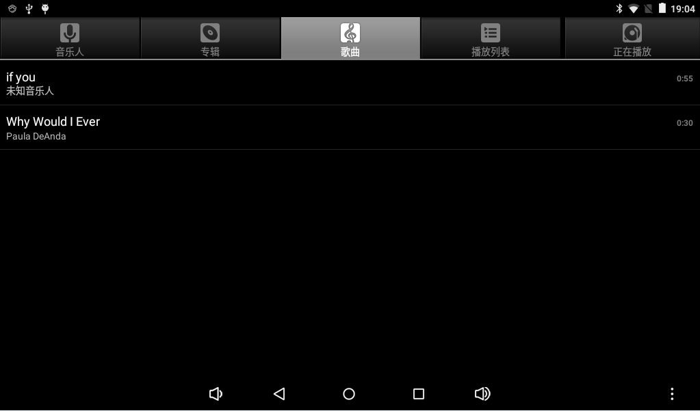
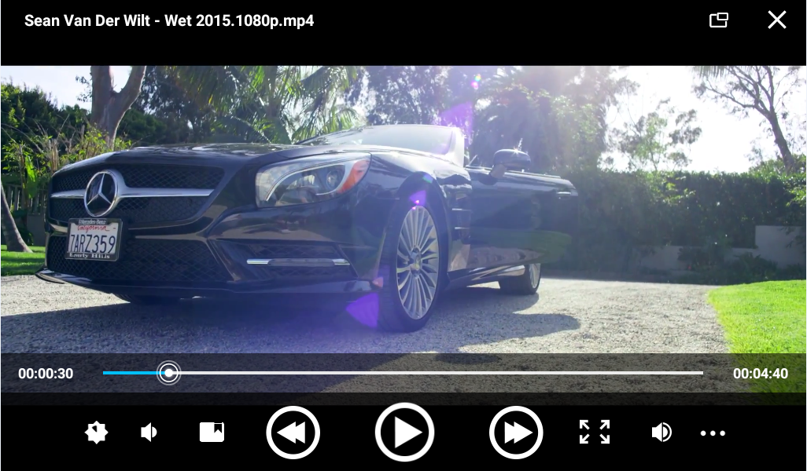

# Android使用指南

## 调试终端

连接UART0调试串口，设置115200 8N1且关闭硬件/软件流控。进入Android后可从串口获取系统日志和Shell。


ADB常用命令：

```bash
adb devices
adb shell
adb push local-file /data/local/tmp/
adb pull /data/local/tmp/remote-file .
```

## 音频播放

将音频文件放到TF卡或U盘中，系统媒体扫描完成后可在音乐应用中播放。



## 视频播放

图库会扫描外部存储中的视频和图片。




## Wi-Fi

进入“设置 → 网络和互联网 → Wi-Fi”，打开Wi-Fi，选择SSID并输入密码。


## Bluetooth

进入“设置 → 已连接的设备 → Bluetooth”，搜索并配对手机、音箱或其他设备。


## USB鼠标和键盘

将USB鼠标、键盘或无线接收器连接到USB Host接口，Android会自动识别标准HID设备。

## TF卡和U盘

Android通常将可移动存储自动挂载到`/storage/`下。可使用以下命令确认：

```bash
adb shell ls -l /storage
adb shell df -h
```


## 屏幕旋转

板载重力传感器可提供方向变化。最终是否旋转还取决于系统自动旋转开关和应用是否允许旋转。

## 摄像头

打开相机应用可进行预览、拍照和录像。摄像头模组必须与当前设备树、驱动、电源和时序配置匹配。


## 有线以太网

连接可用网线后，Android通常通过DHCP获取地址。可使用以下命令排查：

```bash
adb shell ip addr show eth0
adb shell ip route
adb shell ping -c 4 8.8.8.8
```


## HDMI显示

HDMI可输出图像和音频。手册描述支持1080p和更高分辨率，但实际模式取决于当前固件、显示器EDID和显示驱动。


## 开关机与休眠

- 接入12V电源后，板卡可按当前PMU配置自动启动或通过Power键启动。
- 长按Power键可调出关机菜单。
- 短按Power键进入休眠，再次短按唤醒。


