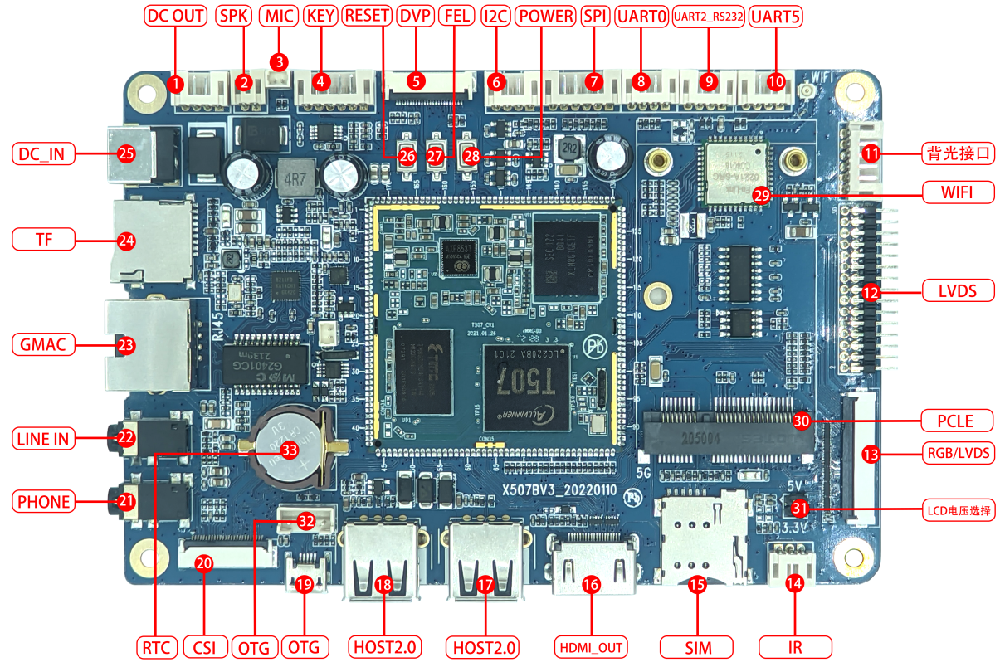

# 硬件资源

## 接口布局

## 接口编号

| 标号 | 名称 | 说明 |
| --- | --- | --- |
| 【1】 | DC OUT | 12V、5V DC电源输出 |
| 【2】 | 喇叭接口 | 外置扬声器接口 |
| 【3】 | 录音接口 | 麦克风扩展接口 |
| 【4】 | 按键座 | 6PIN PH座，引出开关机，复位，升级等按键 |
| 【5】 | 摄像头接口 | 标准 24PIN 并口摄相头接口 |
| 【6】 | I2C1 | I2C接口 |
| 【7】 | SPI | SPI接口 |
| 【8】 | UART0 | UART0，TTL电平接口，调试串口 |
| 【9】 | UART2 | 串口接口，可通过电阻配置成TTL或RS232 |
| 【10】 | UART5 | 串口接口，可通过电阻配置成TTL或RS232 |
| 【11】 | 背光接口 | 外接屏幕背光 |
| 【12】 | LVDS接口 | 外接LVDS接口液晶屏 |
| 【13】 | LCD接口 | 接RGB或LVDS接口的屏 |
| 【14】 | IR | 红外一体化接收头 |
| 【15】 | SIM卡槽 | 3G、4G手机卡槽 |
| 【16】 | HDMI | HDMI输出接口 |
| 【17】 | USB HOST | HOST2.0接口 |
| 【18】 | USB HOST | HOST2.0接口 |
| 【19】 | OTG | 程序烧录接口 |
| 【20】 | MIPI CSI | MIPI摄像头接口 |
| 【21】 | 耳机座 | 耳机输出 |
| 【22】 | LINE IN | 音频输入接口 |
| 【23】 | 千兆网口 | RT8211F 接口 |
| 【24】 | TF卡 | TF卡座 |
| 【25】 | DC座 | 12V DC电源输入 |
| 【26】 | 复位按键 | RESET |
| 【27】 | 独立按键 | FEL按键，升级时使用 |
| 【28】 | 开关机按键 | PWRKEY |
| 【29】 | WIFI/BT | WIFI/BT二合一模块 |
| 【30】 | PCIE接口 | PCIE接口，4G通信模块扩展 |
| 【31】 | 跳线座 | LCD电压选择跳线座 |
| 【32】 | OTG | 程序烧录接口 |
| 【33】 | RTC | RTC电池座，CR1202 |

## 关键资源分组

### 显示与触摸

- RGB/LVDS复用LCD接口。
- 独立LVDS接口和背光接口。
- I2C电容触摸接口。
- Type-A HDMI输出。

### 摄像头

- 24PIN并行摄像头接口。
- 26PIN MIPI CSI摄像头接口。

### 网络与无线

- RTL8211F千兆以太网PHY。
- SDIO双频Wi-Fi/Bluetooth模块。
- PCIe扩展接口和SIM卡槽，可连接4G通信模块。

### 调试与升级

- UART0为TTL调试串口。
- UART2和UART5可通过电阻配置为TTL或RS-232电平。
- Micro USB OTG用于固件烧录。
- FEL键用于进入全志USB升级模式。
