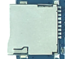
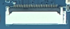
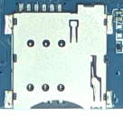
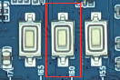
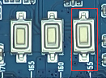
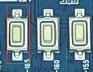
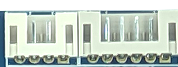
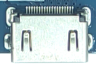
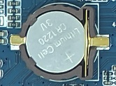

# 接口详解

## 电源输入

开发板使用12V直流电源输入。硬件手册标配清单为12V/2A适配器。

## 千兆以太网

板载RTL8211F千兆以太网PHY。连接网线后可由Android或Linux网络栈配置。

## TF卡槽

提供一路TF卡槽，用于扩展存储或文件交换。

## 并行摄像头

24PIN并行摄像头接口。不同摄像头模组的供电电压需要通过主板LDO配置确认。

## MIPI CSI摄像头

26PIN MIPI CSI接口，用于差分摄像头模组。

## SIM卡与PCIe 4G扩展

SIM卡槽配合PCIe 4G通信模块使用。SIM卡本身不是独立通信接口。

## FEL升级键

按住FEL键并复位或重新上电，可进入全志USB升级模式。

## 开关机键

用于开机、Android休眠/唤醒和软件关机操作。

## 复位键

系统运行时按下复位键执行硬件复位。

## 按键扩展座

6PIN PH座引出开机、复位和升级等按键信号。

## 串口座

UART0为TTL调试串口；UART2和UART5可通过电阻配置成TTL或RS-232。

## I2C与SPI座

提供I2C和SPI扩展信号。具体复用和电压域应核对原理图。

## LCD与背光

从上到下为背光、LVDS和LVDS/RGB显示连接器。

## HDMI

Type-A HDMI输出，用于外接显示器或电视。

## USB

两路USB Host 2.0 Type-A接口和一路Micro USB OTG接口。

## RTC电池

后备电池用于断电后保持RTC时钟。

## Wi-Fi/Bluetooth

板载2.4GHz/5GHz双频Wi-Fi和Bluetooth二合一模块。
