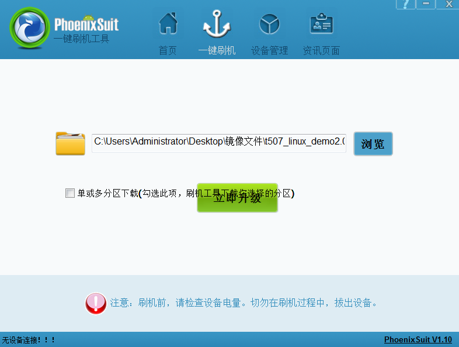
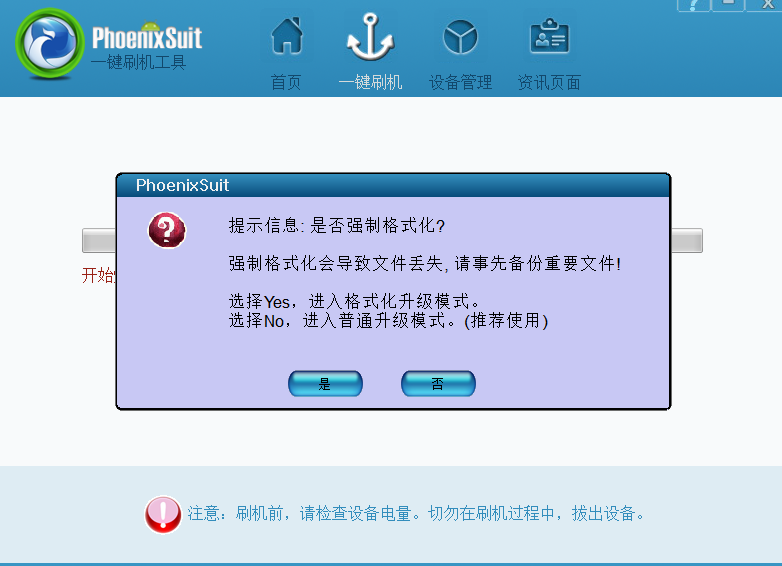
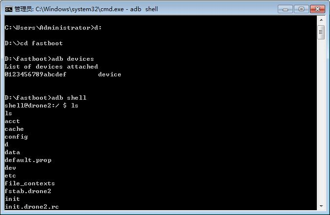

# Linux编译与烧录

## 开发主机

原手册同时介绍VMware和原生Ubuntu。完整SDK编译更建议使用原生Ubuntu或经过验证的容器环境。不要机械照搬手册中的Ubuntu 14.04/16.04配置，应先查看当前SDK README。

## 串口工具

```bash
sudo apt-get install picocom
sudo picocom -b 115200 /dev/ttyUSB0
```

退出picocom：先按`Ctrl+A`，再按`Ctrl+Q`。

也可使用minicom：

```bash
sudo apt-get install minicom
sudo minicom -s
```

配置为115200 8N1，并关闭软硬件流控。

## 编译依赖

手册给出的依赖可整理为：

```bash
sudo apt-get install git-core gnupg flex bison gperf build-essential zip curl   zlib1g-dev gcc-multilib g++-multilib genromfs libc6-dev-i386   libncurses5-dev libx11-dev ccache libgl1-mesa-dev libxml2-utils   xsltproc unzip lzop liblz4-tool genext2fs make device-tree-compiler   u-boot-tools libssl-dev autoconf python3-pyelftools libusb-1.0-0-dev   p7zip-full adb fastboot
```

包名会随Ubuntu版本变化，缺失包应按APT提示替换。

## 交叉编译器

工具链已集成到源码包，手册列出的路径包括：

```text
prebuilts/gcc/linux-x86/aarch64/gcc-linaro-6.3.1-2017.05-x86_64_aarch64-linux-gnu/
prebuilts/gcc/linux-x86/aarch64/aarch64-linux-android-4.9/
```

实际使用的`CROSS_COMPILE`应从当前Makefile和编译脚本确认。

## 获取Linux源码

```bash
tar -xvf x507_linux.tar.bz2
cd x507_linux
git checkout .
```

源码压缩包名称和获取地址可能随交付版本变化。

## SDK目录

手册中的示例目录：

```text
brandy  build  buildroot  build.sh  device  doc  kernel  out  platform  test  tools
```

## 查看编译帮助

```bash
./build.sh -h
```

## 编译

### U-Boot

```bash
./build.sh uboot
```

### 默认编译

```bash
./build.sh
```

### Buildroot文件系统

```bash
./build.sh buildroot
```

### 打包固件

```bash
./build.sh pack
```

最终输出位置以当前编译脚本打印为准，通常位于`out/`相关目录。

## PhoenixSuit烧录

1. 在Windows安装PhoenixSuit和全志USB驱动。
2. 选择`./build.sh pack`生成的完整IMG固件。
3. 不要在设备尚未进入升级模式时直接点击升级。
4. 按住FEL/RECOVERY键，连接Micro USB OTG并接通12V电源；必要时按Reset。
5. 工具识别设备后确认格式化和烧录。





## ADB和串口检查

若Linux镜像启用了ADB，可检查：

```bash
adb devices
adb shell
```




串口终端应设置为115200 8N1，无流控。


