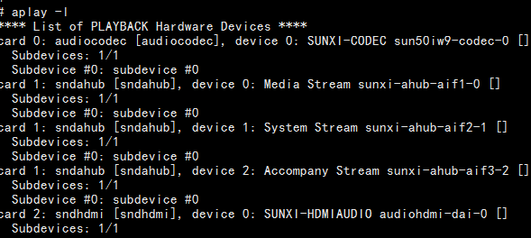

# Linux功能示例

## TF卡

插卡后先查看内核日志和块设备：

```bash
dmesg | tail -n 50
lsblk
```

手册示例中TF卡节点为`/dev/mmcblk1p1`。实际节点应以`lsblk`结果为准：

```bash
mkdir -p /mnt/tf
mount /dev/mmcblk1p1 /mnt/tf
ls -la /mnt/tf
```


## 音频播放

先列出声卡和PCM设备：

```bash
aplay -l
aplay -L
```

播放WAV文件：

```bash
aplay /mnt/tf/test.wav
```



## U盘

```bash
dmesg | tail -n 50
lsblk
mkdir -p /mnt/usb
mount /dev/sda1 /mnt/usb
ls -la /mnt/usb
```

手册中的`/dev/sda4`只是某次分区示例，不是固定节点。


## 有线以太网

连接网线后检查链路和地址：

```bash
ip link show eth0
ip addr show eth0
ip route
ethtool eth0
ping -c 4 192.168.1.1
```

若系统没有`ip`命令，可临时使用`ifconfig`和`route -n`。


## 常见排查顺序

1. `dmesg`确认驱动是否probe成功。
2. 检查设备节点和sysfs节点是否存在。
3. 检查电源、时钟、复位和pinmux。
4. 再检查用户态挂载、网络配置或音频路由。
