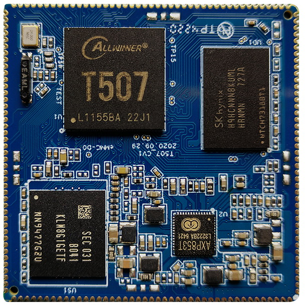
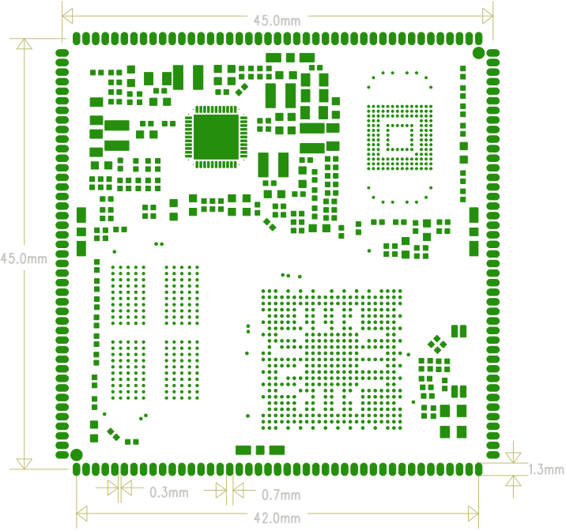

# 产品介绍

## 产品概述

X507开发板基于全志T507处理器，采用四核Cortex-A53架构，主频1.5GHz。开发板板载X507CV1核心板，支持Android和Linux，可用于工业控制、商业显示、多媒体终端、网络设备和嵌入式人机交互。

## 开发板功能特性

- 1GB或2GB LPDDR4，硬件手册标配1GB。
- 4GB、8GB、16GB、32GB或64GB eMMC，硬件手册标配8GB。
- 2路板载USB Host 2.0和1路Micro USB OTG。
- TTL串口、TF卡、复位键、开关机键和FEL升级键。
- 喇叭、麦克风、耳机和Line In音频接口。
- RGB/LVDS显示、背光调节和电容触摸。
- 双频Wi-Fi/Bluetooth模块。
- RTC、千兆以太网、MIPI CSI、并行摄像头和PCIe扩展。

## X507CV1核心板

### 核心板正面

### 核心板背面

### 结构尺寸

## 系统配置

| 项目 | 参数 |
| --- | --- |
| CPU | T507 |
| 主频 | 四核A53(1.5GHz) |
| 内存 | 标配1GB，硬件兼容2GB |
| 存储器 | 4GB/8GB/16GB emmc可选，标配8GB |
| 电源IC | 使用AXP853T，支持动态调频等 |

## 接口参数

| 接口 | 参数 |
| --- | --- |
| LCD接口 | 支持RGB/LVDS接口输出 |
| Touch接口 | 电容触摸 |
| 音频接口 | 支持耳机喇叭直接输出，支持录放音 |
| SD卡接口 | 2路SDIO输出通道 |
| emmc接口 | 板载emmc接口，管脚不另外引出 |
| 以太网接口 | 支持千兆以太网 |
| USB HOST2.0接口 | 3路HOST2.0 |
| OTG接口 | 1路OTG接口 |
| UART接口 | 6路串口，支持带流控串口 |
| PWM接口 | 6路PWM输出 |
| IIC接口 | 6路IIC输出 |
| SPI接口 | 2路SPI输出 |
| ADC接口 | 5路ADC输出 |
| Camera接口 | 1路MIPI输入，1路BT656输入 |

## 电气特性

| 项目 | 参数 |
| --- | --- |
| 5V输入电压 | 5V/2A |
| RTC输入电压 | 3V/0.6uA |
| 输出电压 | 3.3V/1.5A(可用于底板供电) |
| 工作温度 | -40~85度 |
| 储存温度 | -10~40度 |

## 结构参数

| 项目 | 参数 |
| --- | --- |
| 外观 | 邮票孔方式 |
| 核心板尺寸 | 45mm*45mm*3mm |
| 引脚间距 | 1.0mm |
| 引脚焊盘尺寸 | 1.3mm*0.7mm |
| 引脚数量 | 172PIN |
| 板层 | 8层 |

## 软件资源状态

下表按原硬件手册整理。`●`表示手册中已经支持，`即将支持`表示该版本资料尚未给出完成状态。

| 驱动/功能 | Linux 4.9 + Android 10 | Linux 4.9 + Qt |
| --- | --- | --- |
| system driver | linux4.9+ android10.0 | linux4.9+QT |
| 7寸RGB屏(1024*600) | ● | 即将支持 |
| 背光驱动 | ● | 即将支持 |
| PMIC驱动(AXP853T) | ● | 即将支持 |
| 电容触摸 | ● | 即将支持 |
| EMMC驱动 | ● | 即将支持 |
| SD卡驱动 | ● | 即将支持 |
| 独立按键 | ● | 即将支持 |
| ADC驱动 | ● | 即将支持 |
| 开关机 | ● | 即将支持 |
| 休眠唤醒 | ● | 即将支持 |
| 两路USB HOST2.0驱动 | ● | 即将支持 |
| 一路OTG驱动 | ● | 即将支持 |
| 音频 | ● | 即将支持 |
| 录音 | ● | 即将支持 |
| 双频WIFI/BT4.0 | ● | 即将支持 |
| CSI摄相头驱动 | 即将支持 | 即将支持 |
| USB口摄相头驱动 | ● | 即将支持 |
| 串口 | ● | 即将支持 |
| HDMI2.0 | ● | 即将支持 |
| 千兆以太网 | ● | 即将支持 |
| USB鼠标键盘 | ● | 即将支持 |
| uboot | ● | 即将支持 |

## 资料版本提示

- 硬件手册版本为Rev.02，更新到X507BV3底板。
- Linux手册主要描述Linux 4.9/Buildroot流程。
- Android手册主要描述Android 10/Longan流程。
- 实际SDK目录、模块型号和编译脚本可能随交付批次变化，应以当前SDK为准。
