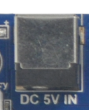
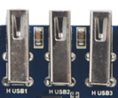
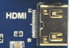
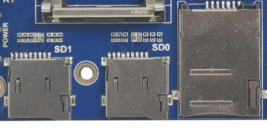
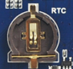
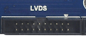
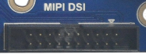

# 接口说明

## 电源输入与电池

开发板提供 DC 5V 输入、电池接口和 RTC 后备电池座。硬件接口图中 DC 5V 输入位于左上角，电池接口位于左侧，RTC 电池座位于核心板左下区域。

## 显示接口

开发板提供 LCD/VGA、LVDS、MIPI DSI 和 mini HDMI。RGB/LVDS/MIPI 可用于不同屏模组，HDMI 用于外接显示器。

## 摄像头接口

开发板同时提供并口 Camera、MIPI CSI 和相关摄像头扩展接口，可覆盖常见 DVP 与 MIPI 摄像头应用。

## USB 接口

开发板提供 3 路 USB HOST 和 1 路 USB OTG。OTG 可用于系统下载、调试或外设模式，HOST 可连接鼠标、键盘、U 盘、USB Wi-Fi/BT、USB 3G 等设备。

## 串口与调试

板上有 UART0、UART1、UART2、UART3、UART4 等接口，其中包含调试串口、RS232 串口和 TTL 串口资源。

## 网络与通信扩展

板载千兆以太网 RTL8211E，同时提供 PCIe 接口、SIM 卡槽，可扩展 3G/4G 通信模块。

## 音频

右侧提供耳机、喇叭、MIC 接口，用于音频播放、录音和测试。

## 按键、LED、蜂鸣器、红外

开发板左侧包含返回、音量加、音量减、菜单、电源、复位等按键，板上还有蜂鸣器、四路 LED 和红外一体化接收头。

## 接口局部图

