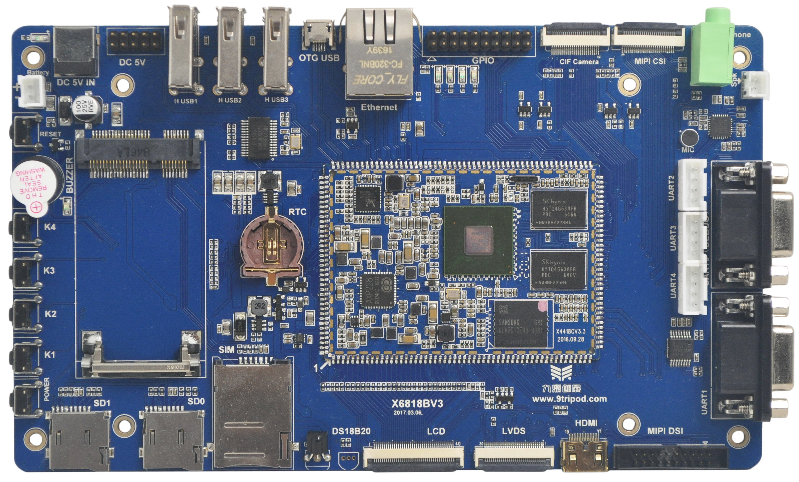

# 产品介绍

X6818 开发板采用三星 S5P6818 处理器，CPU 为 64 位 ARM Cortex-A53 八核架构，最高主频 1.4GHz。开发板由邮票孔核心板、底板和液晶板组成，面向工控、电力、通讯、医疗、媒体、安防、车载、金融、消费电子、手持设备、游戏机、显示控制、教学仪器、POS、广告机、多媒体终端等场景。

X6818 是 X4418 的升级版本，核心从 Cortex-A9 四核升级为 Cortex-A53 八核，并向下兼容 X4418CV3 核心板。硬件手册说明，S5P6818 与 S5P4418 在生产工艺、二级缓存、管脚定义等方面保持一致，主要差异在 CPU 内核和以太网能力。

## S5P4418 与 S5P6818 对比

|  | S5P4418 | S5P6818 |
| --- | --- | --- |
| 上市时间 | 2014年10月 | 2014年 |
| 工艺制程 | 28nm | 28nm |
| CPU主频 | 1.4G | 1.4G+ |
| 封装尺寸 | 0.65mm引脚间距，17*17mm2 513-FCBGA封装 | 0.65mm引脚间距，17*17mm2 513-FCBGA封装 |
| CPU架构 | Cortex-A9四核 | Cortex-A53八核 |
| 缓存容量 | 32KB*4 I/D缓存，1MB二级缓存 | 32KB*4 I/D缓存，1MB二级缓存 |
| DDR3接口 | 单通道32位数据总线，高达800MHz工作频率 | 单通道32位数据总线，高达800MHz工作频率 |
| 多媒体解码 | H.263，H.264，MPEG1，MPEG2，MPEG4，VC1，VP8，Theora，AVS，RV8/9/10，MJPEG(几乎全格式) | H.263，H.264，MPEG1，MPEG2，MPEG4，VC1，VP8，Theora，AVS，RV8/9/10，MJPEG(几乎全格式) |
| 多媒体编码 | H.263，H.264，MPEG4，MJPEG | H.263，H.264，MPEG4，MJPEG |
| 显示接口 | RGB，MIPI，LVDS | RGB，MIPI，LVDS |
| 最大显示分辨率 | 2048*1280 | 2048*1280 |
| 以太网接口 | 需通过地址总线扩展 | 集成千兆以太网控制器 |
| GPIO电平 | 3.3V | 3.3V |
| ADC | 8路12 bit 0~1.8V | 8路12 bit 0~1.8V |
| USB接口 | 1路HOST，1路HSIC，1路OTG | 1路HOST，1路HSIC，1路OTG |
| 芯片ID | 支持128BIT唯一ID号 | 支持128BIT唯一ID号 |

## 产品功能特性

- ARM Cortex-A53 八核，主频 1.4GHz × 8。
- 1GB DDR3，可定制 2GB DDR3。
- 标配 8GB eMMC，支持 4GB / 8GB / 16GB / 32GB eMMC 可选。
- 24 位 RGB、8 位 LVDS、MIPI DSI、mini HDMI 显示接口。
- 3 路 USB HOST 与 1 路 USB OTG。
- 2 路 RS232 UART、3 路 TTL UART。
- 2 路 TF 卡接口，4 路 LED 指示，独立按键、复位键和软件开关机键。
- 标配外置扬声器、MIC 输入和耳机输出。
- PCIe 接口，可扩展 3G/4G 模块。
- 支持背光无级调节和 5 点电容触摸。
- 支持 USB Wi-Fi/BT、G-sensor、红外一体化接收头。
- 支持 MPEG4、H.263、H.264、MJPEG 视频编码，支持几乎全格式视频解码。
- 支持 2D / 3D 高性能图形加速。
- 支持 RTC 时钟实时保存。
- 支持千兆以太网 RTL8211E。
- 支持 BT656、BT601、MIPI 摄像头接口。
- 支持 GPS、GPRS、USB 3G、USB 鼠标和键盘。

## 系统配置与接口参数

| 项目 | 参数 |
| --- | --- |
| CPU | S5P6818，ARM Cortex-A53 八核，1.4GHz × 8 |
| 内存 | 1GB DDR3，支持定制 2GB DDR3 |
| 存储 | 标配 8GB eMMC，支持 4GB / 8GB / 16GB / 32GB eMMC 可选 |
| 电源管理 | AXP228 PMU |
| 显示 | 24 位 RGB、8 位 LVDS、MIPI DSI、mini HDMI，最大显示分辨率 2048 × 1280 |
| 触摸 | 支持 5 点电容触摸 |
| USB | 3 路 USB HOST，1 路 USB OTG |
| 串口 | 2 路 RS232 UART，3 路 TTL UART，调试串口独立 |
| 网络 | 千兆以太网 RTL8211E，支持外置 USB 3G 模块、PCIe 3G/4G 模块 |
| 摄像头 | 支持 BT656 / BT601 / MIPI 摄像头接口 |
| 音频 | 外置扬声器、MIC 输入、耳机输出 |
| 扩展 | PCIe、SPI、I2C、UART、ADC、GPIO、GPS、GPRS 等扩展资源 |
| 其他 | RTC、G-sensor、红外一体化接收头、蜂鸣器、按键、LED |

## 尺寸

- X6818 核心板尺寸：48mm × 68mm。
- X6818 底板尺寸：185mm × 110mm。

## 软件支持范围

X6818 文档包含 Android 平台用户手册和 Linux 平台用户手册。Android 文档覆盖开发环境、源码安装、编译、烧录、系统功能使用、测试程序、内核驱动和项目实战；Linux 文档覆盖 VMware/Ubuntu 环境、Linux + Qt 编译、烧录、Qt 文件系统、Qt 测试、Linux 底层开发、ramdisk、Linux 应用开发和 Ubuntu 12.04 体验。
