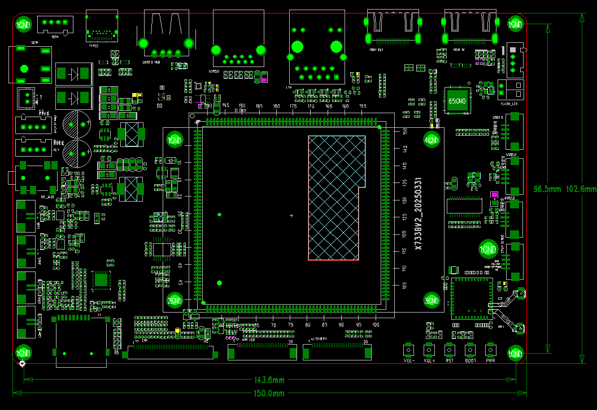
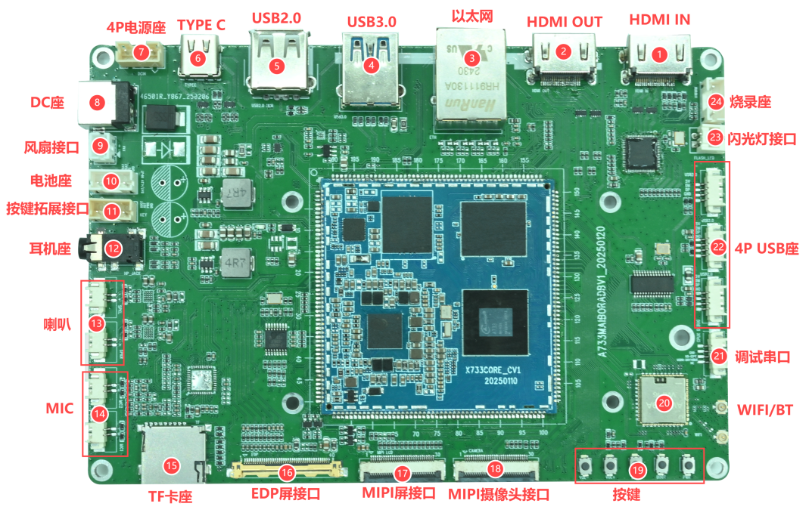
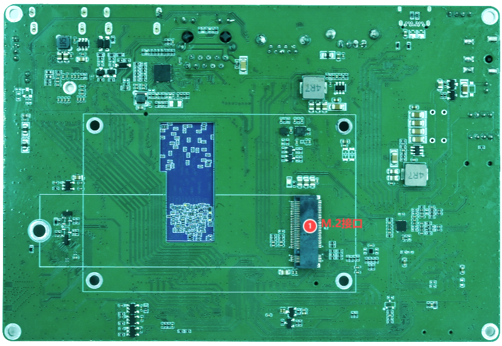

# 硬件资源

## 开发板规格

| 项目 | 规格 |
|---|---|
| 开发板型号 | X733BV2 |
| 处理器 | 全志 A733，Cortex-A76 + Cortex-A55 |
| 主频 | 最高约 2 GHz |
| 内存 | 2 GB / 4 GB / 8 GB |
| eMMC | 4 GB / 8 GB / 16 GB / 32 GB / 64 GB |
| PMIC | AXP318W |
| 输入电源 | DC 12 V，建议 3 A；另有电池接口 |
| 尺寸 | 150 mm × 102 mm × 1.6 mm |
| 工作温度 | 0～70 ℃ |
| 存储温度 | -10～50 ℃ |

## 接口资源

| 类别 | 资源 |
|---|---|
| 显示 | HDMI OUT ×1、MIPI DSI ×1、eDP ×1 |
| 视频输入 | HDMI IN ×1，经 LT6911C 转换为 MIPI CSI |
| 摄像头 | 4-Lane MIPI CSI ×1 |
| 触摸 | 显示连接器引出 I2C、INT、RST 信号 |
| 网络 | RTL8211F 千兆以太网 ×1 |
| USB | USB 3.0 Host ×1、USB 2.0 Host ×4、Type-C OTG ×1 |
| 存储 | 板载 eMMC、TF 卡、M.2 扩展 |
| 音频 | MIC ×2、双声道扬声器、耳机 |
| 调试 | UART0 调试串口、BOOT/RST/PWRON 按键 |
| 其他 | 电池座、12 V 风扇、闪光灯接口、按键扩展接口 |
| 无线 | AW869A，Wi-Fi 6、Bluetooth 5.2 |

## 正反面接口分布

接口编号和详细定义见[接口详解](./x733-interface-details.md)。
