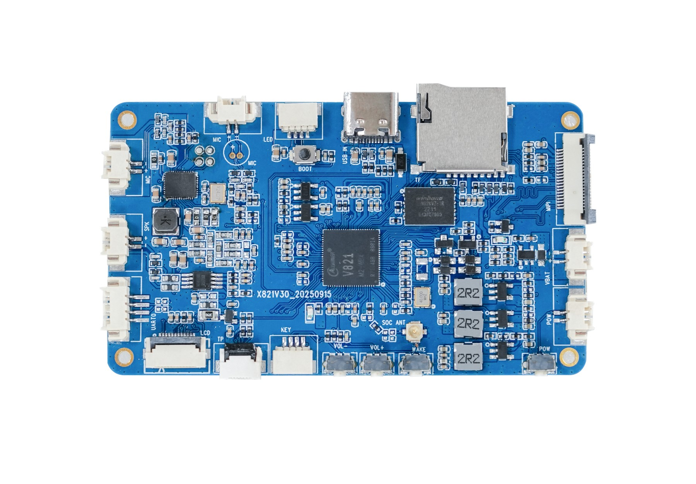

# X821主板

X821V30是一款基于全志V821双RISC-V SoC的AI智能体主板。板载64MB DDR2、128MB Flash、2.4GHz Wi-Fi、BLE、音频、MIPI CSI、SPI LCD和触摸接口，软件平台为Linux 5.4/Tina Linux 5.0。

## 文档导航

### 硬件

- [产品介绍](./x821-product-introduction)
- [硬件资源](./x821-hardware-resources)
- [接口定义](./x821-interface-definition)
- [配置清单](./x821-configuration-list)

### Linux与SDK

- [开发环境搭建](./x821-linux-platform-setup)
- [SDK结构与编译环境](./x821-sdk-overview-environment)
- [编译与烧录](./x821-build-flash)
- [核心配置文件](./x821-sdk-core-config)
- [Quick Config与系统优化](./x821-quick-config-optimization)
- [工具链与应用开发](./x821-toolchain-app-development)
- [Camera与LCD显示](./x821-camera-display)
- [U-Boot LOGO与SPI LCD](./x821-uboot-spi-lcd)
- [LVGL与G2D](./x821-lvgl-g2d)
- [多媒体MPP](./x821-mpp)
- [常用系统模块](./x821-system-modules)
- [RTOS小核与AMP](./x821-rtos-amp)
- [Linux驱动与项目实战](./x821-linux-driver-projects)
- [FAQ](./x821-faq)
