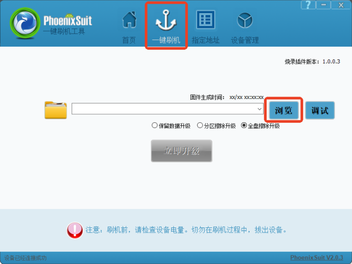
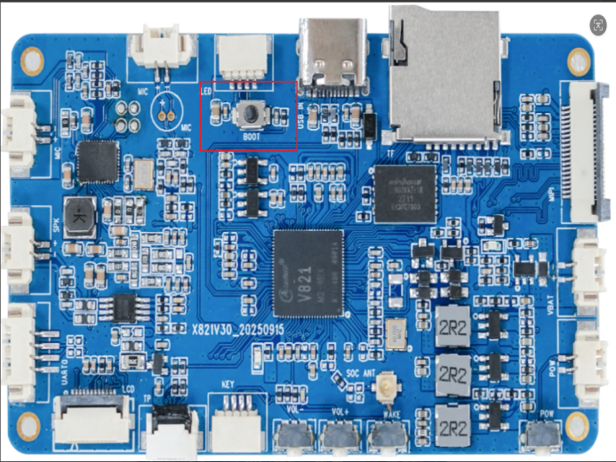
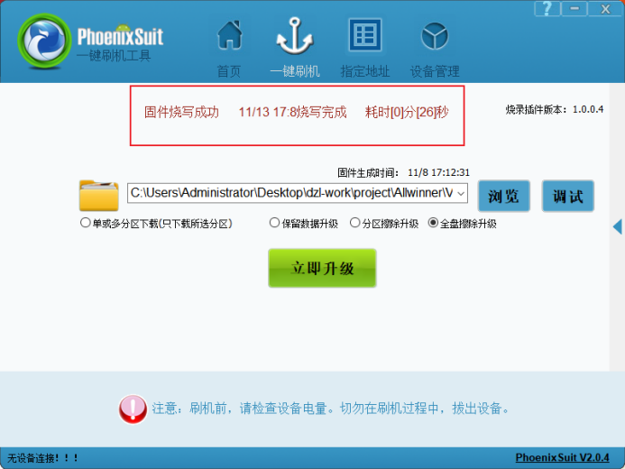

# 编译与烧录

## 解压与检查

```bash
tar -xzvf v821.tar.gz
cd v821-tina
ls
tree -L 1
cat README.txt
```

压缩包名和目录名以实际交付文件为准。

## 选择方案并编译

```bash
source build/envsetup.sh
lunch
# 选择v821-aitoy-tina或交付方指定方案

m -j4
# 或 make -j4
```

首次选择方案时可能要求等待并输入`Y`接受免责声明。也可使用`mp`执行编译加打包。

## 打包

```bash
pack
```

成功后会在`out/`下生成类似文件：

```text
out/v821_linux_aitoy_uart0.img
```


## PhoenixSuit烧录

1. Windows安装全志USB烧录驱动和PhoenixSuit。
2. 打开“一键刷机”，选择生成的`.img`固件。
3. 选择全盘擦除升级。
4. 设备断电，按住BOOT键。
5. 通过Type-C连接PC并给设备上电。
6. 工具识别设备后松开BOOT键，等待进度完成。







## 常见失败点

- Windows设备管理器中仍显示未知设备：重新指定`UsbDriver`目录安装驱动。
- 固件无法打包：检查分区大小，可使用`auto_update_partition`。
- 板子不进入烧录模式：确认按住的是BOOT键，Type-C线支持数据传输，并检查供电。
- 烧录后不启动：核对lunch方案、存储介质和分区表是否与硬件一致。
