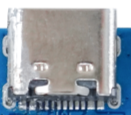
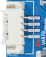
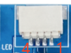
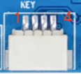
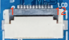
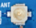

# 接口定义

## 电源与按键

### 开机接口

| 引脚 | 信号 |
| --- | --- |
| 1 | POWER-ON |
| 2 | GND |

### 板载开机按键

| 引脚 | 信号 |
| --- | --- |
| 1 | POWER-ON |
| 2 | GND |
| 3 | GND |

### 电池接口

| 引脚 | 信号 |
| --- | --- |
| 1 | GND |
| 2 | VBAT_3V7 |

## USB Type-C

Type-C接口用于充电、整板供电、固件下载和ADB调试。USB高速差分信号按标准Type-C座内部定义使用，开发时一般不需要从外部线束单独引出。

## UART0调试串口

| 引脚 | 信号 |
| --- | --- |
| 1 | NC |
| 2 | UART0-TX |
| 3 | UART0-RX |
| 4 | GND |

UART为3.3V TTL电平，不能直接连接RS-232电平接口。

## 音频

### 喇叭接口

| 引脚 | 信号 |
| --- | --- |
| 1 | SPK- |
| 2 | SPK+ |

### MIC接口

| 引脚 | 信号 |
| --- | --- |
| 1 | MICP |
| 2 | MICN |

## LED接口

| 引脚 | 信号 |
| --- | --- |
| 1 | GND |
| 2 | L-LEDB |
| 3 | L-LEDA |
| 4 | VBAT_3V7 |

## 触摸接口

| 引脚 | 信号 |
| --- | --- |
| 1 | VCC-3V3 |
| 2 | TP-INT |
| 3 | TP-RST |
| 4 | TWI1-SCK |
| 5 | TWI1-SDA |
| 6 | GND |

## KEY接口

| 引脚 | 信号 |
| --- | --- |
| 1 | GND |
| 2 | VOL+ |
| 3 | VOL- |
| 4 | WAKE |

## LCD接口

| 引脚 | 信号 | 引脚 | 信号 |
| --- | --- | --- | --- |
| 1 | GND | 7 | LCD-RST |
| 2 | LCD-K | 8 | SDA |
| 3 | VCC-3V3 | 9 | SCL |
| 4 | VCC-3V3 | 10 | RS |
| 5 | VCC-3V3 | 11 | CS |
| 6 | NC | 12 | GND |

该接口用于SPI LCD。`SDA/SCL`在本接口语境中是显示控制信号名称，具体是SPI/DBI还是辅助总线应以对应屏驱动和原理图为准。

## 摄像头接口

| 引脚 | 信号 | 引脚 | 信号 |
| --- | --- | --- | --- |
| 1 | MIPI-CSI-D0P | 11 | GND |
| 2 | MIPI-CSI-D0N | 12 | TWI0-SCK |
| 3 | GND | 13 | TWI0-SDA |
| 4 | MIPI-CSI-D1P | 14 | MIPI-CSI-RSTN0 |
| 5 | MIPI-CSI-D1N | 15 | GND |
| 6 | GND | 16 | LDOB-2V8 |
| 7 | MIPI-CSI-CKP | 17 | LDOB-2V8 |
| 8 | MIPI-CSI-CKN | 18 | VCC-1V8 |
| 9 | GND | 19 | VCC-1V2 |
| 10 | MIPI-CSI-MCLK0 | 20 | NC |

## Wi-Fi和TF卡

X821板载2.4GHz单频Wi-Fi，外接天线通过板载射频座连接。

TF卡可作为启动介质或普通存储介质，切换启动介质时还需同步修改SDK中的存储、分区和启动配置。
