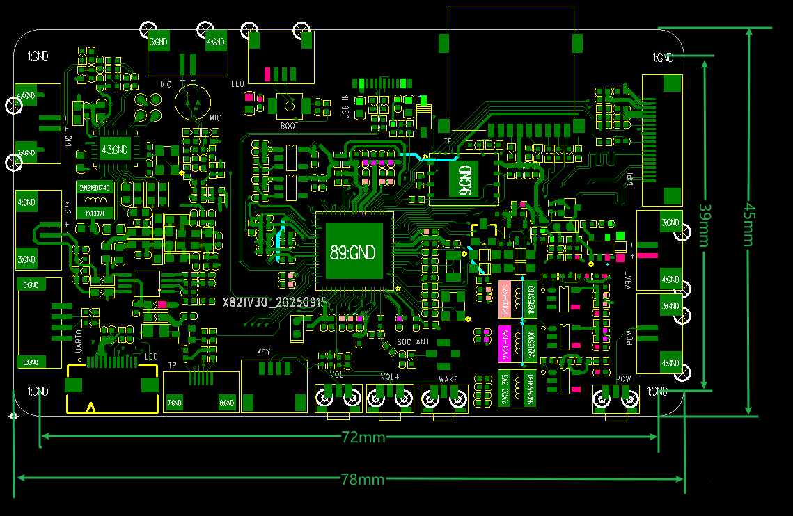

# 产品介绍

## 产品概述

X821V30基于全志V821系列SoC，面向AI智能体、AI玩具、智能门锁、低功耗门铃、IPC及多目网络摄像机等场景。V821内部包含Linux大核与RISC-V MCU小核，集成ISP、H.264/JPEG编解码、Wi-Fi、LDO、IR-CUT驱动和Audio Codec等模块。

## 主要特性

| 项目 | 参数 |
| --- | --- |
| 主控 | V821M2-WBX |
| Linux CPU | RISC-V，最高1GHz |
| MCU | RISC-V MCU，最高600MHz |
| 内存 | 内置64MB DDR2 |
| 存储 | 外挂128MB Flash |
| 视频编码 | H.264 BP/MP/HP；JPEG最高8192×8192 |
| 视频解码 | JPEG最高8192×8192 |
| ISP | 离线3264×2448；在线1920×1920 |
| 摄像头 | 默认资料支持GC2083，1路MIPI CSI |
| 音频 | 1路DAC、1路ADC；双MIC；8Ω/3W喇叭 |
| 无线 | 2.4GHz 1T1R Wi-Fi，BLE |
| 显示 | SPI LCD，推荐2.0英寸240×320屏 |
| 触摸 | I2C电容触摸接口 |
| 扩展存储 | TF卡 |
| 配网 | Wi-Fi、摄像头二维码、声波；蓝牙配网按软件版本确认 |
| AI模型 | 涂鸦、小智等方案 |

## 机械与环境参数

| 项目 | 参数 |
| --- | --- |
| 主板尺寸 | 78mm × 45mm × 1.0mm |
| 工作温度 | 0°C～70°C |
| 存储温度 | -10°C～50°C |

## 软件资源

| 项目 | 说明 |
| --- | --- |
| 操作系统 | Linux |
| 内核 | Linux 5.4 |
| SDK | Tina Linux 5.0/V821 SDK |
| 异构能力 | Linux大核 + RISC-V MCU小核，支持AMP协同 |
