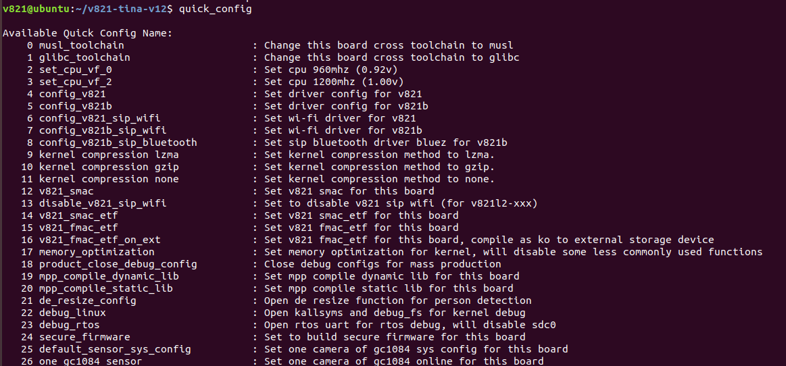

# Quick Config与系统优化

## 使用quick_config

```bash
source build/envsetup.sh
lunch
quick_config
```



`quick_config`会直接修改内核defconfig、Tina defconfig、`board.dts`、`uboot-board.dts`、分区和环境文件。执行前先提交Git或创建临时分支；部分条目是单向修改，没有自动恢复命令。


## 配置覆盖顺序

典型顺序由低到高：

```text
default/quick_config.json
default/quick_config/sensor.json
default/quick_config/storage_change.json
aitoy/quick_config.json
```

同名key由后加载的板级配置覆盖。JSON末项不能保留多余逗号。

## 存储介质切换

| 条目 | 功能 |
| --- | --- |
| `change_to_emmc` | 切换到eMMC启动 |
| `change_to_sdcard` | 切换到SD Card/SD NAND |
| `change_to_nand` | 切换到SPI NAND |

执行后重新编译和打包：

```bash
m -j4
pack
```

## 工具链切换

根文件系统默认使用musl，也可切换glibc。切换前执行：

```bash
make distclean
quick_config
# select musl_toolchain or glibc_toolchain
```

Linux内核工具链不随rootfs工具链一起切换。

## 自动分区优化

```bash
auto_update_partition
```

该命令根据已打包镜像大小调整分区，适合处理`amp_rv0.fex size too large`、rootfs增大和默认分区浪费。默认选择64KB对齐；只有明确启用了SPI NOR 4KB擦除模式时才选4KB。

## 摄像头切换

常用条目包括：

- `one_gc2083_sensor`
- `one_gc1084_sensor`
- `one_sc2336_sensor`
- `dual_gc2083_sensor`
- `three_gc2083_sensor(soft_tdm_mode)`
- 各类`2in1`离线/在线模式

配置双目或三目时还需检查I2C地址、MIPI/DVP通道、供电、MCLK和ISP pipeline，不是只切换驱动名。

## 调试配置

- `debug_linux`：开启BOOT0、内核符号、DEBUG_FS、SLUB调试和早期串口。
- `debug_rtos`：开启小核多控制台日志，可能关闭与RTOS UART冲突的大核SDC0。

量产固件应关闭不需要的调试选项，避免增加内存和启动时间。

## 内存优化

内存优化条目会缩小日志缓冲、关闭CGROUP、FTRACE、部分文件系统、IPv6及无用驱动。V821只有64MB DDR2，关闭功能前必须确认产品实际依赖。

使用`ramparser`分析：

```bash
ramparser -a
ramparser -p <pid>
ramparser -r
```

## CPU主频

- VF0：默认约0.92V/960MHz，可根据24MHz或40MHz晶振配置1000/1008MHz频点。
- VF2：默认约1.0V/1200MHz。

提高主频前先验证供电、温升、长期稳定性和晶振条件。修改频点后应执行压力测试和反复冷启动。

## 串口波特率

调试串口涉及BOOT0、U-Boot、内核cmdline和设备树多个阶段。修改时必须保持各阶段一致，否则会出现前段正常、后段乱码的现象。
