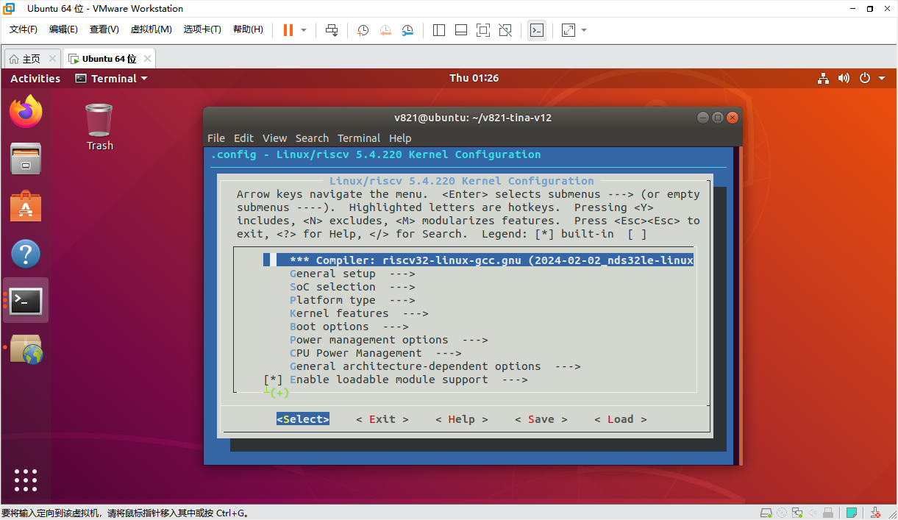

# 核心配置文件

## Kconfig入口

```bash
make kernel_menuconfig   # Linux内核
make menuconfig          # Tina/OpenWrt软件包
mrtos menuconfig         # RISC-V MCU RTOS
```




常用配置文件：

```text
device/config/chips/v821/configs/aitoy/linux-5.4-ansc/bsp_defconfig
openwrt/target/v821/v821-aitoy/defconfig
rtos/lichee/rtos/projects/v821_e907/aitoy/defconfig
```

## 设备树

```text
bsp/configs/linux-5.4-ansc/sun300iw1p1.dtsi
    SoC公共资源

device/config/chips/v821/configs/aitoy/linux-5.4-ansc/board.dts
    具体板级资源，开发时优先修改

device/config/chips/v821/configs/aitoy/uboot-board.dts
    U-Boot板级显示、存储等配置
```

方案`board.dts`会覆盖公共dtsi中的同名属性。避免直接修改公共dtsi，否则会影响其他板级。

## 分区表

- SPI NOR：`sys_partition_nor.fex`
- SPI NAND/eMMC/SD：`sys_partition.fex`

```ini
[partition]
name         = rootfs
size         = 20480
downloadfile = "rootfs.fex"
user_type    = 0x8000
```

`size`通常以扇区或KB规则解释，必须按介质擦除块对齐。SPI NOR常用64KB对齐；SPI NAND需结合物理擦除块和UBI逻辑擦除块计算。

## env.cfg与sys_config.fex

```text
device/config/chips/v821/configs/default/env.cfg
device/config/chips/v821/configs/aitoy/env.cfg
device/config/chips/v821/configs/aitoy/sys_config.fex
```

`env.cfg`管理启动等待、控制台、打印等级等；快起方案可能不使用该文件。`sys_config.fex`主要服务BOOT0，优先级高于U-Boot设备树中的冲突配置。

BOOT0 UART示例：

```ini
[uart_para]
uart_debug_port = 0
uart_debug_tx = port:PD22<3><1><default><default>
uart_debug_rx = port:PD23<3><1><default><default>

[platform]
debug_mode = 8
```

`debug_mode=0`关闭BOOT0打印，`8`打开完整打印。

## 根文件系统

默认只读根文件系统为SquashFS，也可切换EROFS：

```bash
make menuconfig
# CONFIG_TARGET_ROOTFS_EROFS=y
# disable TARGET_ROOTFS_SQUASHFS

make kernel_menuconfig
# CONFIG_EROFS_FS=y
```

可写数据通常通过`rootfs_data`作为overlay上层：SPI NOR使用JFFS2，eMMC方案常用ext4。没有挂载SD卡时，应用不要持续向`/mnt/extsd`写大文件，否则可能写满overlay。
