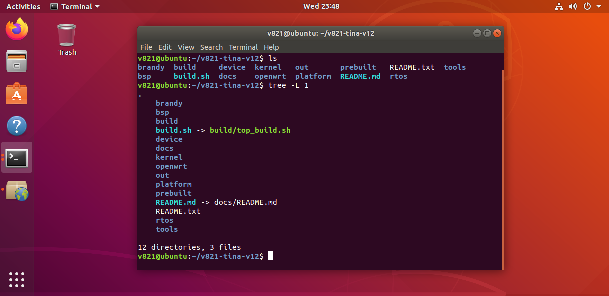

# SDK结构与编译环境

## SDK目录

Tina Linux 5.0的常用目录如下：

```text
brandy/                 BOOT0、U-Boot和启动工具
bsp/                    Linux BSP设备树、驱动和头文件
build/                  SDK构建与打包脚本
device/config/chips/v821/  V821板级配置
kernel/linux-5.4-ansc/  原生Linux内核
openwrt/                根文件系统和用户态软件包
platform/allwinner/     MPP和平台应用
prebuilt/               主机工具与交叉工具链
rtos/                   RISC-V MCU的RTOS源码
out/                    编译和打包输出
```



## 初始化环境

所有快捷命令都依赖环境脚本：

```bash
cd <sdk-root>
source build/envsetup.sh
lunch
```

X821资料中的板级示例为`v821-aitoy-tina`。不同交付版本的lunch名称可能带有存储介质、UART或快起后缀，以当前`lunch`列表和`README.txt`为准。

## 常用快捷命令

| 命令 | 作用 |
| --- | --- |
| `croot` | 返回SDK根目录 |
| `cconfigs` | 跳转到方案BSP配置目录 |
| `cplat` | 跳转到OpenWrt板级目录 |
| `cboot` / `cboot0` | 跳转到U-Boot/BOOT0目录 |
| `cbsp` | 跳转到BSP目录 |
| `crtos` | 跳转到RTOS目录 |
| `cout` | 跳转到当前方案输出目录 |
| `make menuconfig` | 配置Tina软件包 |
| `make kernel_menuconfig` | 配置Linux内核 |
| `mrtos menuconfig` | 配置RTOS |
| `m` / `make` | 编译SDK |
| `pack` | 打包固件 |

## 编译并行度

```bash
nproc
m -j$(nproc)
```

内存不足、磁盘I/O慢或工具链任务串行时，继续增加`-j`不会线性提速。稳定性优先时可从CPU物理核心数附近开始测试。
