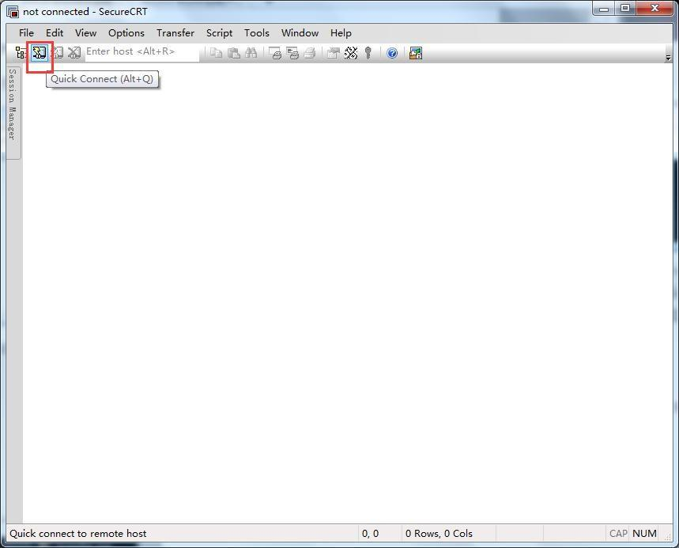
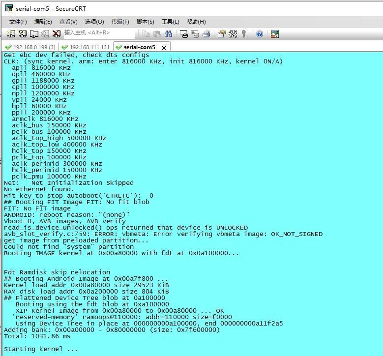

# Android平台搭建

## 主机环境

完整Android源码编译需要较大的CPU、内存和磁盘资源。原手册推荐Ubuntu 16.04 64位环境；实际项目应优先使用随当前SDK交付的虚拟机、容器或环境说明。

建议先确认：

```bash
cat /etc/os-release
uname -m
java -version
python3 --version
gcc --version
```

## 常用工具

```bash
sudo apt-get update
sudo apt-get install -y meld minicom picocom ckermit
```

Picocom示例：

```bash
sudo picocom -b 921600 /dev/ttyUSB0
```

X8390手册指定调试串口波特率为921600；如果当前固件没有输出，应再核对项目实际串口配置。

### SecureCRT设置






## SDK编译依赖

原手册列出的主要软件包如下。不同Ubuntu版本可能需要替换已经下架或改名的软件包。

```bash
sudo apt-get install -y \
    git-core gnupg flex bison gperf build-essential zip curl \
    zlib1g-dev gcc-multilib g++-multilib genromfs libc6-dev-i386 \
    libncurses5-dev x11proto-core-dev libx11-dev ccache \
    libgl1-mesa-dev libxml2-utils xsltproc unzip lsb-core \
    lib32z1-dev lib32ncurses5-dev texinfo mercurial subversion \
    whois g++ git lzop liblz4-tool genext2fs make \
    device-tree-compiler u-boot-tools libssl-dev autoconf \
    python3-pyelftools libusb-1.0-0-dev tig p7zip p7zip-full \
    android-tools-fastboot android-tools-adb
```

## JDK

X8390 Android 13编译脚本示例使用OpenJDK 8：

```bash
sudo apt-get install -y openjdk-8-jdk
export PATH=/usr/lib/jvm/java-8-openjdk-amd64/bin:$PATH
java -version
```

不建议为了该SDK全局替换系统默认Java。优先在编译脚本或当前终端中指定JDK路径。

## 交叉编译工具链

交叉编译工具链已经集成在Android源码中，通常不需要单独安装。手册给出的路径包括：

```text
prebuilts/gcc/linux-x86/aarch64/gcc-linaro-6.3.1-2017.05-x86_64_aarch64-linux-gnu/bin/
prebuilts/gcc/linux-x86/aarch64/aarch64-linux-android-4.9/bin/
```

## ADB

```bash
adb devices
adb shell
```


## 关键源码路径

手册记录的设备树示例路径：

```text
ap-sdk/kernel-4.19/arch/arm64/boot/dts/mediatek/tb8788p1_64_wifi_k419.dts
```

具体项目名称、内核版本和设备树文件可能随SDK版本变化，应以当前源码树为准。
