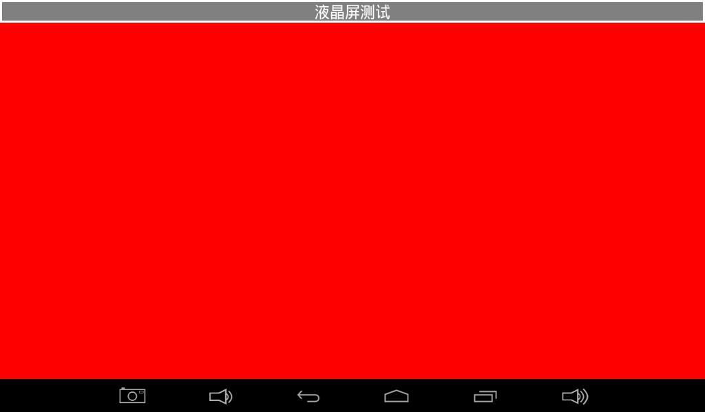
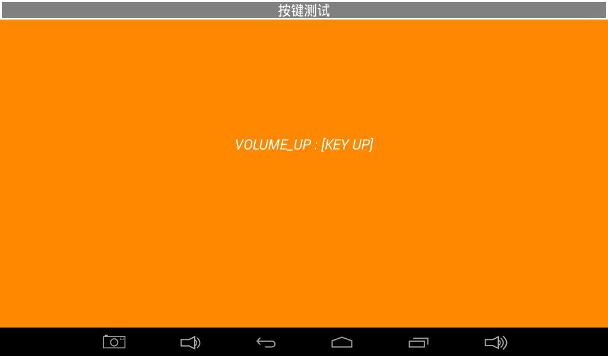
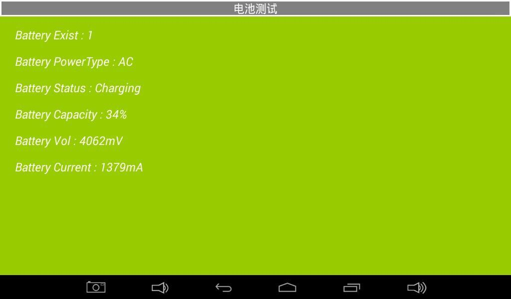
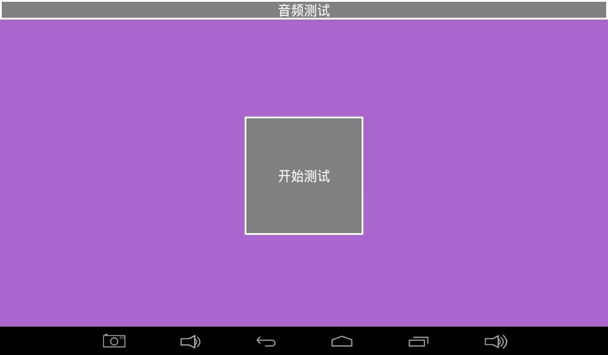
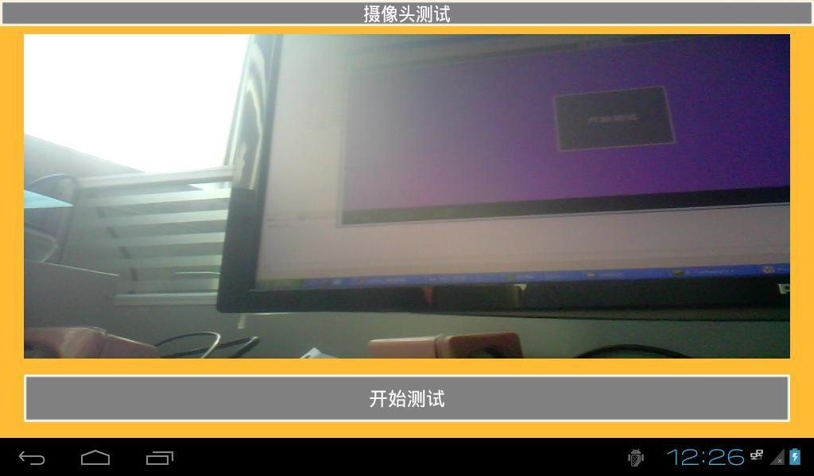
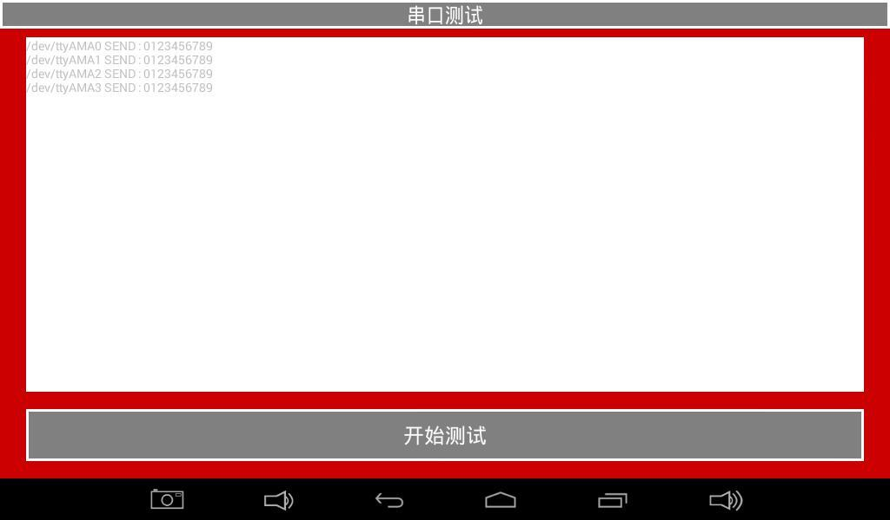
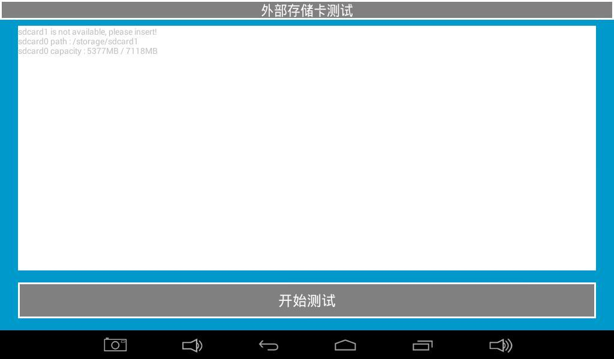
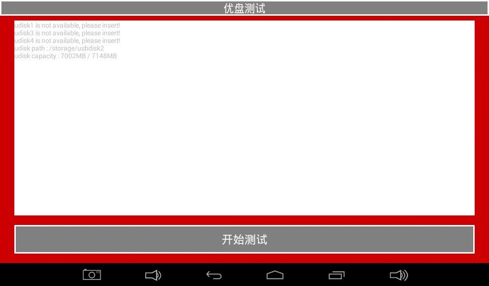

# Android测试与系统信息

## 硬件测试程序

测试程序用于研发验证和量产检测，可通过触摸或鼠标切换测试页面。

### LCD与触摸




- LCD测试：切换纯色画面，检查坏点、亮点、偏色和丢色。
- 触摸测试：绘制直线和对角线，检查触摸连续性和边缘区域。

### LED、蜂鸣器和背光


### 按键和电池





### ADC和重力传感器


### 音频和摄像头





### 网络和存储








串口环回测试时，应将待测串口TXD与RXD短接；存储测试前应确认TF卡或U盘已正确插入。

## 常用系统查询

```bash
cat /proc/cmdline
cat /proc/cpuinfo
cat /proc/meminfo
cat /proc/partitions
cat /proc/version
cat /proc/net/dev
dmesg
```

持续查看内核消息可使用：

```bash
cat /proc/kmsg
```

## 驱动源码说明

MT8390/MT8370属于MediaTek平台，驱动目录、内核版本和模块名称会随SDK版本变化。实际适配应从当前设备树、`kernel/drivers/`和项目编译配置反查，不使用其他SoC平台的示例路径作为依据。
