# Android使用指南

## 串口终端

连接UART0调试串口并启动系统后，可通过串口查看Android终端和内核日志。


## 音频与视频

将媒体文件放入TF卡或U盘后，可通过系统应用播放。

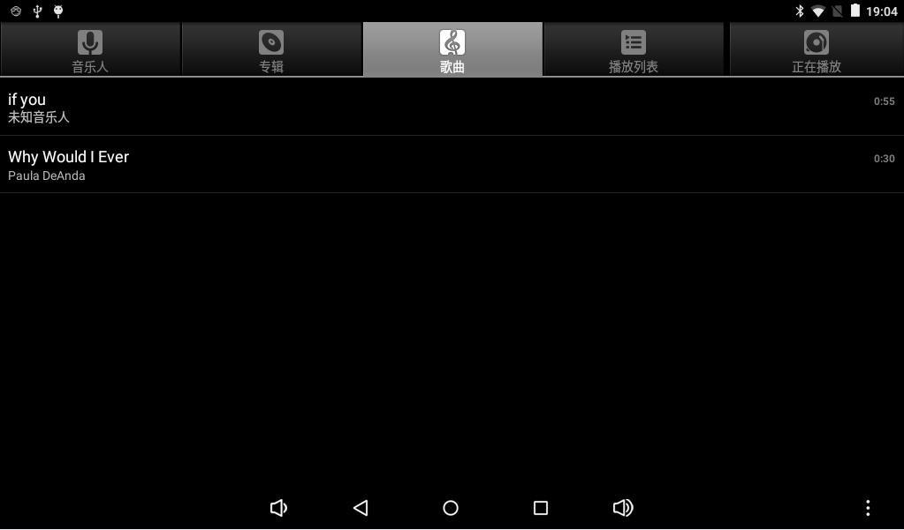

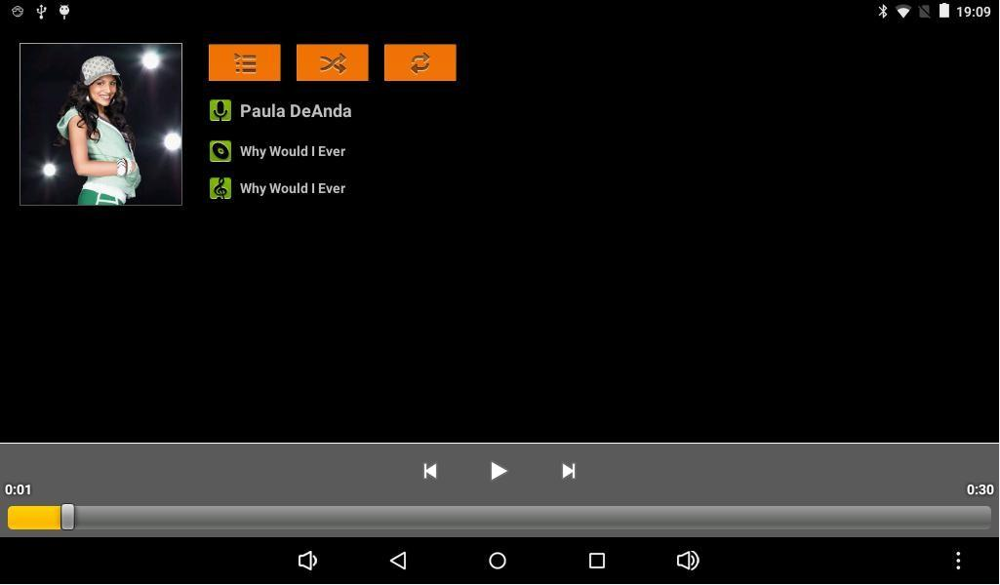


## Wi-Fi

进入“设置 -> 网络和互联网 -> Wi-Fi”，打开无线网络并选择接入点。

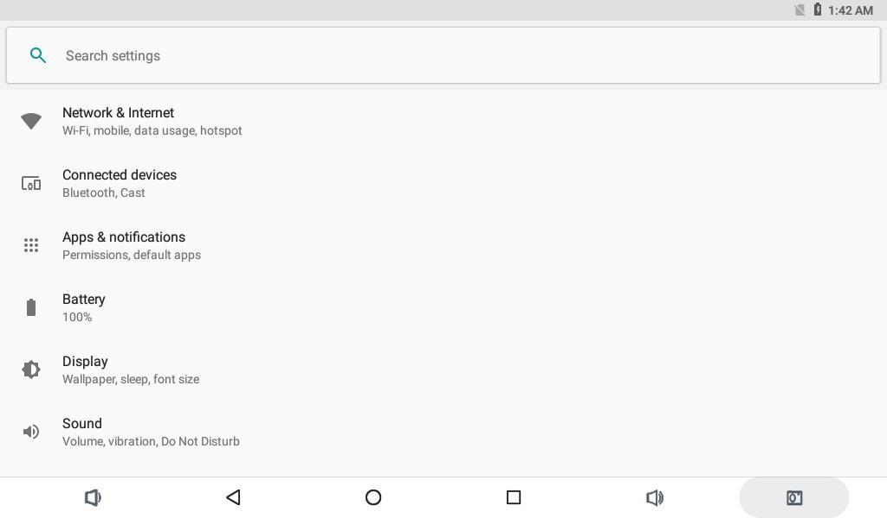

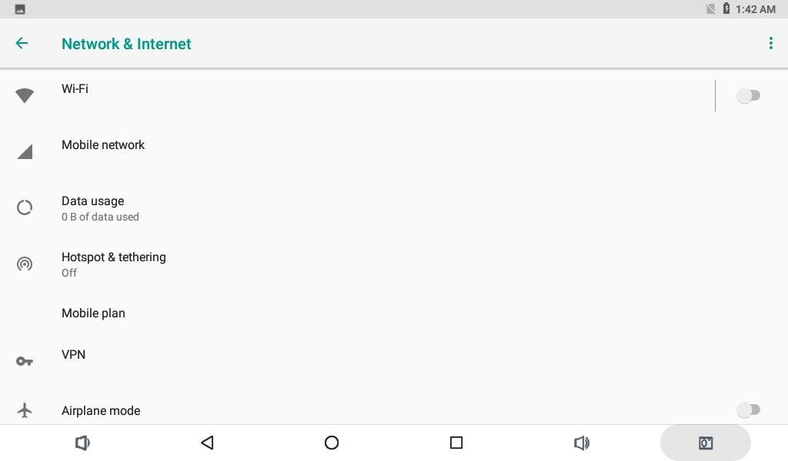

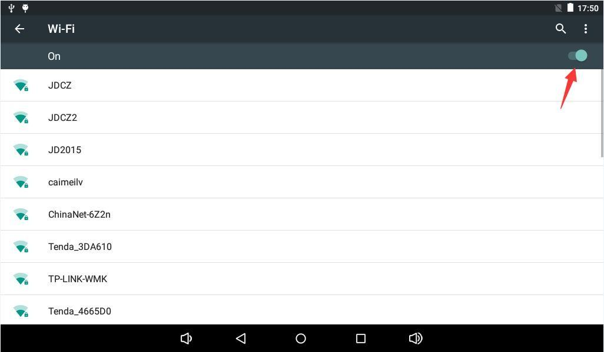

## Bluetooth

进入“设置 -> 已连接的设备 -> Bluetooth”打开蓝牙，搜索设备并完成配对。

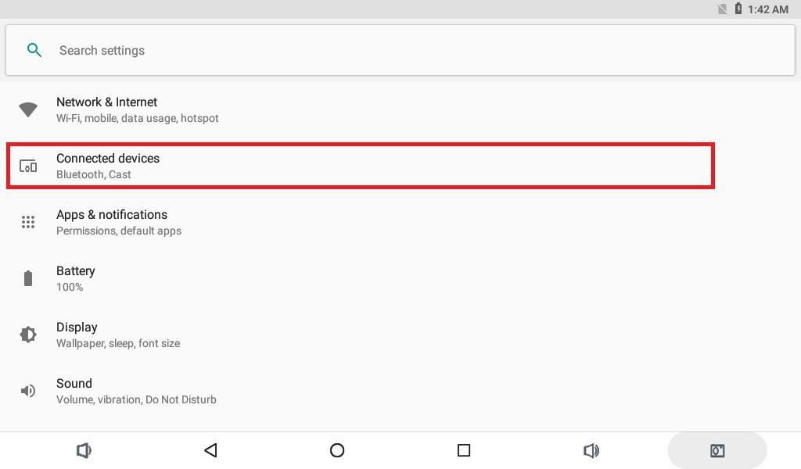


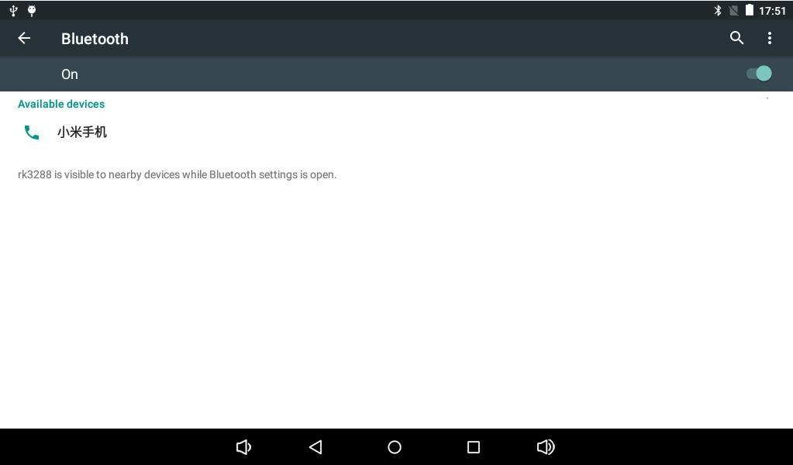

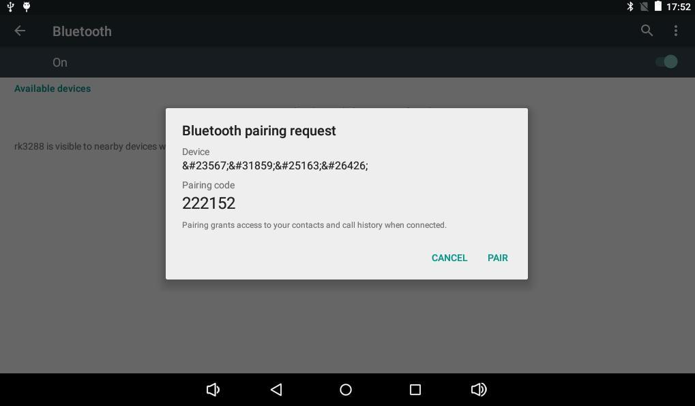

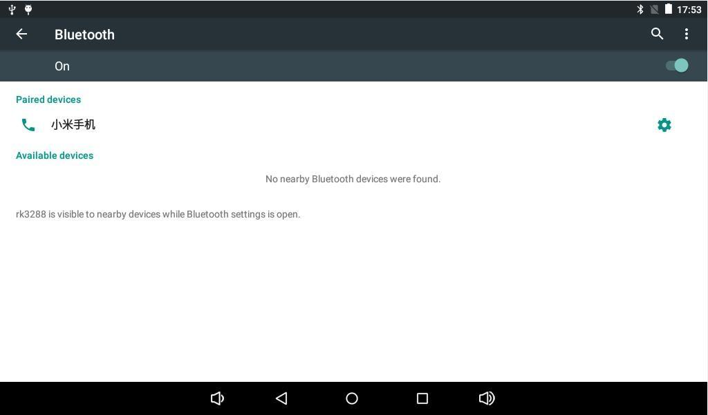

系统可通过蓝牙分享文件，也可连接蓝牙音箱播放音频。

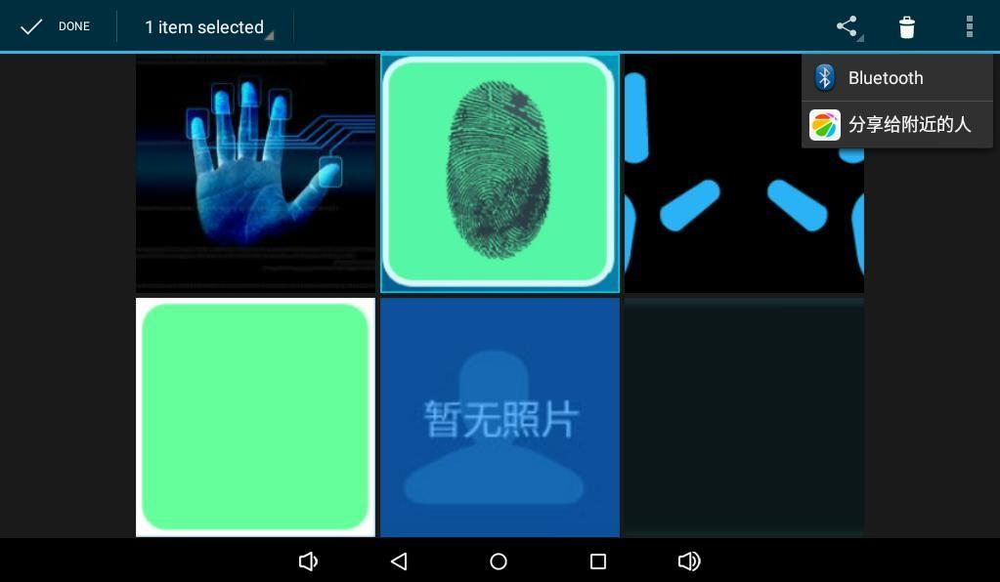

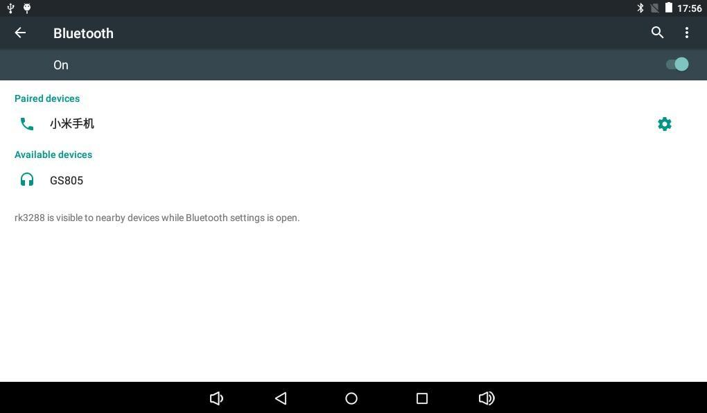

## USB鼠标和键盘

将USB鼠标、键盘或无线接收器连接到USB Host接口即可操作Android界面。

## TF卡和U盘

系统通常将外部存储挂载到`/storage/`：

```bash
adb shell
ls -l /storage
```

设备名称会根据文件系统UUID变化。

## 屏幕旋转

如果固件启用了重力传感器和自动旋转，转动开发板时支持旋转的应用界面会随方向变化。

## 摄像头

连接匹配的MIPI摄像头后，打开相机应用进行预览、拍照和录像。


## 有线以太网

接入可用网线后，网口指示灯应闪烁，系统可通过以太网获取网络连接。

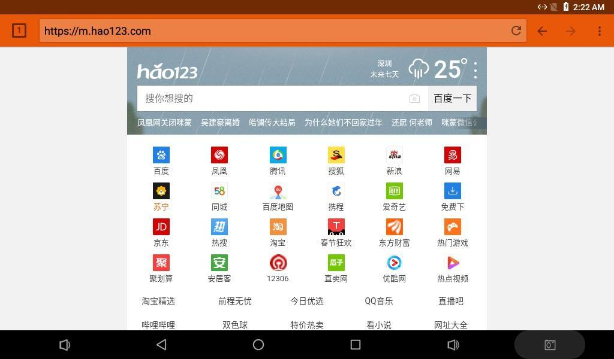

## 开关机与休眠

外接12V电源后，长按Power键约3秒开机。系统运行时长按Power键可调出关机菜单；短按Power键用于休眠和唤醒。

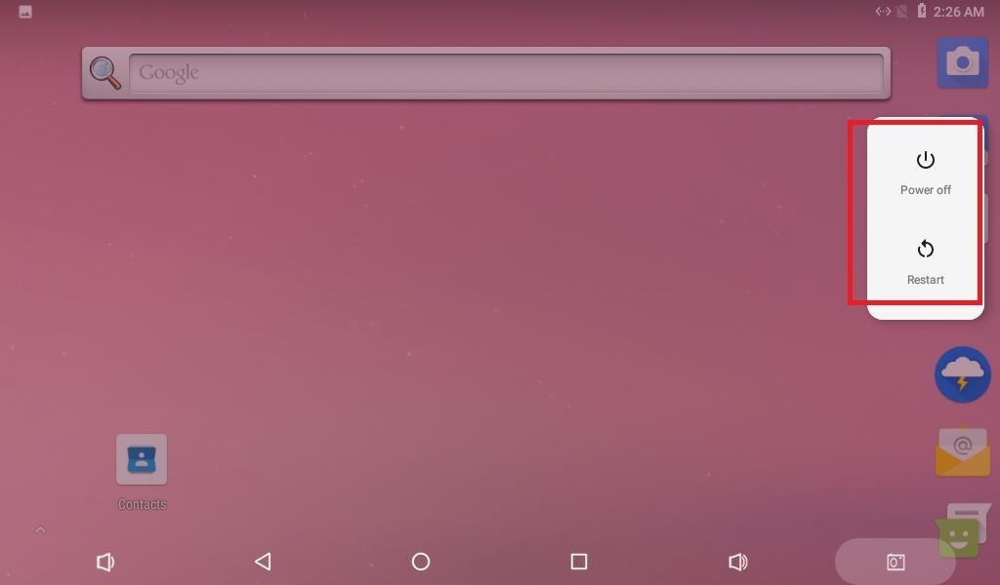
