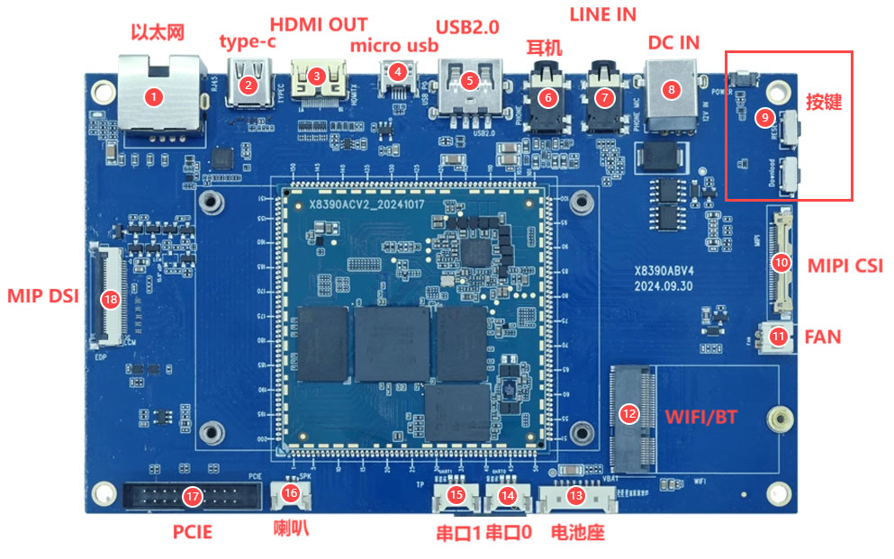
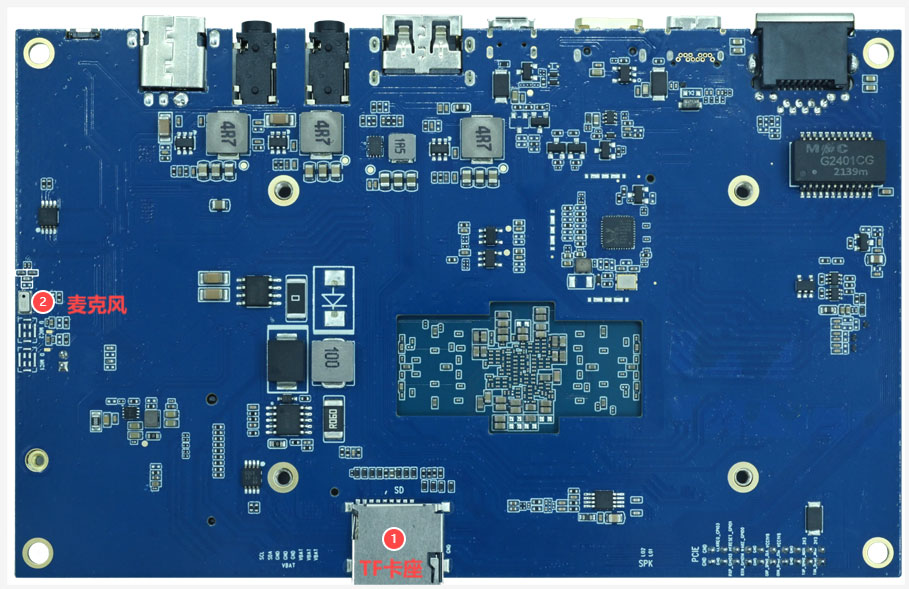

# 硬件资源

## 正面接口布局

| 标号 | 名称 | 说明 |
| --- | --- | --- |
| 1 | 以太网 | 千兆以太网接口，RGMII连接RTL8211F PHY |
| 2 | Type-C | 全功能Type-C接口 |
| 3 | HDMI OUT | HDMI输出接口 |
| 4 | Micro USB | USB OTG及固件烧录接口 |
| 5 | USB2.0 | USB2.0 Type-A Host接口 |
| 6 | 耳机 | 耳机输出接口 |
| 7 | Line In | 模拟音频输入接口 |
| 8 | DC IN | 12V直流电源输入 |
| 9 | 按键 | 从上到下为开关机键、复位键、下载键 |
| 10 | MIPI CSI | 摄像头接口 |
| 11 | FAN | 风扇接口 |
| 12 | Wi-Fi/BT | M.2无线模块接口 |
| 13 | 电池座 | 8.7V锂电池接口 |
| 14 | 串口0 | UART0，TTL电平，默认调试串口 |
| 15 | 串口1 | 扩展TTL串口 |
| 16 | 喇叭 | 单路扬声器输出 |
| 17 | PCIe | 2 × 10PIN PCIe扩展接口 |
| 18 | MIPI DSI | 显示接口 |

## 背面接口布局

| 标号 | 名称 | 说明 |
| --- | --- | --- |
| 1 | TF卡座 | 外置TF卡启动或数据存储 |
| 2 | 数字麦克风 | 板载数字麦克风，默认器件MIC2702 |

## 资源分组

### 显示与触摸

- MIPI DSI显示连接器。
- eDP相关显示资源。
- HDMI OUT。
- I2C电容触摸、电源和背光控制信号。

### 网络与无线

- RTL8211F千兆以太网。
- AW-CB451NF Wi-Fi 6 / Bluetooth 5.0模块。
- PCIe扩展接口，可连接高速外设。

### 调试与升级

- UART0默认作为调试串口。
- Micro USB用于固件烧录或USB Device功能。
- 下载键用于进入MTK下载模式。
