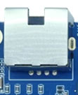
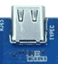
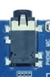
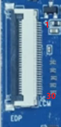
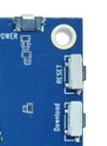
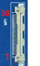
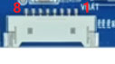
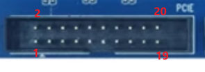
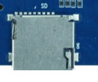
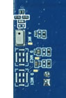

# 接口定义

## 以太网接口

开发板提供1路千兆有线以太网，使用GMAC连接RTL8211F PHY。

## Type-C接口

全功能Type-C接口可用于数据传输。实际DisplayPort、供电方向和USB角色由当前硬件配置及软件决定。

## HDMI接口

开发板使用Mini HDMI Type-C连接器，HDMI OUT由处理器原生接口引出。

## Micro USB和USB2.0

Micro USB用于系统固件烧录，也可作为USB Device接口。

板载1个USB2.0 Type-A Host接口，可连接U盘、鼠标、键盘等外设。

## 音频接口

### 耳机

耳机口可直接输出音频，也可连接外部功放输入。

### Line In

Line In用于外部模拟音频输入和录音。

### 喇叭

| PIN | 信号 |
| ---: | --- |
| 1 | LO2 |
| 2 | LO1 |

开发板支持单路约0.5W扬声器输出。

### 数字麦克风

板上引出3路数字麦克风资源，默认使用MIC2702器件。

## DC电源与按键

开发板采用12V直流电源供电，硬件规格建议使用12V/3A电源适配器。

从上到下依次为开关机键、复位键和下载键。

## MIPI CSI摄像头接口

| PIN | 信号 | PIN | 信号 |
| ---: | --- | ---: | --- |
| 1 | GND | 2 | CSI1A_L0P_T0A |
| 3 | CSI1A_L0N_T0B | 4 | GND |
| 5 | CSI1A_L1P_T0C | 6 | CSI1A_L1N_T1A |
| 7 | GND | 8 | CSI1A_L2P_T1B |
| 9 | CSI1A_L2N_T1C | 10 | GND |
| 11 | CSI1B_L0P_T0A | 12 | CSI1B_L0N_T0B |
| 13 | GND | 14 | CSI1B_L1P_T0C |
| 15 | CSI1B_L1N_T1A | 16 | GND |
| 17 | CMMCLK1 | 18 | CMMRST1 |
| 19 | GND | 20 | CMMPDN1 |
| 21 | CAM_3V3 | 22 | CAM_3V3 |
| 23 | CAM_SDA | 24 | CAM_SCL |
| 25 | CAM_5V | 26 | CAM_5V |
| 27 | CAM_5V | 28 | CMMPDN1 |
| 29 | GND | 30 | GND |

## 风扇接口

| PIN | 信号 |
| ---: | --- |
| 1 | 12V |
| 2 | GND |

## Wi-Fi / Bluetooth接口

开发板使用M.2座连接AW-CB451NF无线模块，支持Wi-Fi 6和Bluetooth 5.0。

## 电池接口

| PIN | 信号 | PIN | 信号 |
| ---: | --- | ---: | --- |
| 1 | I2C_SCL | 5 | GND |
| 2 | I2C_SDA | 6 | VBAT |
| 3 | GND | 7 | VBAT |
| 4 | GND | 8 | VBAT |

该接口用于8.7V锂电池供电，电池可通过DC输入进行充电。

## 串口

### UART0调试串口

| PIN | 信号 |
| ---: | --- |
| 1 | UART0_TXD |
| 2 | UART0_RXD |
| 3 | GND |

### 扩展串口

| PIN | 信号 |
| ---: | --- |
| 1 | UART1_TXD |
| 2 | UART1_RXD |
| 3 | GND |

## PCIe扩展接口

| PIN | 信号 | PIN | 信号 |
| ---: | --- | ---: | --- |
| 1 | PCIE_TXN_SPIM2_MISO | 2 | 3V3 |
| 3 | PCIE_TXP_SPIM2_MOSI | 4 | 3V3 |
| 5 | GND | 6 | GND |
| 7 | PCIE_CKN_SPIM2_CSB | 8 | VIO18_PMU |
| 9 | PCIE_CKP_SPIM2_CLK | 10 | VIO18_PMU |
| 11 | GND | 12 | GND |
| 13 | PCIE_RXN_GPIO14 | 14 | PCIE_WAKE_GPIO0 |
| 15 | PCIE_RXP_GPIO13 | 16 | PCIE_PERRESET_GPIO1 |
| 17 | GND | 18 | PCIE_CLKREQ_GPIO3 |
| 19 | GND | 20 | GND |

部分PCIe信号与SPI/GPIO复用，底板改版前应结合当前原理图和设备树确认。

## LCD显示接口

| PIN | 信号 | PIN | 信号 |
| ---: | --- | ---: | --- |
| 1 | VDD_5V | 2 | VDD_5V |
| 3 | VDD_5V | 4 | VSYS_LCM1 |
| 5 | VSYS_LCM1 | 6 | TP_I2C_SCL |
| 7 | TP_I2C_SDA | 8 | TP_INT |
| 9 | TP_RST | 10 | VCC_3V3 |
| 11 | VCC_3V3 | 12 | LCM_BL_EN |
| 13 | LCM_RST | 14 | NC |
| 15 | LCM_EN | 16 | GND |
| 17 | LCM1_D3N | 18 | LCM1_D3P |
| 19 | GND | 20 | LCM1_D2N |
| 21 | LCM1_D2P | 22 | GND |
| 23 | LCM1_CKN | 24 | LCM1_CKP |
| 25 | GND | 26 | LCM1_D1N |
| 27 | LCM1_D1P | 28 | GND |
| 29 | LCM1_D0N | 30 | LCM1_D0P |

该30PIN连接器包含4 Lane MIPI DSI、触摸、电源、复位和背光控制信号。

## TF卡

TF卡可用于系统启动或多媒体文件存储。
