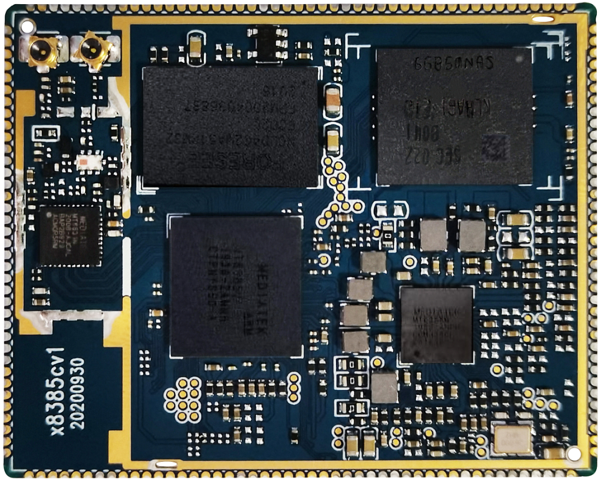
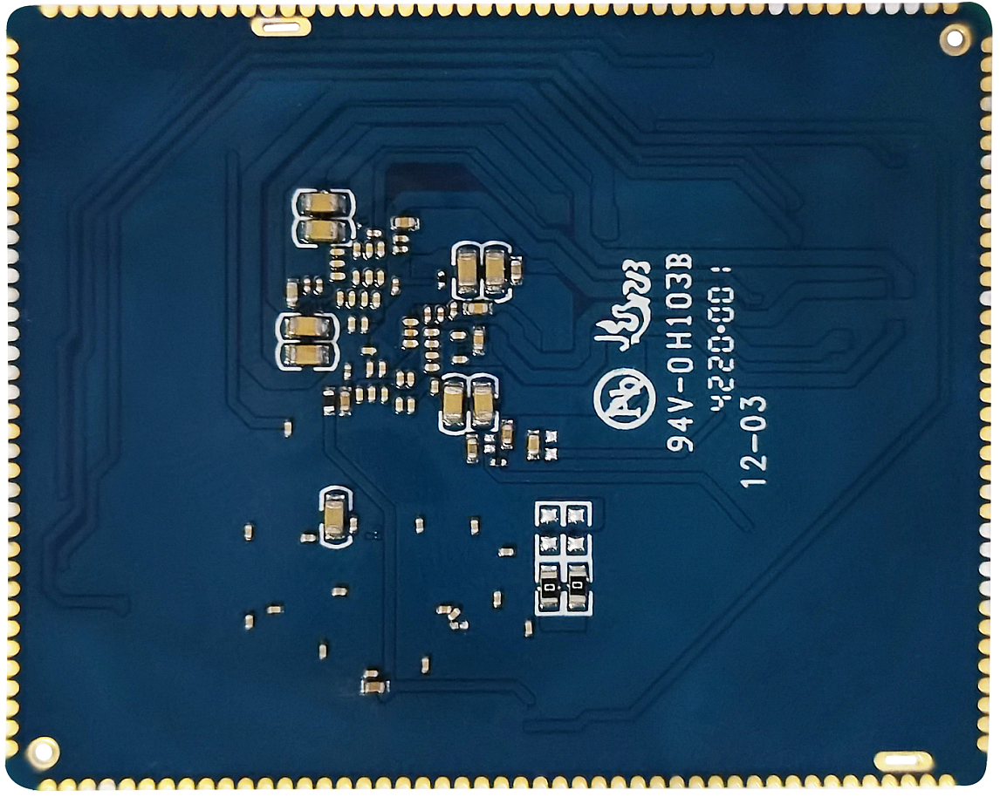
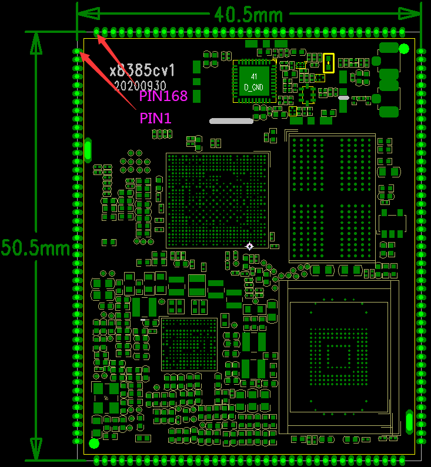

# 核心板

X8385CV1 核心板尺寸为 40.5mm × 50.5mm，采用邮票孔方式，引出 168PIN 管脚。硬件手册描述该核心板使用 LPDDR4 设计，支持 Android / Linux 操作系统，经过高低温、反复重启等可靠性实验。

## 核心板正面

## 核心板背面

## 核心板结构图

## 系统配置

| 系统配置 |  |
| --- | --- |
| CPU | MT8385 |
| 主频 | 四核A73 2GHz + 四核A53 2GHz |
| 内存 | 标配2GB，可定制4GB |
| 存储器 | 标配16GB eMMC |
| Wi-Fi | 标配，支持802.11 a/b/g/n/ac |
| BT | 标配，支持BT4.2 |
| GPS | 标配，支持GPS/Glonass/Beidou/Galileo/QZSS |
| FM | 未引出，芯片支持，核心板不支持 |

## 接口参数

| 接口参数 |  |
| --- | --- |
| LCD接口 | 支持MIPI接口输出 |
| Touch接口 | 电容触摸，可使用USB或串口扩展电阻触摸 |
| 音频接口 | 支持耳机喇叭直接输出，支持录放音 |
| SD卡接口 | 1路SDIO输出通道 |
| eMMC接口 | 板载eMMC接口，管脚不另外引出 |
| USB接口 | HOST 2.0和OTG复用 |
| UART接口 | 2路串口 |
| PWM接口 | 3路PWM输出 |
| IIC接口 | 7路IIC输出 |
| SPI接口 | 2路SPI输出 |
| ADC接口 | 1路ADC输出 |
| Camera接口 | 2路MIPI输入 |

## 电气特性

| 电气特性 |  |
| --- | --- |
| 5V输入电压 | 5V/3A |
| RTC输入电压 | 2.5到3V/5uA 【待测试】 |
| 输出电压 | 多路LDO输出，可用于底板外设供电 |
| 工作温度 | -20~85度 |
| 储存温度 | 0~40度 |

## 结构参数

| 结构参数 |  |
| --- | --- |
| 外观 | 邮票孔方式 |
| 核心板尺寸 | 40.5mm*50.5mm*3mm |
| 引脚间距 | 1mm |
| 引脚焊盘尺寸 | 1.3mm*0.7mm |
| 引脚数量 | 168PIN |
| 板层 | 10层 |

