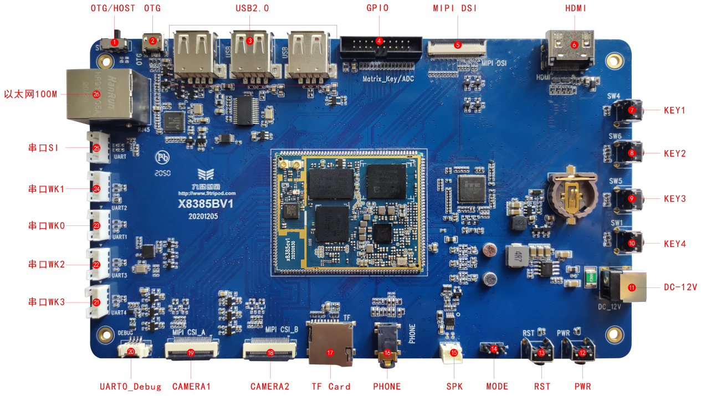

# 产品介绍

X8385 开发板是基于 MediaTek MT8385 / i500 平台的高性能 AIoT 开发板，由深圳市九鼎创展科技有限公司研发、生产和销售。整机由 X8385CV1 邮票孔核心板、底板和液晶板组成。核心板采用 10 层板设计，底板提供百兆以太网、CSI、DSI、UART、SPI、Micro USB、USB 2.0、SDIO、I2S、I2C、TF 卡和 HDMI 等接口，默认搭配 7 寸 MIPI 液晶屏。

X8385 适用于 AIoT、人工智能、工业控制、电力、通信、医疗、媒体、安防、车载、金融、消费电子、手持设备和教学仪器等应用场景。

## 功能特性

- 内核：ARM Cortex-A73 四核 + ARM Cortex-A53 四核。
- 主频：A73 四核 2GHz + A53 四核 2GHz。
- 内存：2GB / 4GB / 8GB LPDDR4，标配 2GB。
- Flash：支持多种容量 eMMC，标配 16GB。
- 三路 USB HOST 2.0，一路 Micro USB OTG，OTG 与 USB HOST 2.0 复用。
- 5 路 TTL 串口接口，其中 1 路为调试串口。
- 1 路 TF 卡接口，1 个复位按钮，1 个开关机按钮，4 路独立按键。
- 支持外置喇叭、MIC 输入、耳机输出、背光无级调节和电容触摸。
- 板载 2.4G / 5G 双频 Wi-Fi，支持 Bluetooth、RTC 时钟、百兆以太网。
- 支持 MIPI 摄像头接口、MIPI 显示屏接口、USB 鼠标和键盘。

## 规格概览

| 项目 | 参数 |
| --- | --- |
| SoC | MediaTek MT8385 / i500 |
| CPU | 4 × Cortex-A73 2GHz + 4 × Cortex-A53 2GHz |
| GPU | Arm Mali-G72 MP3，最高 800MHz，支持 GL ES 3.1 / Vulkan 1.0 / OpenCL ES 1.1 |
| AI | 双核 AI 处理器 DSP，最高 500MHz |
| 内存 | 2GB / 4GB / 8GB LPDDR4，标配 2GB |
| 存储 | 标配 16GB eMMC |
| 无线 | 2.4G / 5G Wi-Fi，BT4.2，GPS / Glonass / Beidou / Galileo / QZSS |
| 显示 | MIPI DSI，默认 7 寸 MIPI 屏 1024 × 600，HDMI 2.0 |
| 摄像头 | 2 路 MIPI Camera 输入 |
| 电源 | 底板 12V DC 输入；核心板 VSYS 3.1V 到 5.25V |
| 尺寸 | 核心板 40.5mm × 50.5mm × 3mm，168PIN 邮票孔 |

## 版本信息

| 版本号 | 日期 | 作者 | 描述 |
| --- | --- | --- | --- |
| Rev.01 | 2021-1-4 | 九鼎创展 | 原始版本 |

