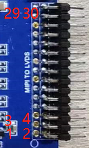
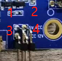
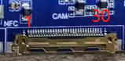
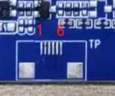
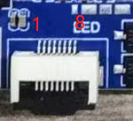
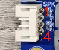
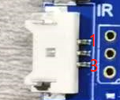
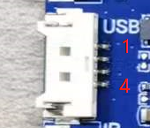
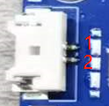
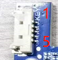

# 接口定义

本页整理 MT8788 闺蜜机主板接口 7 到接口 24 的详细管脚定义。接口编号与硬件接口图中的标号保持一致。

## 接口 7：CN2 6P-2.54MM

| 管脚 | 定义 | 描述 |
| --- | --- | --- |
| 1 | GND | 参考地 |
| 2 | GND | 参考地 |
| 3 | GND | 参考地 |
| 4 | +12V | 12V输入 |
| 5 | +12V | 12V输入 |
| 6 | +12V | 12V输入 |

## 接口 8：J9 4P-1.25MM

| 管脚 | 定义 | 描述 |
| --- | --- | --- |
| 1 | GND | 参考地 |
| 2 | SCL | I2C总线时钟 |
| 3 | SDA | I2C总线数据 |
| 4 | +5V | 5V供电 |

## 接口 9：J8222 15×2×2MM

| 管脚 | 定义 | 描述 | 管脚 | 定义 | 描述 |
| --- | --- | --- | --- | --- | --- |
| 1 | VCC | 屏电源 | 16 | DCAN | A组时钟- |
| 2 | VCC | 屏电源 | 17 | D3AP | A组数据3+ |
| 3 | GND | 参考地 | 18 | D3AN | A组数据3- |
| 4 | VCC | 屏电源 | 19 | D0BP | B组数据0+ |
| 5 | GND | 参考地 | 20 | D0BN | B组数据0- |
| 6 | GND | 参考地 | 21 | D1BP | B组数据1+ |
| 7 | D0AP | A组数据0+ | 22 | D1BN | B组数据1- |
| 8 | D0AN | A组数据0- | 23 | D2BP | B组数据2+ |
| 9 | D1AP | A组数据1+ | 24 | D2BN | B组数据2- |
| 10 | D1AN | A组数据1- | 25 | GND | 参考地 |
| 11 | D2AP | A组数据2+ | 26 | GND | 参考地 |
| 12 | D2AN | A组数据2- | 27 | DCBP | B组时钟+ |
| 13 | GND | 参考地 | 28 | DCBN | B组时钟- |
| 14 | GND | 参考地 | 29 | D3BP | B组数据3+ |
| 15 | DCAP | A组时钟+ | 30 | D3BN | B组数据3- |

## 接口 10：U10 2×2×2MM

| 管脚 | 定义 | 描述 |
| --- | --- | --- |
| 1 | 5V | 屏供电+5V |
| 2 | VCC | 屏电源接口 |
| 3 | VCC | 屏电源接口 |
| 4 | 12V | 屏供电+12V |

## 接口 11：J12 30P-0.5MM

| 管脚 | 定义 | 描述 | 管脚 | 定义 | 描述 |
| --- | --- | --- | --- | --- | --- |
| 1 | GND | 参考地 | 16 | GND | 参考地 |
| 2 | D0+ | MIPI数据0+ | 17 | MCLK | 主时钟 |
| 3 | D0- | MIPI数据0- | 18 | RST | 复位 |
| 4 | GND | 参考地 | 19 | GND | 参考地 |
| 5 | D1+ | MIPI数据1+ | 20 | 3.3V | 3.3V供电 |
| 6 | D1- | MIPI数据1- | 21 | 3.3V | 3.3V供电 |
| 7 | GND | 参考地 | 22 | 3.3V | 3.3V供电 |
| 8 | DCLK+ | MIPI时钟+ | 23 | SDA | I2C总线数据 |
| 9 | DCLK- | MIPI时钟- | 24 | SCL | I2C总线时钟 |
| 10 | GND | 参考地 | 25 | 5V | 5V供电 |
| 11 | D2+ | MIPI数据2+ | 26 | 5V | 5V供电 |
| 12 | D2- | MIPI数据2- | 27 | 5V | 5V供电 |
| 13 | GND | 参考地 | 28 | PND | 接入检测 |
| 14 | D3+ | MIPI数据3+ | 29 | GND | 参考地 |
| 15 | D3- | MIPI数据3- | 30 | GND | 参考地 |

## 接口 12：J37 6P-0.5MM

| 管脚 | 定义 | 描述 |
| --- | --- | --- |
| 1 | +5V | NFC模块5V供电 |
| 2 | +5V | NFC模块5V供电 |
| 3 | SDA | I2C总线数据 |
| 4 | SCL | I2C总线时钟 |
| 5 | GND | 参考地 |
| 6 | GND | 参考地 |

## 接口 13：J2 4P-1.25MM

| 管脚 | 定义 | 描述 |
| --- | --- | --- |
| 1 | NC | 悬空 |
| 2 | TXD | 调试串口发射端 |
| 3 | RXD | 调试串口接收端 |
| 4 | GND | 参考地 |

## 接口 14：J36 6P-0.5MM

| 管脚 | 定义 | 描述 |
| --- | --- | --- |
| 1 | +3.3V | TP供电3.3V |
| 2 | GND | 参考地 |
| 3 | SCL | I2C总线时钟 |
| 4 | SDA | I2C总线数据 |
| 5 | INT | 中断数据 |
| 6 | RST | TP复位 |

## 接口 15：J8 8P-0.5MM

| 管脚 | 定义 | 描述 |
| --- | --- | --- |
| 1 | +3.3V | 指示灯供电 |
| 2 | +3.3V | 指示灯供电 |
| 3 | GND | 参考地 |
| 4 | GND | 参考地 |
| 5 | Red Control | 红灯控制端 |
| 6 | Red Control | 红灯控制端 |
| 7 | Green Control | 绿灯控制端 |
| 8 | Green Control | 绿灯控制端 |

## 接口 16 / 17：J17 / J18 2P-2.0MM

| 管脚 | 定义 | 描述 |
| --- | --- | --- |
| 1 | MIC+ | 模拟麦克风输入 |
| 2 | GND | 参考地 |

## 接口 18：J13 5P-1.25MM

| 管脚 | 定义 | 描述 |
| --- | --- | --- |
| 1 | +5V | 感光灯5V供电 |
| 2 | INT | 中断数据 |
| 3 | SCL | I2C总线时钟 |
| 4 | SDA | I2C总线数据 |
| 5 | GND | 参考地 |

## 接口 19：J8239 4P-2.0MM

| 管脚 | 定义 | 描述 |
| --- | --- | --- |
| 1 | OUT1A | 喇叭桥接输出 |
| 2 | OUT1B | 喇叭桥接输出 |
| 3 | OUT2A | 喇叭桥接输出 |
| 4 | OUT2B | 喇叭桥接输出 |

## 接口 20：CN1 6P-2.0MM

| 管脚 | 定义 | 描述 |
| --- | --- | --- |
| 1 | GND | 参考地 |
| 2 | GND | 参考地 |
| 3 | LCD-PWM | 屏背光调节 |
| 4 | LCD-EN | 屏背光开关 |
| 5 | +12V | 屏背光12V供电 |
| 6 | +12V | 屏背光12V供电 |

## 接口 21：J8229 3P-1.25MM

| 管脚 | 定义 | 描述 |
| --- | --- | --- |
| 1 | IR | 遥控接收头输入 |
| 2 | GND | 参考地 |
| 3 | +3.3V | 遥控接收头3.3V供电 |

## 接口 22：J16 4P-1.25MM

| 管脚 | 定义 | 描述 |
| --- | --- | --- |
| 1 | GND | 参考地 |
| 2 | DP | USB数据+ |
| 3 | DM | USB数据- |
| 4 | +5V | USB 5V供电 |

## 接口 23：J8230 2P-1.25MM

| 管脚 | 定义 | 描述 |
| --- | --- | --- |
| 1 | RTC | RTC电池电压输入 |
| 2 | GND | 参考地 |

## 接口 24：J8236 5P-1.25MM

| 管脚 | 定义 | 描述 |
| --- | --- | --- |
| 1 | GND | 参考地 |
| 2 | SYS-RST | 系统复位 |
| 3 | KPCOL0 | 3和4组成烧录按键 |
| 4 | KPROW0 | 3和4组成烧录按键 |
| 5 | PWRKEY | 开关机按键 |

