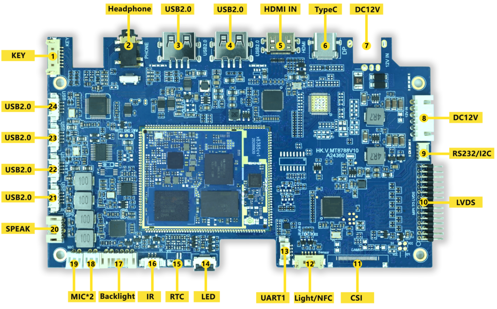

# 硬件资源

本页整理 MT8788 闺蜜机主板的接口位置和硬件资源。详细接口管脚定义见[接口定义](./mt8788-girlfriend-machine-connector-definition)。

## 硬件接口介绍

| 标号 | 名称 | 说明 |
| --- | --- | --- |
| 【1】 | KEY接口 | 外接开关机按键 |
| 【2】 | 耳机接口 | 外接耳机 |
| 【3】 | USB 2.0 | 标准Type-A型USB 2.0接口 |
| 【4】 | USB 2.0 | 标准Type-A型USB 2.0接口 |
| 【5】 | HDMI IN | 标准Type-C型HDMI输入接口 |
| 【6】 | Type-C接口 | 标准Type-C型USB 2.0接口 |
| 【7】 | DC 12V输入接口 | 默认NC，通过标号8内部供电 |
| 【8】 | DC 12V wafer座 | 12V直流电源输入 |
| 【9】 | RS232/I2C接口 | RS232串口或I2C接口，用于读取电量 |
| 【10】 | LVDS接口 | 外接双路LVDS显示屏，可驱动标准1080P各种尺寸液晶屏幕 |
| 【11】 | CSI接口 | 用于外接MIPI摄像头 |
| 【12】 | Light/NFC接口 | 用于外接感光或NFC设备 |
| 【13】 | UART1 | 标准串口接口 |
| 【14】 | LED座 | 双色LED指示灯座子 |
| 【15】 | RTC座 | 外接纽扣电池，用于RTC时钟掉电保存 |
| 【16】 | 红外接收头座 | 外接红外一体化接收头 |
| 【17】 | Backlight | 屏幕背光接口 |
| 【18】 | MIC*2 | 双MIC接口 |
| 【19】 | MIC*2 | 双MIC接口 |
| 【20】 | SPEAK | 立体声3~15W扬声器接口，自带EQ功能 |
| 【21】 | USB 2.0 wafer座 | 内部标准USB 2.0 wafer座 |
| 【22】 | USB 2.0 wafer座 | 内部标准USB 2.0 wafer座 |
| 【23】 | USB 2.0 wafer座 | 内部标准USB 2.0 wafer座 |
| 【24】 | USB 2.0 wafer座 | 内部标准USB 2.0 wafer座 |

