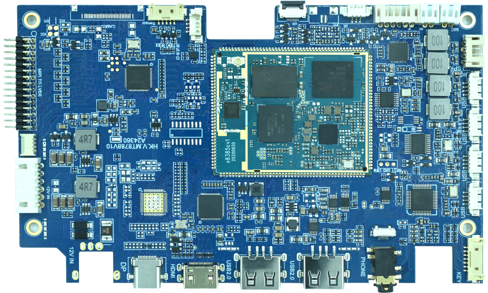

# 产品介绍

MT8788 闺蜜机主板基于联发科 MT8788 系列平台设计，是一款面向音视频产品的 Android 主板，由深圳市九鼎创展科技有限公司自主研发、生产和销售。联发科 MT8788，也称 i500，是一款高性能、低功耗处理器，采用 12nm 台积电流片工艺，具备四核 A73 和四核 A53 的八核架构。

## 功能特性

- 处理器平台：MT8788 / MT8385V / MT8183，Android 13。
- CPU：四核 A73 + 四核 A53 八核架构，最高 2GHz。
- 内存：2GB / 4GB / 8GB LPDDR4。
- 存储：支持 4GB / 8GB / 16GB / 32GB / 64GB / 128GB eMMC 可选。
- USB：外置 2 路 Type-A USB 2.0、1 路 Type-C USB 2.0，内置 4 路 USB 2.0 wafer 座。
- 显示：1 路 HDMI 输入，1 路 LVDS 输出，支持 21.5~86 英寸 1920 × 1080 FHD LVDS 屏。
- Camera：1 路 MIPI 4Lane CSI 摄像头接口，也支持 USB 摄像头方案。
- 音频：3.5mm 耳机输出，外置 2 × 3~15W 扬声器接口，双 MIC 输入。
- 扩展：调试串口、Light/NFC、RTC、红外、背光、触摸、按键和电池电量读取接口。

## 适用范围

本产品为闺蜜机专用 Android 主板，适配 15.6 英寸到 32 英寸 LVDS 屏，也可面向更大尺寸显示终端进行产品化设计。典型应用包括家庭娱乐、餐厅点菜、学校教学、分屏办公、商品展示、广告播放、运动健身、电子相框、趣味游戏、视频会议、电子白板和数字标牌等。

## 特性参数

| 操作系统 | Android13 |
| --- | --- |
| CPU | MT8385V/MT8183/MT8788（三款芯片已做到软件无缝切换，批量成本更优） |
| GPU | Mali G72 MP3 800MHz |
| 主频 | 最高2GHz |
| 运行内存 | 4GB/6GB/8GB |
| 存储内存 | 64GB/128GB/256GB |
| 显示屏 | 21.5~86英寸，1920*1080 FHD，LVDS 显示屏，支持单/双路输出 |
| 触摸屏 | USB接口 |
| 摄像头 | MIPI 4Lane接口或USB接口，支持最大 3200 万像素 |
| 喇叭 / | 立体声道，2*3~15W 功率输出，自带EQ，高保真智能降噪功放 / |
| MIC | 2*麦克接口 |
| SENSOR | 支持光线感应，G-SENSOR，手势感应 |
| WIFI | IEEE 802.11 a/b/g/n/ac，双频 |
| BT | BT4.2 |
| USB 接口 | 1 路 Type-C、2 路 Type-A，4 路 USB Wafer 座 |
| HDMI 接口 | HDMI Type-C 接口，支持输入 |
| 耳机接口 | 3.5mm 耳机 Jack 座 |
| UART 接口 | 2 路 UART 串口 |
| 按键 | 电源键、音量+、-键，支持双路信号灯 |
| 电源接口 | 12V 额定电压，支持由电源板或外置电源适配器供电，兼容UART或I2C数据通讯 |

