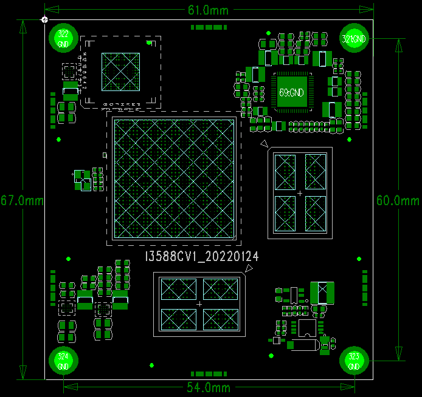
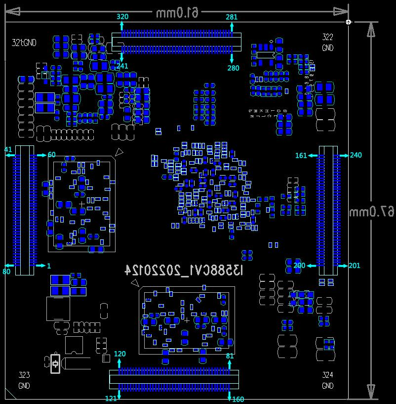

# Product Introduction

## Overview

I3588 is a core board based on the Rockchip RK3588 processor. It is intended for embedded product development and provides a compact hardware platform with rich peripheral interfaces.

## Features

- Optimum size, ensuring all GPIO ports are lead out, the size is only 61mm*67mm
- Using RK's own RK806 PMU, the cost is low enough while ensuring stable and reliable operation.
- supports multiple brands and various capacities of emmc
- Using dual-channel LPDDR4(X) design, it can support 2GB/4GB/8GB/16GB/32GB capacity
- supports power sleep wake up
- supports android12.0, linux, debain, ubuntu and other operating systems
- supports dual Gigabit wired Ethernet, SATA, PCIE, USB3.0 and other high-speed buses
- Using Panasonic board-to-board connector, the contact is stable and reliable
- The product is stable and reliable. After a lot of high and low temperatures, repeated restarts, Android stability tests, AnTuTu tests and other reliability experiments, the machine did not crash for 7 days and 7 nights.

## Appearance and Mechanical Structure

## Specifications

### System Configuration

| CPU | RK3588 |
|---|---|
| Frequency | quad-coreA76 +quad-coreA55(2.4GHz) |
| RAM / Storage | 4G&16G or 8G&32Goptional |
| Power IC | Using RT806, supports dynamic frequency modulation, etc. |

### Interface Parameters

| LCD Interface | At the same time supports MIPI, EDP, HDMI Interface output; the maximum   supports 6 channels of simultaneous display and 4 channels of different display |
|---|---|
| Touch Interface | capacitive touch, can use USB or I2C Interface touch |
| Audio Interface | IIS/PCM/TDM interface |
| SPDIF interface | 2-way 8-channel optical fiber audio output interface |
| SD Card Interface | 2 SDIO output channels |
| eMMC Interface | on-boardeMMC Interface, pins not routed out separately |
| Ethernet Interface | Dual Gigabit Ethernet Interface |
| USB HOST2.0 interface | 2-way HOST2.0 |
| USB HOST3.0 interface | 2-way USB OTG 3.0/2.0/TypeC |
| UART Interface | 10-way serial port, supports serial port with flow control |
| PWM Interface | 16 channels of PWM output |
| IIC Interface | 9 channels IIC output |
| SPI Interface | 5 SPI outputs |
| ADC Interface | 8 ADC outputs |
| CAN interface | 3 channels CAN output |
| Camera Interface | 6 CSI inputs |
| HDMI Interface | 2 channels HDMI2.1 TX, 1 channel HDMI RX2.0 |
| PCIE interface | PCIe3.0 (2x2,1x4,4x1) |
| SATA interface | 2x SATA3.3/PCIe2.1 |

### Electrical Characteristics

| 4VInput Voltage | 4V/5A(Recommended4V/8Aenter) |
|---|---|
| RTCInput Voltage | 2.5 to 3V/100uA, can be powered by an external button battery |
| Output Voltage | 3.3V/2A, 1.8V/2A(can be used forBackplane powered) |
| Operating Temperature | 0~70°C |
| Storage Temperature | -10~50°C |

### Mechanical Parameters

| Package | Board-to-board connector package |
|---|---|
| Core Board Size | 67mm*61mm*6mm |
| Pin Pitch | 0.5mm |
| Connector Specification | Panasonic AXK6F80537YG |
| Number of Pins | 320PIN |
| PCB Layers | 10th floor |
| Warpage | less than0.5% |

## Related Pages

- [Pin Definition](./i3588-pin-definition)
- [Hardware Design](./i3588-hardware-design)
