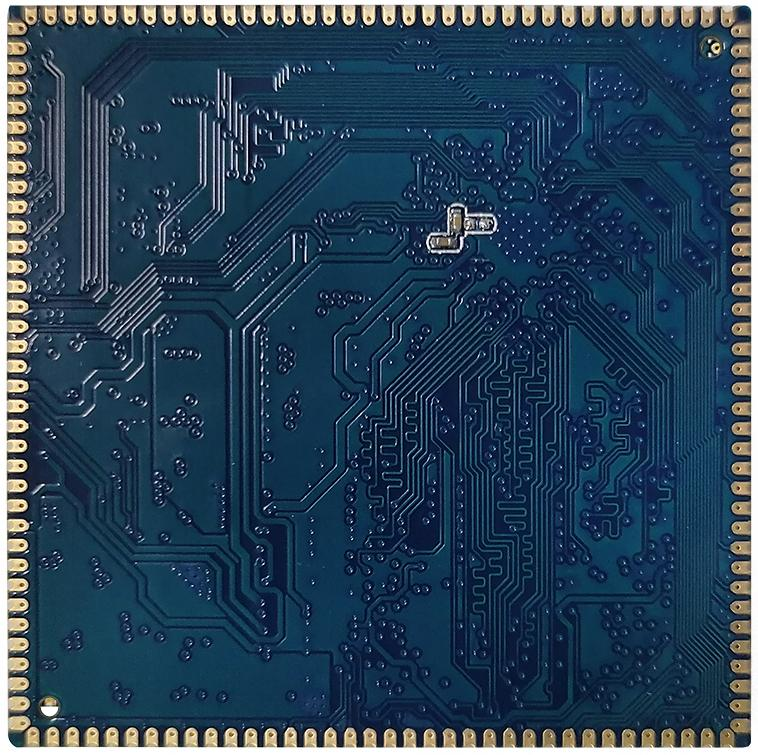
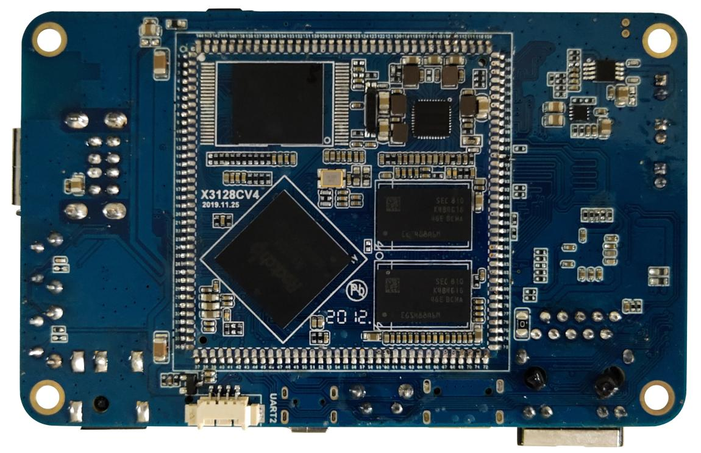
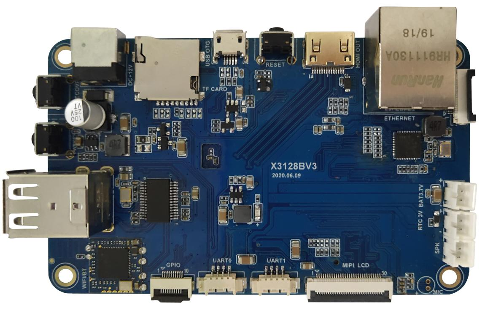

# Product Introduction

## Overview

X3128CV4 is a core board based on the Rockchip RK3128 processor. It is intended for embedded product development and provides a compact hardware platform with rich peripheral interfaces.

## Features

- 最佳尺寸, 即保证精悍的体积又保证足够的GPIO 口, 仅45mm*45mm
- 使用瑞芯微的RK816 作为电源管理设计, 成本低廉, 性能可靠
- supports多种品牌, 多种容量的emmc, default使用东芝8GB emmc, 可兼容nand flash
- 使用单通道DDR3 设计, defaultsupports1GB 容量, 可定制2GB, 512MB 容量
- supports电源休眠唤醒
- supportsandroid6.0, linux 操作系统
- supports千兆有线以太网
- 产品稳定可靠, 拷机7 天7 夜不死机

## Appearance and Mechanical Structure

## Specifications

### System Configuration

| CPU | RK3128 |
|---|---|
| Frequency | A7quad-core1.3GHz |
| RAM | standard1GB, 可定制2GB及512MB |
| Storage | standard8GB EMMC, optional配nand flash |
| Power IC | 使用RK816, supports动态调频 |

### Interface Parameters

| LCD Interface | TTL, LVDS, MIPI接口select one of three |
|---|---|
| Touch Interface | capacitive touch, 可使用USB或串口扩展电阻触摸 |
| Audio Interface | AC97/IIS接口, supports录放音 |
| SD Card Interface | 2路SDIO输出通道 |
| eMMC Interface | on-boardeMMC Interface, 管脚not routed out separately |
| Ethernet Interface | supportsGigabit Ethernet |
| USB HOST Interface | 1路HOST2.0 |
| USB OTG Interface | 1路OTG2.0 |
| UART Interface | 3路串口, 2路带流控, 1路used forDEBUG |
| PWM Interface | 3路PWM输出 |
| IIC Interface | 4路IIC输出 |
| SPI Interface | 1路SPI输出 |
| ADC Interface | 3路ADC输入 |
| Camera Interface | 1路BT656/BT601 |
| HDMI Interface | HD audio/video output接口, LCD和HDMIselect one of two |
| Boot Configuration Interface | 无需启动配置, 核心板自动适配 |

### Electrical Characteristics

| Input Voltage | 4.8~5.5V(推荐使用5V输入) |
|---|---|
| Output Voltage | 3.3V/4.2V(can be used for底板供电及电池充电) |
| Operating Temperature | -10~70°C |
| Storage Temperature | -10~80°C |

### Mechanical Parameters

| Package | Castellated-hole package |
|---|---|
| Core Board Size | 45mm*45mm*3mm |
| Pin Pitch | 1.2mm |
| Pad Size | 1.8mm*0.7mm |
| Number of Pins | 144PIN |
| PCB Layers | 6层 |

### x3128development boardDriversupports列表

| Driver | linux3.10+ android6.0 | linux3.10+ QT |
|---|---|---|
| 7寸MIPI LCD(1024*600) | ● | ● |
| PMICDriver(RK816) | ● | ● |
| capacitive touch | ● | ● |
| EMMCDriver | ● | ● |
| SD卡Driver | ● | ● |
| 独立按键 | ● | ● |
| Gsensor | ● | no need |
| 蜂鸣器Driver | ● | ● |
| 红外遥控 | ● | ● |
| 开关机 | ● | ● |
| 休眠唤醒 | ● | no need |
| 2路USB HOSTDriver | ● | ● |
| 1路USB OTGDriver | ● | ● |
| 音频 | ● | ● |
| 录音 | ● | no need |
| USB WIFI/BT4.0(RT8723BU) | ● | ● |
| 并口摄相头Driver | ● | no need |
| USB口摄相头Driver | ● | ● |
| 串口 | ● | ● |
| HDMI | ● | no need |
| 3G模块(3G dongle) | ● | no need |
| 3G模块(PCIE接口) | ● | no need |
| GPS模块 | ● | ● |
| Gigabit Ethernet | ● | ● |
| USB鼠标键盘 | ● | ● |

## Related Pages

- [Pin Definition](./x3128cv4-pin-definition)
- [Hardware Design](./x3128cv4-hardware-design)
