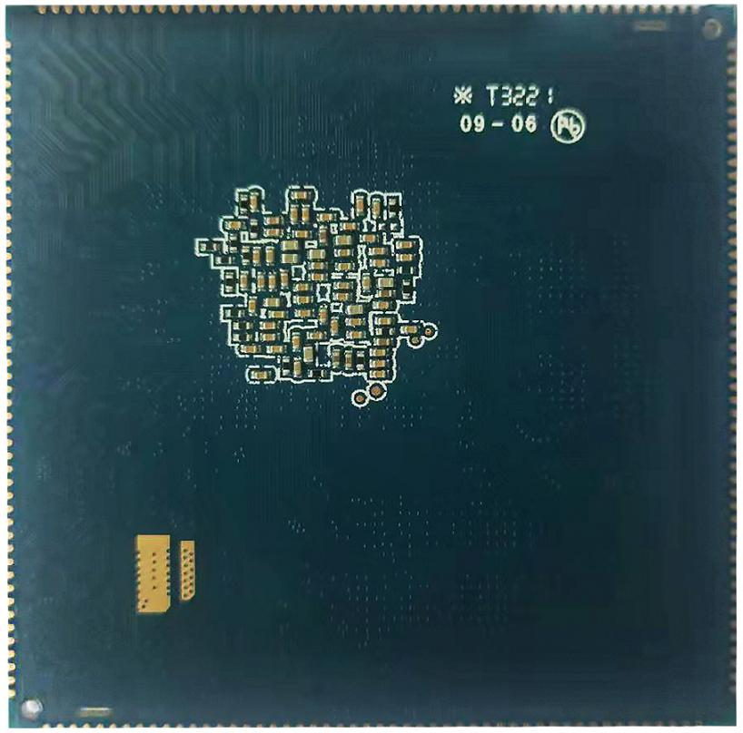

# Product Introduction

## Overview

X3399CV5 is a core board based on the Rockchip RK3399 processor. It is intended for embedded product development and provides a compact hardware platform with rich peripheral interfaces.

## Features

- 最佳尺寸, 即保证精悍的体积又保证足够的GPIO 口, 仅55mm*55mm
- 使用RK 自身的RK808 PMU, 在保证工作稳定可靠的同时, 成本足够低廉
- supports多种品牌, 多种容量的emmc, default使用东芝16GB emmc
- 使用双通道LPDDR4 设计, defaultsupports2GB 容量, 可定制4GB 容量
- supports电源休眠唤醒
- supportsandroid6.0, android7.0, linux, debain9, ubuntu 等操作系统
- supports千兆有线以太网
- 引出高达200PIN 管脚, 几乎囊括CPU 所有管脚
- 产品稳定可靠, 经过大量高低温, 反复重启, 安卓稳定性测试, 安兔兔测试等可靠性实验, 拷机7 天7 夜不死机; X3399CV4/X3399CV5 核心板相对原来的X3399CV3 的基础上, 将LPDDR3 调整为LPDDR4, 管脚完全兼容. 针对android7.0 及or higher操作系统, 代码完全兼容. 注意, 目前android6.0 版本不supportsLPDDR4, 需要使用X3399CV4/X3399CV5 核心板的用户, 请谨慎选择.

## Appearance and Mechanical Structure

## Specifications

### System Configuration

| CPU | RK3399 |
|---|---|
| Frequency | quad-coreA53(1.4GHz) + 双核A72(2GHz) |
| RAM | standard2GB, 无缝兼容4GB |
| Storage | standard16GB, 其他容量optional |
| Power IC | 使用RT808, supports动态调频等 |

### Interface Parameters

| LCD Interface | 同时supportsMIPI, EDP, HDMI Interface输出 |
|---|---|
| Touch Interface | capacitive touch, 可使用USB或串口扩展电阻触摸 |
| Audio Interface | AC97/IIS接口, supports录放音 |
| SD Card Interface | 2路SDIO输出通道 |
| eMMC Interface | on-boardeMMC Interface, 管脚not routed out separately |
| Ethernet Interface | supportsGigabit Ethernet |
| USB HOST2.0接口 | 2路HOST2.0 |
| USB HOST3.0接口 | 2路TYPE3.0 |
| UART Interface | 5路串口, supports带流控串口 |
| PWM Interface | 4路PWM输出 |
| IIC Interface | 7路IIC输出 |
| SPI Interface | 1路SPI输出 |
| ADC Interface | 1路ADC输出 |
| Camera Interface | 1路BT656/BT601, 1路MIPI输出 |
| HDMI Interface | HD audio/video output接口, synchronized audio/video output |

### Electrical Characteristics

| 主3.3VInput Voltage | 3.3V/4.3A(推荐使用3.3V/5A输入) |
|---|---|
| 副3.3VInput Voltage | 3.3V/300mA(不能和主3.3V混用) |
| RTCInput Voltage | 2.5到3V/100uA |
| Output Voltage | 1.8V(can be used for底板供电, 休眠后为0V) |
| Operating Temperature | 0~70°C |
| Storage Temperature | -10~50°C |

### Mechanical Parameters

| Package | Castellated-hole package |
|---|---|
| Core Board Size | 55mm*55mm*3mm |
| Pin Pitch | 1.0mm |
| Pad Size | 0.5mm*1.8mm, 封装以中心对称 |
| Number of Pins | 200PIN |
| PCB Layers | X3399CV3: 10层 X3399CV4: 8层 X3399CV5: 8层 |
| Warpage | less than0.5% |
| Opening Area | 上图中红色部分为推荐底板封装Opening Area |

## Related Pages

- [Pin Definition](./x3399cv5-pin-definition)
- [Hardware Design](./x3399cv5-hardware-design)
