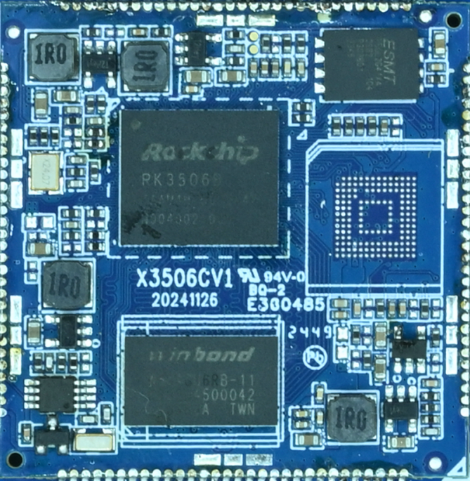
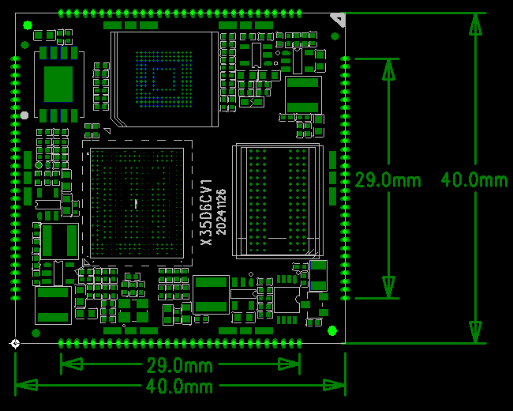
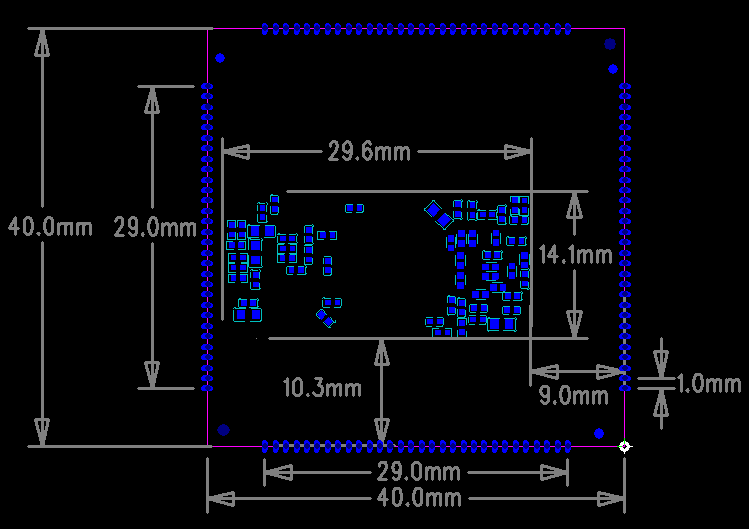

# Product Introduction

## Overview

The X3506 core board is based on the Rockchip RK3506 CPU and is developed, manufactured, and sold by Shenzhen 9Tripod Technology Co., Ltd.

RK3506 is a system-on-chip (SoC) integrating Cortex-A7 and Cortex-M0 cores. It is designed for intelligent IoT devices, supports Linux operating systems, and provides rich peripheral interfaces for applications such as smart home devices, building intercom systems, PLCs, and other AIoT solutions.

## Features

- **40mm × 40mm** compact form factor for space-constrained products.
- DDR3 memory design.
- Supports high-speed interfaces such as Ethernet, MIPI-DSI, and USB2.0.
- Castellated-hole package for easy carrier-board integration.

## Appearance and Mechanical Structure

### Front View

### Mechanical Structure

## Specifications

### System Configuration

| CPU | RK3506 (Cortex-A7 +Cortex-M0) |
|---|---|
| Frequency | 1.5GHz |
| RAM | 512MB |
| ROM | 256MB / 8GB optional |
| Power IC | DCDC |

### Interface Parameters

| eMMC Interface | On-board eMMC |
|---|---|
| USB Interface | 2 × USB interfaces |
| LCD Interface | 1 × MIPI DSI / 1 × RGB |
| SPI Interface | 3 channels |
| I2C Interface | 3 channels |
| UART Interface | 6 channels |
| SDIO Interface | 1 channel |
| RMII Interface | 2 channels |
| ADC Interface | 4 channels |

### Electrical Characteristics

| Input Voltage / Current | VCC5V0_SYS/3A |
|---|---|
| Operating Temperature | 0~70°C |
| Storage Temperature | -10~50°C |

### Mechanical Parameters

| Package | Castellated-hole package |
|---|---|
| Core Board Size | 40mm*40mm*1.2mm |
| Pin Pitch | 1.0mm |
| Number of Pins | 120PIN |
| PCB Layers | 6th floor |
| Warpage | &lt; 0.5% |

## Related Pages

- [Pin Definition](./x3506-pin-definition)
- [Hardware Design](./x3506-hardware-design)
