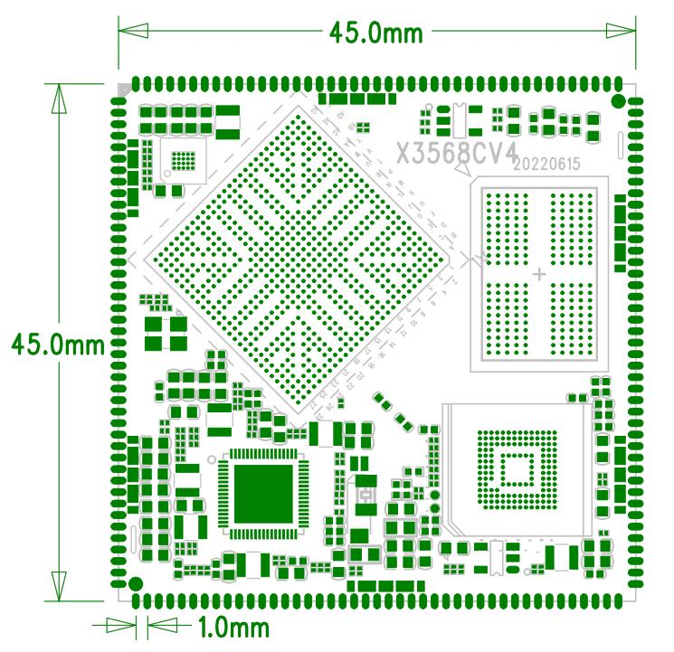

# Product Introduction

## Overview

X3568CV4 is a core board based on the Rockchip RK3568 processor. It is intended for embedded product development and provides a compact hardware platform with rich peripheral interfaces.

## Features

- 最佳尺寸, 即保证精悍的体积又保证足够的GPIO 口, 仅45mm*45mm
- 使用RK 自身的RK809 PMU, 在保证工作稳定可靠的同时, 成本足够低廉
- supports多种品牌, 多种容量的EMMC, default使用三星EMMC, 分别为8GB 版本和16GB 版本
- 使用双通道LPDDR4X 或DDR4 设计, 拥有1GB/2GB/4GB/8GB 版本
- supports电源休眠唤醒
- supportsandroid8.1, linux, debain9, ubuntu 等操作系统
- supportsdual-channel千兆有线以太网
- 引出200PIN 管脚, 基本满足各种应用需求
- 产品稳定可靠, 经过大量高低温, 反复重启, 安卓稳定性测试, 安兔兔测试等可靠性实验, 拷机7 天7 夜不死机

## Appearance and Mechanical Structure

## Specifications

### System Configuration

| CPU | RK3568/RK3568B2 |
|---|---|
| Frequency | quad-coreA55(2GHz) |
| RAM | standard2GB, 硬件兼容4GB, 8GB |
| Storage | 8GB/16GBEMMCoptional, standard16GB |
| Power IC | 使用RK809, supports动态调频等 |

### Interface Parameters

| LCD Interface | supportsDSI/LVDS/EDP/HDMI Interface输出 |
|---|---|
| Touch Interface | capacitive touch |
| Audio Interface | supports耳机喇叭直接输出, supports录放音 |
| SD Card Interface | 2路SDIO输出通道 |
| eMMC Interface | on-boardeMMC Interface, 管脚not routed out separately |
| Ethernet Interface | supports2路Gigabit Ethernet |
| USBHOST2.0接口 | 2路HOST2.0 |
| USBHOST3.0接口 | 2路HOST3.0 |
| OTG接口 | 1路OTG接口(和其中一路USB3.0multiplexed) |
| UART Interface | 10路串口, supports带流控串口 |
| PWM Interface | 16路PWM输出 |
| IIC Interface | 6路IIC输出 |
| SPI Interface | 4路SPI输出 |
| ADC Interface | 2路ADC输出(有6路未引出) |
| Camera Interface | CSI/BT601/BT656/BT1120/RAW输入 |

### Electrical Characteristics

| 3.3VInput Voltage | 3.3V/2A |
|---|---|
| RTCInput Voltage | 3V/0.6uA |
| Output Voltage | 3.3V/1.5A(can be used for底板供电) |
| Operating Temperature | commercial grade: -10~70°C industrial grade : -40~85°C |
| Storage Temperature | -10~40°C |

### Mechanical Parameters

| Package | Castellated-hole package |
|---|---|
| Core Board Size | 45mm*45mm*3mm |
| Pin Pitch | 1.0mm |
| Pad Size | 1.3mm*0.6mm |
| Number of Pins | 172PIN |
| PCB Layers | 8层 |
| Warpage | not greater than0.5% |

## Related Pages

- [Pin Definition](./x3568cv4-pin-definition)
- [Hardware Design](./x3568cv4-hardware-design)
