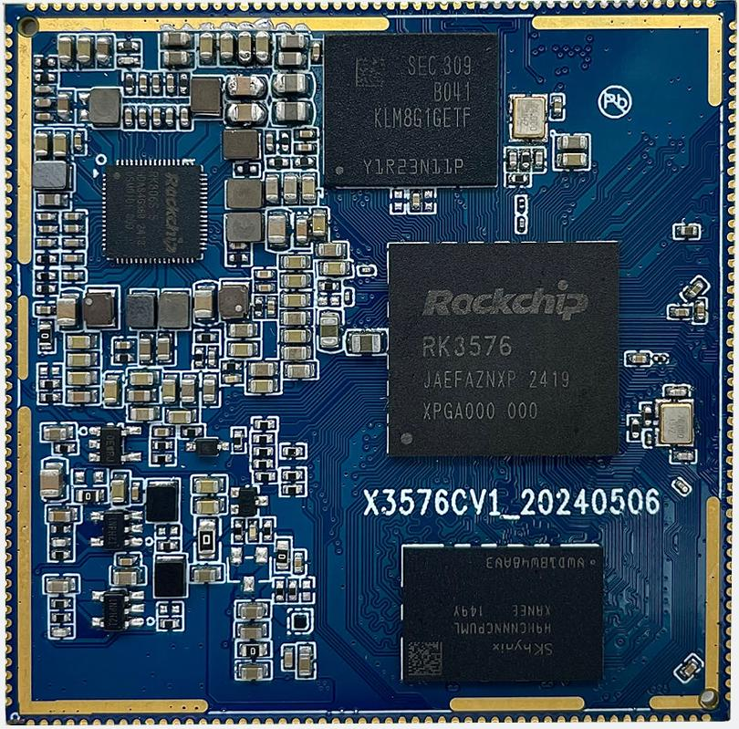
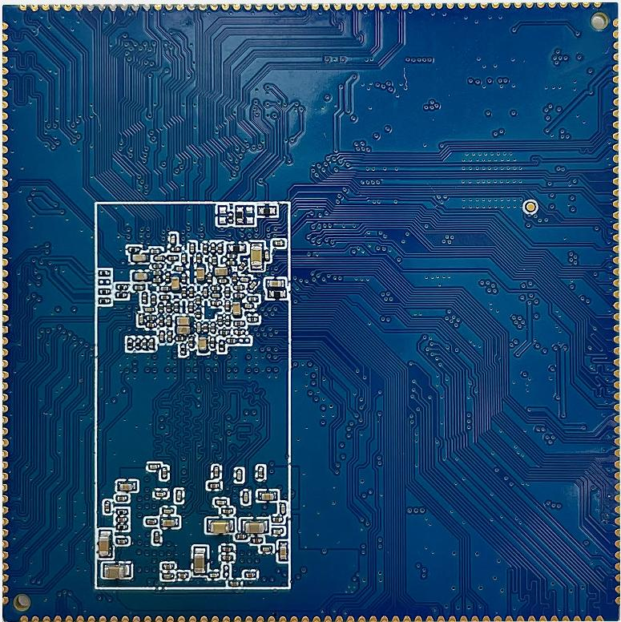
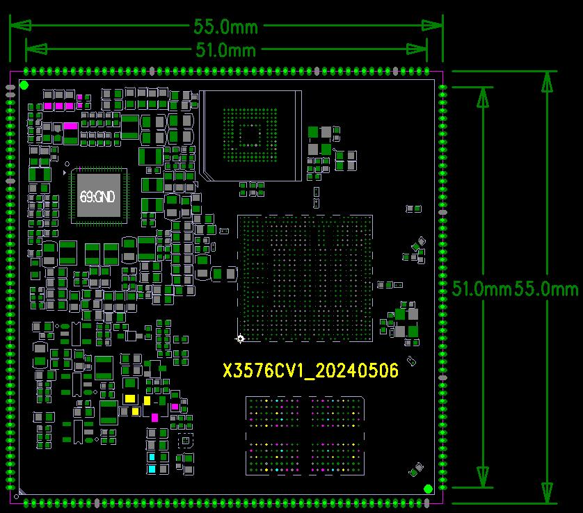
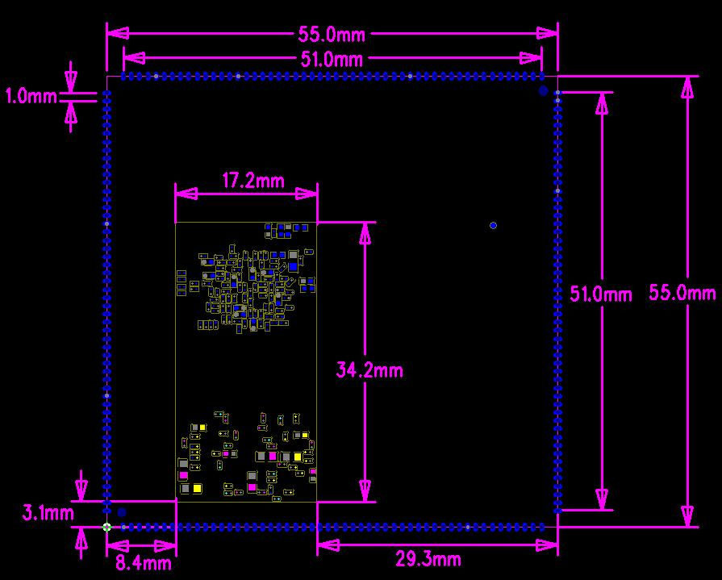

# Product Introduction

## Product Overview

X3576 is a core board based on the Rockchip RK3576 CPU. It is independently developed, manufactured, and sold by Shenzhen Jiuding Chuangzhan Technology Co., Ltd. RK3576 is Rockchip's second-generation 8 nm high-performance AIoT platform. It integrates an independent 6 TOPS (Tera Operations Per Second) NPU (Neural Processing Unit) for artificial-intelligence workloads. RK3576 also supports UFS (Universal Flash Storage), providing efficient data storage and access.

The platform is suitable for a wide range of embedded and intelligent-device applications, especially commercial display equipment, live-streaming equipment, industrial control hosts/boards, automotive electronics, and related product upgrades.

Compared with RK3399, RK3576 improves multiple key areas. The process technology is upgraded from 28 nm to 8 nm, while the AnTuTu benchmark score is more than doubled and the core-module power consumption can remain below 5 W. AI capability is upgraded from having no integrated NPU to a built-in 6 TOPS NPU. Memory support is expanded from DDR3 and LPDDR4 to DDR3, LPDDR4, LPDDR4X, and LPDDR5. Storage support is extended to UFS. Video encoding performance can reach the RK3588 level, with support for 4K@60fps, while the cost is approximately half that of RK3588.

## Core Board Features

- Compact 55 mm × 55 mm size while exposing all GPIO pins
- Uses a PMU power-supply solution to provide stable and reliable operation at low cost
- Supports eMMC devices from multiple vendors and in multiple capacities
- X3576CV3 uses an LPDDR5 design and supports up to 16 GB
- Supports power sleep and wake-up
- Supports high-speed buses including Gigabit Ethernet, MIPI-CSI, MIPI-DSI, PCIE, and USB 3.0
- Uses a 208-pin castellated-hole package

## Appearance and Structure

## Specifications

### System Configuration

| Item | Specification |
|---|---|
| CPU | RK3576 (Quad A72 + Quad A53) |
| CPU Frequency | 1.8 GHz |
| RAM | 2 GB / 4 GB / 8 GB |
| ROM | 4 GB / 8 GB / 16 GB / 32 GB / 64 GB |
| Power IC | RK806-S, supports dynamic frequency scaling |

### Interface Specifications

| Interface | Specification |
|---|---|
| LCD Interface | 1 × MIPI-DSI (MAX 2K@60Hz) |
| Touch Interface | Capacitive touch, I2C interface |
| Audio Interface | I2S / PCM / PDM / SPDIF |
| SD Card Interface | 1 × SDIO output channel |
| eMMC Interface | On-board eMMC interface; pins are not routed out |
| Ethernet Interface | 1 × Gigabit Ethernet interface |
| USB HOST 2.0 Interface | 2 |
| USB HOST 3.0 Interface | 2 |
| UART Interface | 11 |
| PWM | 16 |
| I2C Interface | 10 |
| Camera Interface | 3 × MIPI-CSI inputs |
| HDMI Interface | 1 × HDMI 2.0 TX |
| PCIE Interface | 1 × PCIE 2.0 |

### Electrical Characteristics

| Item | Specification |
|---|---|
| Input Voltage / Current | VCC5V0_SYS_S5 / 3A |
| Output Voltage / Current | VCC_3V3_S0 / 1A (for peripherals in the same voltage domain); VCC_1V8_S3 / 500mA (for IO pull-ups in the same voltage domain) |
| Operating Temperature | 0°C to 70°C |
| Storage Temperature | -10°C to 50°C |

### Mechanical Specifications

| Item | Specification |
|---|---|
| Package | Castellated-hole module |
| Core Board Size | 55 mm × 55 mm × 1.2 mm |
| Pin Pitch | 1.0 mm |
| Number of Pins | 208 pins |
| PCB Layers | 6 layers |
| Warpage | Less than 0.5% |

## Related Sections

- [Pin Definition](./x3576cv1-pin-definition)
- [Hardware Design](./x3576cv1-hardware-design)
