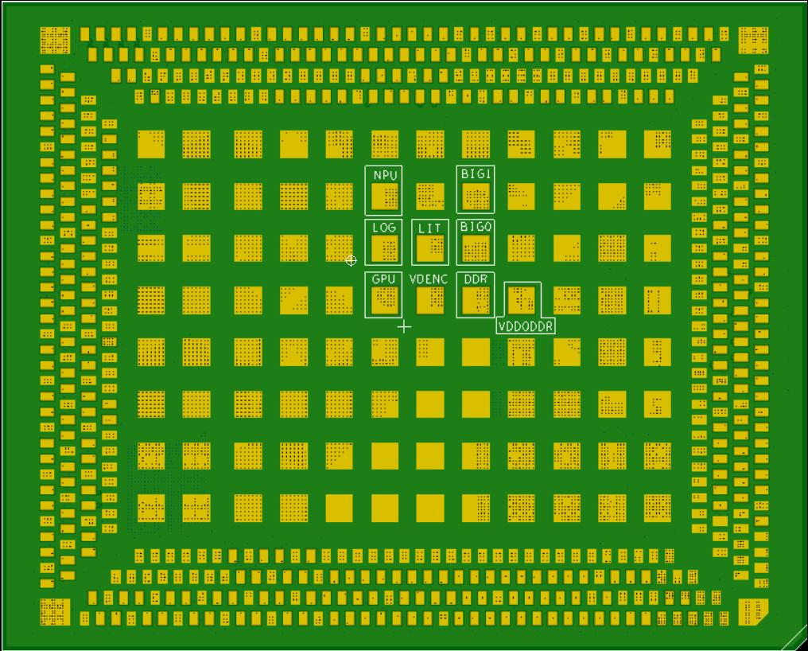
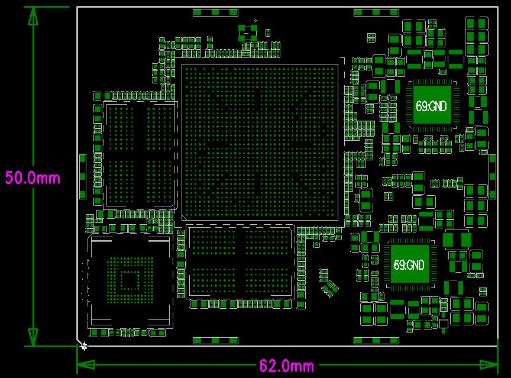
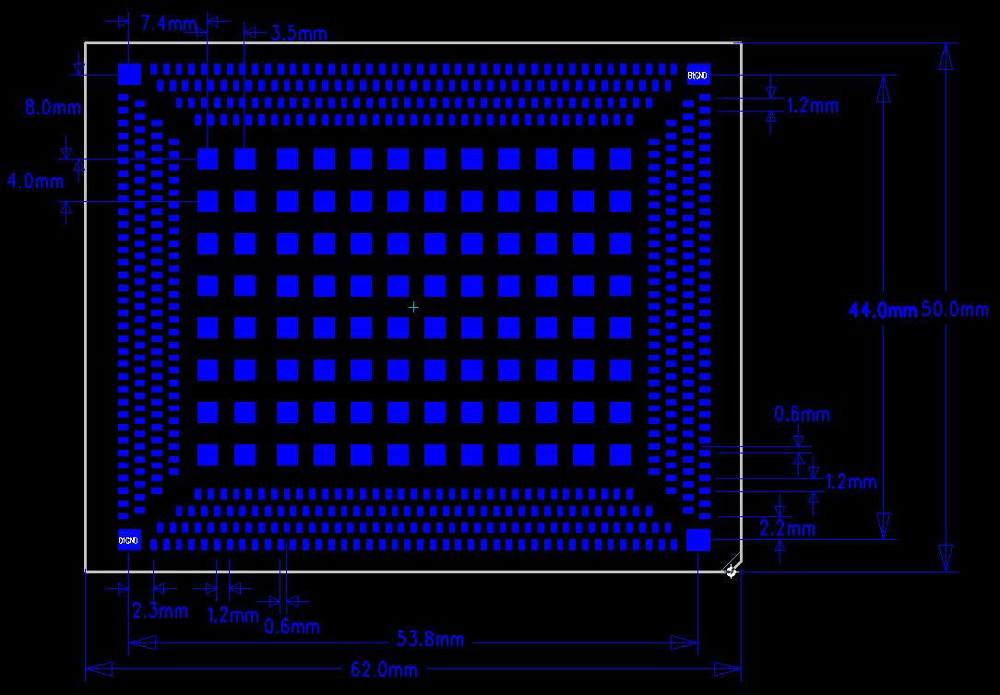

# Product introduction

## Product introduction

Z3588CV1 is a core board based on Rockchip RK3588. It is independently developed, produced and sold by Shenzhen Jiuding Chuangzhan Technology Co., Ltd. RK3588 is a new generation flagship high-end processor launched by Rockchip. It is designed using 8nm process, equipped with quad-core A76+quad-core A55 eight-core CPU and Arm high-performance GPU, and has a built-in NPU with 6T computing power. It has powerful visual processing capabilities and can support a variety of fast face unlocking solutions such as structured light and TOF. It supports a variety of display interfaces and has up to 8K display processing capabilities. It has strong scalability and supports PCIE3.0, SATA3.0, dual TypeC/USB3.1 and other high-speed interfaces, and can expand AI computing power, image data processing, etc. Applied to ARMPC, high-end tablet computers, edge computing servers, virtual reality, NVR, 8K TV and other directions.

## Core board features

- The best size, ensuring that all GPIO ports are lead out, the size is only 50mm*62mm
- Using RK's own RK806 PMU, the cost is low enough while ensuring stable and reliable operation.
- Supports emmc of multiple brands and capacities
- Using dual-channel LPDDR4(X) design, supporting 2GB/4GB/8GB/16GB/32GB capacity
- Support power sleep wake-up
- Supports android12.0, linux, debain, ubuntu and other operating systems
- Supports dual Gigabit wired Ethernet, SATA, PCIE, USB3.0 and other high-speed buses
- Adopting LGA package form, the contact is stable and reliable
- The product is stable and reliable. After a lot of high and low temperatures, repeated restarts, Android stability tests, AnTuTu tests and other reliability experiments, the machine did not crash for 7 days and 7 nights.

## Appearance and structure

## Characteristic parameters

### System configuration

| CPU | RK3588 |
|---|---|
| Main frequency | Quad-core A76+quad-core A55(2.4GHz) |
| memory/storage | 4G&16G or 8G&32G optional |
| Power IC | Using RK806-2, supports dynamic frequency modulation, etc. |

### Interface parameters

| LCD interface | Supports MIPI, EDP, and HDMI interface output at the same time; the maximum support is 6 channels of simultaneous display and 4 channels of separate display. |
|---|---|
| Touch interface | Capacitive touch, can use USB or I2C interface touch |
| audio interface | IIS/PCM/TDM interface |
| SPDIF interface | 2-way 8-channel optical audio output interface |
| SD card interface | 2 SDIO output channels |
| emmc interface | Onboard emmc interface, no pins are lead out separately |
| Ethernet interface | Dual Gigabit Ethernet interfaces |
| USBHOST2.0 interface | 2-way HOST2.0 |
| USBHOST3.0 interface | 2-way USBOTG3.0/2.0/TypeC |
| UART interface | 10-channel serial port, supports serial port with flow control |
| PWM interface | 16 channels of PWM output |
| IIC interface | 9 channels IIC output |
| SPI interface | 5 channels SPI output |
| ADC interface | 8 ADC outputs |
| CAN interface | 3 channels CAN output |
| Camera interface | 6 CSI inputs |
| HDMI interface | 2 channels HDMI2.1TX, 1 channel HDMIRX2.0 |
| PCIE interface | PCIe3.0(2x2,1x4,4x1) |
| SATA interface | 2xSATA3.3/PCIe2.1 |

### Electrical characteristics

| 4V input voltage | 4V/5A(Recommended 4V/8Aenter) |
|---|---|
| Output voltage | 3.3V/2A，1.8V/2A(Can be used for backplane power supply) |
| working temperature | 0~70 degrees |
| storage temperature | -10~50 degrees |

### Structural parameters

| Core board size | 62mm*50mm*1.2mm |
|---|---|
| Number of pins | 660PIN |
| Ply | 12th floor |
| Warpage | less than 0.5% |

## Related chapters

- [Pin definition](./z3588-pin-definition)
- [Hardware design](./z3588-hardware-design)
