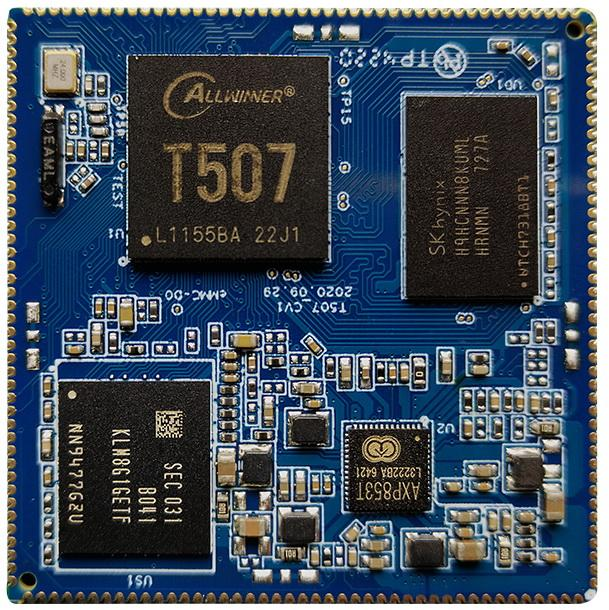
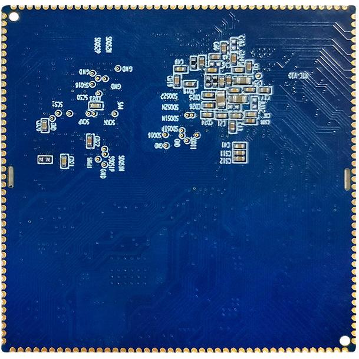

# Product Introduction

## Product Overview

The X507CV1 is a core board based on the Allwinner T507 SoC and supports Android and Linux.

The T507 integrates four Cortex-A53 CPU cores with a clock of up to 1.5GHz. The module uses LPDDR4 memory and on-board eMMC and is suitable for industrial control, commercial displays, multimedia terminals, gateways, and embedded HMI products.

## Core Board Features

- Compact **45mm × 45mm** dimensions with the primary GPIO and high-speed interfaces exposed.
- AXP853T PMU for power management.
- Android and Linux support.
- LPDDR4 memory with 1GB or 2GB capacity.
- Sleep and wake-up support.
- Gigabit Ethernet support.
- 172-pin castellated/stamp-hole package.
- The source manual records a seven-day continuous stability test.

## Appearance and Mechanical Drawings

### Front View

### Rear View

### Mechanical Drawing

## Specifications

### System Configuration

| CPU | T507, 4 × Cortex-A53 |
|---|---|
| Clock | 1.5GHz |
| RAM | 1GB / 2GB LPDDR4 |
| ROM | 4GB / 8GB / 16GB eMMC |
| PMIC | AXP853T with dynamic frequency scaling support |

### Interfaces

| LCD | RGB / LVDS |
|---|---|
| Touch | Capacitive touch over I2C |
| Audio | IIS / PCM / PDM / SPDIF |
| SD card | Two SDIO channels |
| eMMC | On-board eMMC; pins are not separately exposed |
| Ethernet | One Gigabit Ethernet interface |
| USB Host 2.0 | Three ports |
| USB OTG | One port |
| UART | Six channels |
| PWM | Six channels |
| I2C | Six channels |
| SPI | Two channels |
| ADC | Five channels |
| Camera | One MIPI CSI input and one BT.656 input |

### Electrical Characteristics

| Input voltage/current | 5V / 2A |
|---|---|
| RTC input | 3V / 0.6µA |
| 3.3V output | 3.3V / 1.5A |
| Operating temperature | -40°C to 85°C |
| Storage temperature | -10°C to 40°C |

### Mechanical Parameters

| Package | Castellated/stamp-hole module |
|---|---|
| Dimensions | 45mm × 45mm × 3mm |
| Pin pitch | 1.0mm |
| Pin count | 172 pins |
| PCB layers | 8 |

## Related Chapters

- [Pin Definition](./x507-pin-definition)
- [Hardware Design](./x507-hardware-design)
