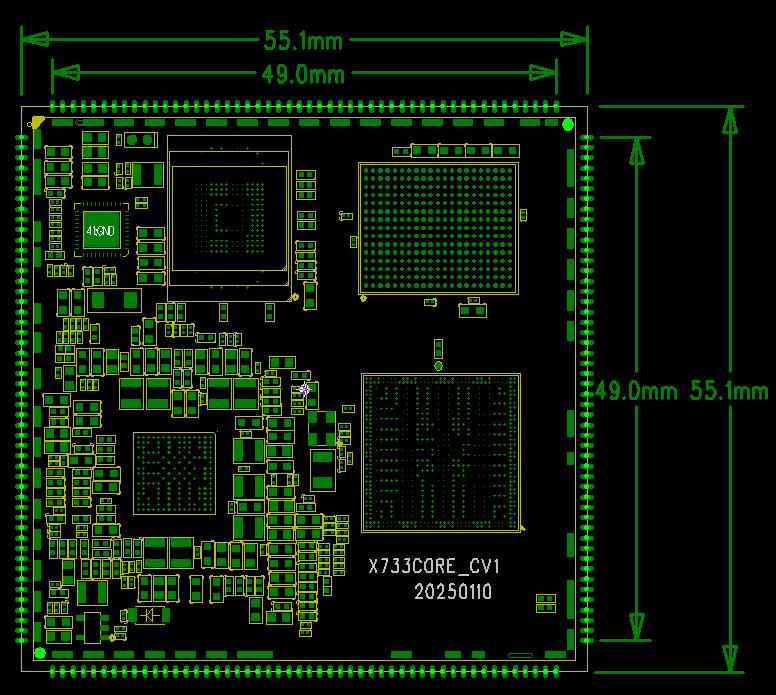

# Product Introduction

## Product Overview

The X733 core board is based on the Allwinner A733 SoC.

The A733 uses an eight-core Cortex-A76 + Cortex-A55 architecture and integrates a RISC-V E902 core. An optional 3TOPS NPU is available, and the platform supports up to 16GB of memory for tablets, notebooks, intelligent terminals, and Android 15 devices.

## Core Board Features

- **55mm × 55mm** dimensions.
- PMU-based power management.
- Support for multiple eMMC brands and capacities.
- LPDDR5 memory; the platform supports up to 16GB.
- Sleep and wake-up support.
- Gigabit Ethernet, MIPI CSI, MIPI DSI, PCIe, and USB3.0.
- 200-pin castellated/stamp-hole package.

## Appearance and Mechanical Drawings

### Front View

### Top-Layer Mechanical Drawing

### Bottom-Layer Mechanical Drawing

## Specifications

### System Configuration

| CPU | A733, Cortex-A76 + Cortex-A55 |
|---|---|
| Clock | 2GHz |
| RAM | 2GB / 4GB / 8GB; the overview states platform support up to 16GB |
| ROM | 4GB / 8GB / 16GB / 32GB / 64GB eMMC |
| PMIC | AXP318W with dynamic frequency scaling support |

### Interfaces

| eMMC | On-board eMMC |
|---|---|
| USB | The parameter table lists three USB2.0 and two USB3.0 ports |
| LCD | Two MIPI DSI, one eDP, one LVDS, and one RGB interface |
| SPI | Five channels |
| I2C | 16 channels |
| UART | Nine channels |
| GMAC | One interface |
| PWM | 20 channels |
| MIPI CSI | 4 + 4 + 2 lanes |

### Electrical Characteristics

| Input voltage/current | PS, 5V / 4A |
|---|---|
| Operating temperature | 0°C to 70°C |
| Storage temperature | -10°C to 50°C |

### Mechanical Parameters

| Package | Castellated/stamp-hole module |
|---|---|
| Dimensions | 55mm × 55mm × 1.2mm |
| Pin pitch | 1.0mm |
| Pin count | 200 pins |
| PCB layers | 8 |
| Warpage | Less than 0.5% |

## Related Chapters

- [Pin Definition](./x733-pin-definition)
- [Hardware Design](./x733-hardware-design)
