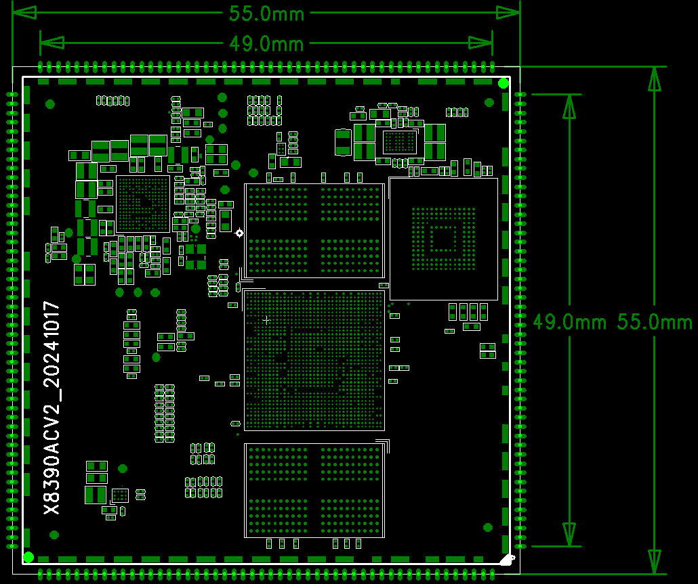

# Core Board Overview

## Overview

The X8390CV2 core board is designed around the MediaTek MT8390 and supports the pin-compatible MT8370. The MT8390 contains two Cortex-A78 and six Cortex-A55 cores; the MT8370 contains two Cortex-A78 and four Cortex-A55 cores.

## Features

- 55mm × 55mm castellated/stamp-hole core module.
- MT6365 PMIC.
- 2GB / 4GB / 8GB LPDDR4X.
- 4GB to 64GB on-board eMMC.
- Suspend and resume support.
- USB3.0, USB2.0, PCIe Gen2, DisplayPort, MIPI DSI, MIPI CSI, HDMI, eDP, SDIO, and Gigabit Ethernet resources.
- Complete pin table from pin 1 through pin 200.

## Appearance

### Front

### Rear

## Mechanical Drawings

### Top Layer

### Bottom Layer

## System Configuration

| Item | Specification |
| --- | --- |
| CPU | MT8390; compatible with MT8370 |
| MT8390 architecture | 2 × Cortex-A78 + 6 × Cortex-A55 |
| Clock | Cortex-A78 at 2.2GHz; Cortex-A55 at 2.0GHz |
| RAM | 2GB / 4GB / 8GB LPDDR4X |
| Storage | 4GB / 8GB / 16GB / 32GB / 64GB eMMC |
| PMIC | MT6365 |

## Interfaces

| Interface | Specification |
| --- | --- |
| USB | One USB3 OTG/Device and two USB2 OTG/Device interfaces |
| PCIe | One PCIe Gen2, one lane |
| DisplayPort | One four-lane interface |
| MIPI DSI | Two four-lane interfaces |
| HDMI | One HDMI TX |
| eDP | One two-lane interface |
| MIPI CSI | Two four-lane interfaces |
| SDIO | Two SDIO 3.0 interfaces |
| SPI | Three interfaces |
| PWM | Four outputs |
| UART | Two interfaces |
| I2C | Three interfaces |
| SPMI | One SPMI V2.0 interface |
| Audio | 4 × I2S, 8 × DMIC, 1 × PCM, 4 × SPDIF, and 6 × AUXADC |
| Ethernet | One Gigabit Ethernet interface |
| DPI | One interface |

## Electrical Characteristics

| Item | Specification |
| --- | --- |
| Main input | VSYS 5V / 3A |
| VCN33_1_PMU | 3.3V, up to 800mA for same-voltage-domain peripherals |
| VIO18_PMU | 1.8V; the feature table states 500mA for I/O pull-ups and related loads |
| Operating temperature | 0°C to 70°C |
| Storage temperature | -10°C to 50°C |

## Mechanical Parameters

| Item | Specification |
| --- | --- |
| Package | Castellated/stamp-hole module |
| Dimensions | 55mm × 55mm × 1.2mm |
| Pin pitch | 1.0mm |
| Pin count | 200 pins |
| PCB layers | 8 |
| Warpage | Less than 0.5% |

This document uses the mechanical table and the complete 1-to-200 pin table as the basis for the 200-pin definition.
