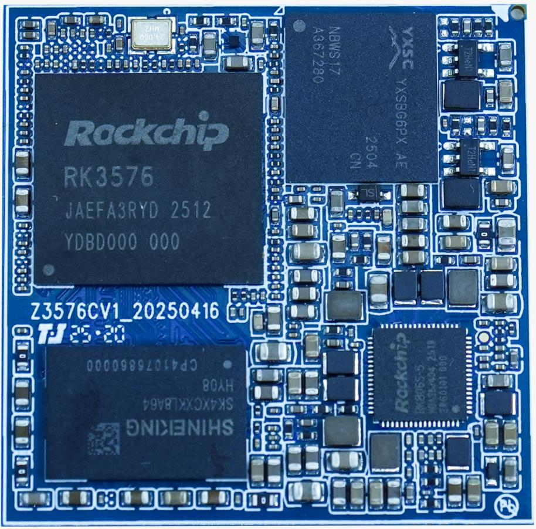
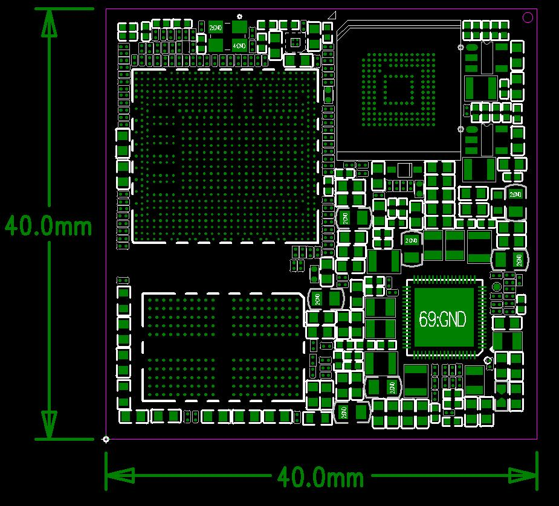

# Product Introduction

## Overview

Z3576 is a core board based on the Rockchip RK3576 processor. It is intended for embedded product development and provides a compact hardware platform with rich peripheral interfaces.

## Features

- 最佳尺寸, 保证引出全部GPIO 口的同时, 尺寸仅40mm*40mm
- 系统供电使用PMU, 在保证工作稳定可靠的同时, 成本足够低廉
- supports多种品牌, 多种容量的emmc
- 使用LPDDR4x 设计, up to supports16GB
- supports电源休眠唤醒
- supportsGigabit Ethernet, MIPI-CSI, MIPI-DSI, PCIE, USB3.0 等高速总线
- 采用447PIN LGA 封装

## Appearance and Mechanical Structure

## Specifications

### System Configuration

| CPU | RK3576(QuadA72+QuadA53) |
|---|---|
| Frequency | 2.2GHz |
| RAM | 2GB/4GB/8GB/16GB |
| ROM | 8GB/16GB/32GB/64GB/128GB/256GB/512GB |
| Power IC | 使用 RK806-S, supports动态调频 |

### Interface Parameters

| LCD 接口 | 1 路 MIPI-DSI(MAX2K@60Hz) |
|---|---|
| Touch 接口 | 电容触摸, I2C 接口 |
| Audio Interface | IIS/PCM/PDM/SPDIF |
| SD Card Interface | 1 路 SDIO 输出通道 |
| eMMC Interface | 板载 emmc 接口, 管脚不另外引出 |
| Ethernet Interface | supports1路千兆Ethernet Interface |
| USBHOST2.0接口 | 2 路 |
| USBHOST3.0接口 | 2路 |
| UART Interface | 11路 |
| PWM | 16路 |
| IIC Interface | 10路 |
| Camera Interface | 3 路 MIPI-CSI 输入 |
| HDMI Interface | 1 路 HDMI2.0TX |
| PCIE Interface | 1 路 PCIE2.0 |

### Electrical Characteristics

| Input Voltage / Current | VCC5V0_SYS_S5/3A |
|---|---|
| Output Voltage / Current | VCC_3V3_S0/1A(used for同电压域外设供电); VCC_1V8_S3/500MA(used for同电压域 IO 上 拉); |
| Operating Temperature | 0~70°C |
| Storage Temperature | -10~50°C |

### Mechanical Parameters

| Package | BGA package |
|---|---|
| Core Board Size | 40mm*40mm*1.2mm |
| Pin Pitch | 1.5mm |
| Number of Pins | 447PIN |
| PCB Layers | 14层 |
| Warpage | less than0.5% |

## Related Pages

- [Pin Definition](./z3576-pin-definition)
- [Hardware Design](./z3576-hardware-design)
